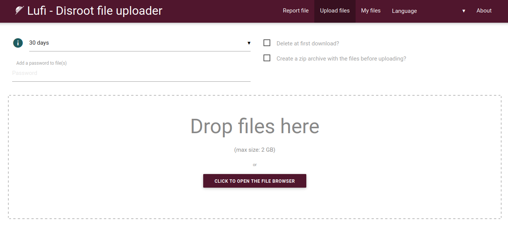
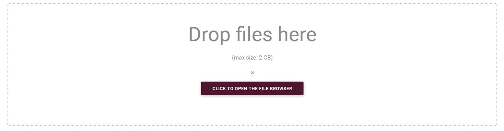

# Upload

**Disroot Upload** is a temporary file hosting service powered by **Lufi**, an open source online software to upload and share files in a secure and private way with other people. We can think of it as an alternative to propietary services such as WeTransfer.

**Registration is not needed to use this service.**
# How does it work?
If we have a file we want or need to share, we just drag and drop it in the upload area, it is chunked, encrypted and sent to the server. We then get two links per file: _a download link_, that we give to the people we want to share the file with and a _deletion link_, that allows us to delete the file whenever we want.

Yes, it is as simple as that.

## How secure is it?

**Lufi** is an [**E2EE (End-to-End Encryption)**](https://en.wikipedia.org/wiki/End-to-end_encryption) file sharing service that encrypts our files through the web browser before they leave our computer, so not only our **Internet Service Provider (ISP)** cannot see the file's content, **Disroot**'s administrators cannot either. The admins can only see the file's name, its size and its [mimetype](https://en.wikipedia.org/wiki/MIME) (what kind of file it is: video, text, etc).  
When someone downloads our file, it is decrypted locally in that person's browser after the download. As we have just mentioned, neither the network administrators or the ISP will be able to see what is in the downloaded file.

We can use it, for example:

   - **to store** (temporarily) files online, download them or share them with other people, and/or
   - **to send** someone files that will delete themselves from the server after the first download.

!! #### NOTE  
!! **Upload** is not a cloud service since files are only stored online for a certain time, after which they are deleted.  For cloud services we have the [**Disroot Cloud**](https://cloud.disroot.org). It is also a different service from [**PrivateBin**](../03.Bin/docs.en.md/) since it can only shares text, while **Upload** can be used to share and download any type of file.

We can read more about **Lufi** [**here**](https://git.framasoft.org/luc/lufi).

## Understanding the encryption process

The whole encryption/decryption process is done automatically by the browsers, so no need of manually encrypt the files before, or manually decrypt them at the download.

The encryption key (that which allows whomever downloads the file to decrypt it) is a part of the link that is presented to us by our browser after we have uploaded a file.

Let's see an example.

The following is an example link to a file in **Upload** (https://upload.disroot.org):

`https://upload.disroot.org/r/FA7MHOOL`**#**`AgsmqnJEyUZAcybZmOGKljqYRtDhJKsvZC/Qt05N8dE=`

It has two components:

* Left of the **#** symbol in the link is the URL to the file:
`https://upload.disroot.org/r/FA7MHOOL`

* Right of the **#** symbol in the link is **the encryption key** of the file:
`AgsmqnJEyUZAcybZmOGKljqYRtDhJKsvZC/Qt05N8dE=`

This encryption key part of the URL is in fact what is called a [**URI** fragment](https://en.wikipedia.org/wiki/URI_fragment), it is only processed client-side (in our computer) and does not reach the server of the Lufi provider, so they cannot decrypt the file.

In short, **only persons that have the full link will be able to download and decrypt the file.**

If we try to use just `https://upload.disroot.org/r/FA7MHOOL` without the second part (the encryption key) we will get a message like this:

OK. Let's see how to use the **Upload** service.
# The Interface

The interface is pretty straightforward.

## 1. The top bar options

Here we have the following options:

* **Report file**: to report a suspicious or illegal file to **Disroot** admins. Clicking on this option will open a dialog box to choose what email client we want to use to send the email report.
* **Upload files**: the default main screen with the upload area.
* **My files**: to check and manage the files we have uploaded (_we will see this in detail below_).

* **Language**: to change the language interface.

## 2. The upload options

In this section are the upload options where we can choose:

* how many days a file will stay online. _**The maximum is 30 days (for smaller files)**_;
* if we want the file to be deleted after the first download;
* if we want the file to be compressed in zip format before uploading it; and
* if we want to add a password to the file.

## 3. The upload area

This is where we upload our files by drag and dropping them. We can also do it the traditional way, opening the file browser and selecting the file.

The size limit for the files we can upload is **2GB**. And the maximum time a file stays stored online varies according to its size. After that time expired the file is deleted.

So the larger the file size the shorter the time it is stored. The expiration delay of our files will be the minimum between what we choose and the following limitations:

* between 0 and 96MB, the file will be kept 30 days
* between 96MB and 954MB, the file will be kept 15 days
* for 954MB and more, the file will be kept 2 days

# Uploading and downloading
As mentioned above, after setting the upload options (how many days it will stays online, if delete it after download or not and if it will be password protected) we can upload files by dragging it to the upload area and dropping it. Or we can choose to "click to open the file browser", navigate to our file and select it.

After the upload is complete we will get two links:

* first one is the **Download link**, this is the URL to the file we can share or download, and
* second one is the **Deletion link** which allows us to delete the file uploaded to the server at any time we want. To use it we just paste it in our browser and press "Enter" in the keyboard.

We will get the following message:

If we delete a file or the expiration date that was set passed, anyone trying to download the file will get a message like this:

We will also have the options to **Copy all links to clipboard** (it is recommended to do so and save them somewhere else) and to **Send all links by email**.

# Sharing a file
This is also very simple. We can either:

* copy the link manually and paste it in an email, a text file, or any other option; or

* send it directly by email from Upload.

In the case of this last option, we just click on the **Send all links by email** button, write the email address in the next screen and (optionally) a message to the recipient. Now note that there are two sending options:

* **Send with this server**: this is not recommended for security reasons, because if we send the email from the service provider's server, the links will be sent to that server first and then sent from the provider's email, not our personal one. This means that full links could be seen by the server administrators and therefore they would be able to download and decrypt the files. **Disroot** is a privacy-conscious provider, but as a matter of principle the best practice to keep our privacy safe is to avoid this option.

* **Send with your own mail software**: if we have an email client installed on our computer or device (e.g: Thunderbird, Evolution, etc.) then clicking this option will open it with the email ready to be sent.

# Uploaded files management
We can manage our uploads by clicking on the **My files** option in the top bar.

Here we can see the files that we have uploaded as well as:

* see the download/deletion links for each and every one of them;
* see which ones were set to delete after the first download;
* select the ones we want to delete from the server; or
* select one or more of them to send by email again (as seen above).

This list of uploaded files is kept locally in our browser using the ["_localStorage_"](https://ng-girls.gitbook.io/todo-list-tutorial/workshop-todo-list/local-storage) (local web storage) in a [.json](https://en.wikipedia.org/wiki/JSON) file. So, if we delete our "localStorage" data or use a different browser or computer, we will not be able to access it again.

Other options we have and can use in this screen are:

* **Export localStorage data**: to download the .json file containing our uploaded files information to our computer.
* **Purge expired files from localStorage**: to wipe the information related to expired files from our browser local storage.
* **Import localStorage data**: to import a .json file previously exported to our browser local storage.
* **Delete selected files**: to remove files from the server.

