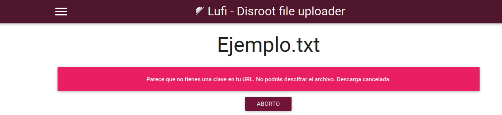
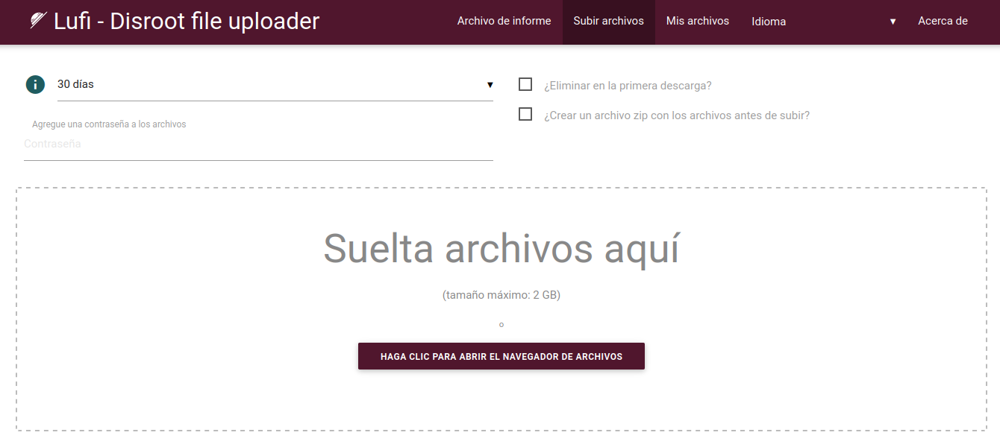
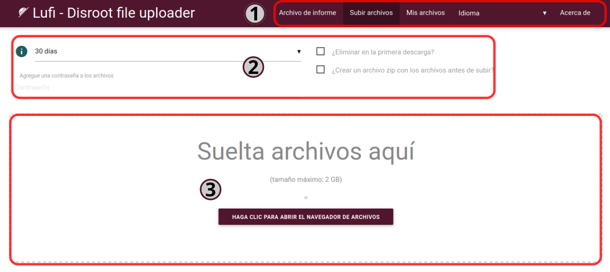
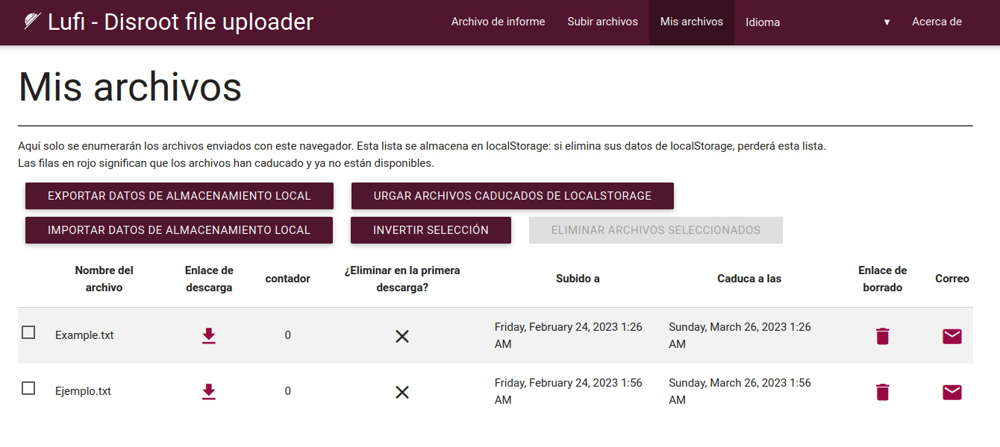
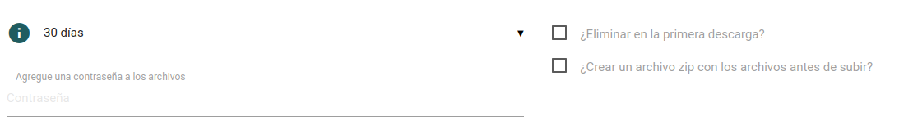
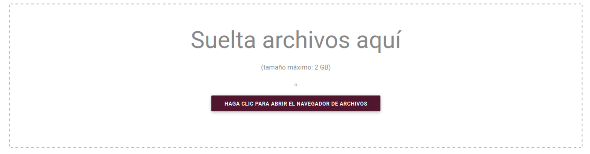
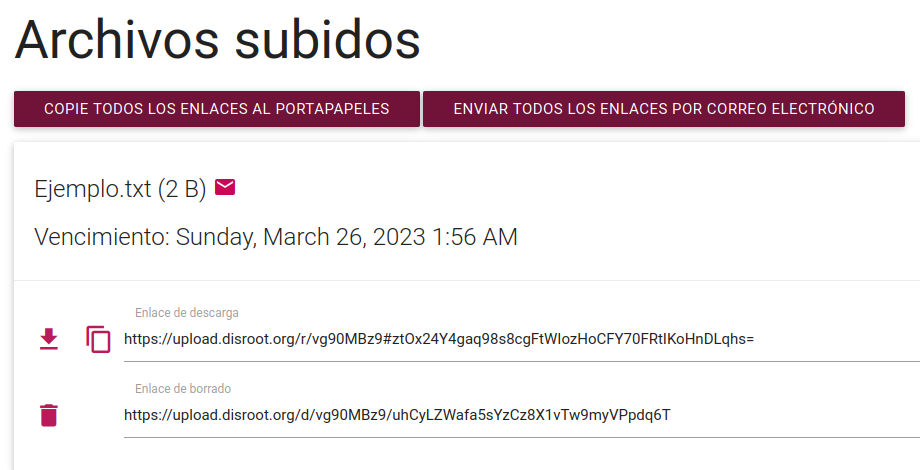
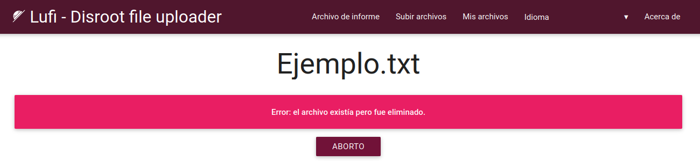
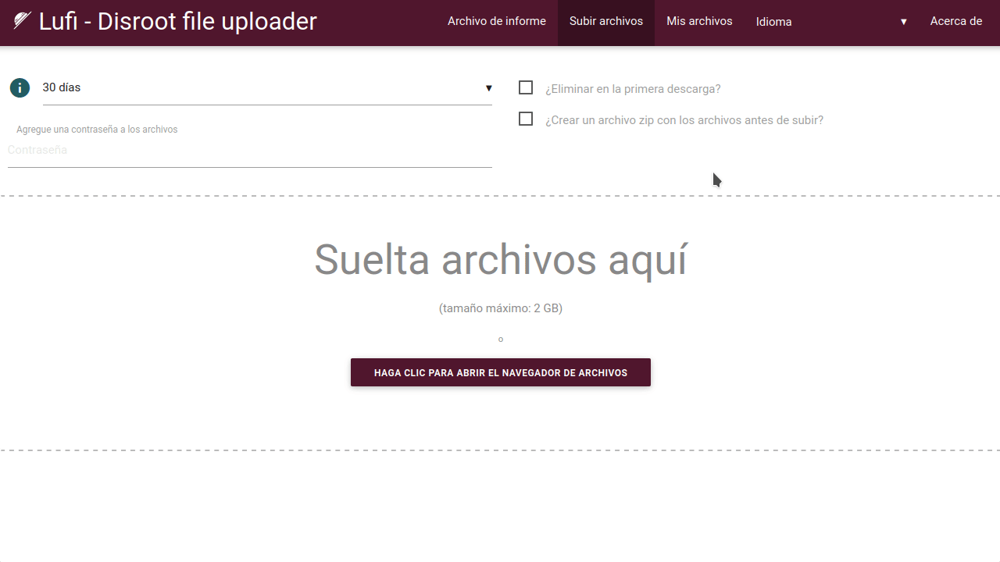

# Subida

**Subida de Disroot** es un servicio de alojamiento temporario de archivos desarrollado por **Lufi**, un programa en línea de código abierto para subir y compartir archivos de manera segura y privada con otras personas. Podemos pensar en él como una alternativa a servicios propietarios tales como WeTransfer.

**No es necesario registrarse para utilizar este servicio.**
# ¿Cómo funciona?
Si tenemos un archivo que queremos o necesitamos compartir, simplemente lo arrastramos y soltamos en el área de carga, este es fragmentado, cifrado y enviado al servidor. Obtenemos entonces dos enlaces por archivo: _un enlace de descarga_, que podemos dar a las personas con las que queremos compartirlo y un _enlace de borrado_ que nos permite eliminar el archivo cuando queramos.

Sí, es tan simple como eso.

## ¿Qué tan seguro es?

**Lufi** es un servicio cifrado de [**Extremo-a-Extremo**](https://es.wikipedia.org/wiki/Cifrado_de_extremo_a_extremo) para compartir archivos que cifra nuestros archivos a través del navegador web antes que dejen nuestra computadora, así que no solo nuestro **Proveedor de servicios de Internet (ISP)** no puede ver su contenido, los administradores de **Disroot** tampoco pueden. Los admins solo pueden ver el nombre del archivo, su tamaño y su tipo [MIME](https://es.wikipedia.org/wiki/Multipurpose_Internet_Mail_Extensions) (qué clase de archivo es: video, texto, etc.)  
Cuando alguien descarga nuestro archivo, este es descifrado localmente en el navegador de esa persona después de la descarga. Como acabamos de mencionar, ni los administradores de red o el ISP podrán ver qué hay en el archivo descargado.

Podemos utilizarlo, por ejemplo:

   - **para almacenar** (temporalmente) archivos en línea, descargarlos o compartirlos con otras personas, y/o
   - **para enviar** a alguien archivos que se eliminarán automáticamente del servidor luego de la primera descarga.

!! #### AVISO  
!! **Subida** no es un servicio de nube ya que los archivos son almacenados en línea solo por cierto tiempo, después del cual son borrados.  Para servicio de nube tenemos la [**Nube de Disroot**](https://cloud.disroot.org). También es un servicio diferente de [**PrivateBin**](../03.Bin/docs.es.md/) ya que con este solo se puede compartir texto mientras que **Subida** puede utilizarse para compartir y descargar cualquier tipo de archivo.

Podemos leer más sobre **Lufi** [**aquí**](https://git.framasoft.org/luc/lufi) (en inglés).

## Entendiendo el proceso de cifrado
Todo el proceso de cifrado/descifrado es realizado automáticamente por los navegadores, por lo que no es necesario cifrar antes los archivos manualmente o descifrarlos de la misma manera tras la descarga.

La clave de cifrado (que permite a quienquiera que descargue el archivo descifrarlo) es una parte del enlace que nos es presentado por nuestro navegador luego que hemos subido el archivo.

Veamos un ejemplo.

El que sigue es un enlace de ejemplo a un archivo en **Subida** (https://upload.disroot.org):

`https://upload.disroot.org/r/FA7MHOOL`**#**`AgsmqnJEyUZAcybZmOGKljqYRtDhJKsvZC/Qt05N8dE=`

Tiene dos componentes:

* A la izquierda del símbolo **#** en el enlace está la URL (la dirección) al archivo:
`https://upload.disroot.org/r/FA7MHOOL`

* A la derecha del símbolo **#** en el mismo enlace está la **clave de cifrado** del archivo:
`AgsmqnJEyUZAcybZmOGKljqYRtDhJKsvZC/Qt05N8dE=`

Esta parte de la clave de cifrado de la URL es en realidad lo que se llama un [fragmento **URI**](https://es.wikipedia.org/wiki/Identificador_de_recursos_uniforme), solo es procesado del lado del cliente (en nuestra computadora) y no llega al servidor del proveedor de Lufi, por lo que este no puede descifrar el archivo.

Resumiendo, **solo las personas que tengan el enlace completo podrán descargar y descifrar el archivo.**

Si intentamos utilizar solo `https://upload.disroot.org/r/FA7MHOOL` sin la segunda parte (la clave de cifrado) obtendremos un mensaje como este:

Muy bien. Veamos cómo utilizar el servicio de **Subida**.
# La interfaz

La interfaz es bastante clara.

## 1. Las opciones de la barra superior

Aquí tenemos las siguientes opciones:

* **Archivo de informe**: para reportar un archivo sospechoso o ilegal a los admins de **Disroot**. Al hacer clic en esta opción se abrirá un cuadro de diálogo para elegir qué cliente de correo queremos utilizar para enviar el reporte.
* **Subir archivos**: la pantalla principal por defecto con el área de carga.
* **Mis archivos**: para revisar y gestionar los archivos que hayamos subido (_veremos esto en detalle más adelante_).

* **Idioma**: para cambiar el idioma de la interfaz.

## 2. Las opciones de subida

En esta sección están las opciones de subida donde podemos elegir:

* cuántos días un archivo permancerá en línea. _**El máximo son 30 días (para archivos más pequeños)**_;
* si queremos que el archivo sea borrado luego de la primera descarga;
* si queremos que el archivo sea comprimido en formato zip antes de subirlo; y
* si queremos agregarle una contraseña.

## 3. El área de carga

Este el lugar donde subimos nuestros archivos arrastrando y soltándolos. También podemos hacerlo de la manera tradicional, abriendo el gestor de archivos y seleccionando el archivo.

El límite de tamaño para los archivos que podemos subir es de **2GB**. Y el máximo de tiempo que un archivo permanece almacenado en línea varía de acuerdo a su tamaño. Después que ese tiempo expira el archivo es eliminado.

Así que cuanto mayor es el tamaño del archivo más corto es el período de tiempo que es almacenado. El plazo de caducidad de nuestros archivos será el mínimo entre lo que elijamos y las siguientes limitaciones:

* entre 0 y 96MB, el archivo será guardado por 30 días
* entre 96MB y 954MB, el archivo será guardado por 15 días
* a partir de 954MB y más, el archivo será guardado por 2 días

# Subiendo y descargando
Como se mencionó arriba, después de establecer las opciones de subida (cuántos días permanecerá en línea, si será borrado después de ser descargado o no y si estará protegido con contraseña) podemos subir el archivo arrastrando y soltándolo en el área de carga. O podemos elegir "hacer clic para abrir el navegador de archivos", navegar hasta nuestro archivo y seleccionarlo.

Luego que la carga esté completa obtendremos dos enlaces:

* el primero es el **Enlace de descarga**, este es la URL al archivo que podemos compartir o descargar, y
* el segundo es el **Enlace de borrado** que nos permite eliminar el archivo subido al servidor en cualquier momento que queramos. Para utilizarlo, simplemente lo pegamos en nuestro navegador y presionamos "Enter" en el teclado.

Recibiremos el siguiente mensaje:

Si borramos un archivo o pasó la fecha de caducidad establecida, cualquiera que intente descargarlo obtendrá un mensaje como este:

También tendremos las opciones de **Copiar todos los enlaces al portapapeles** (es recomendable hacerlo y guardarlo en algún otro lugar) y de **Enviar todos los enlaces por correo electrónico**.

# Compartiendo un archivo
Esto también es muy sencillo. Podemos bien:

* copiar manualmente el enlace y pegarlo en un correo, un archivo de texto o cualquier otra opción; o

* enviarlo directamente por correo desde Subida.

En el caso de esta última opción, simplemente hacemos clic en el botón **Enviar todos los enlaces por correo electrónico**, escribimos la dirección de correo en la siguiente pantalla y (opcionalmente) un mensaje al destinatario. Ahora, noten que hay dos opciones de envío:

* **Enviar con este servidor**: esto no es recomendado por razones de seguridad, porque si enviamos el correo desde el servidor del proveedor del servicio, los enlaces serán enviados a ese servidor primero y luego desde el correo del proveedor, no desde nuestro correo personal. Esto quiere decir que los enlaces completos podrían ser vistos por los administradores del servidor y por lo tanto estos podrían descargar y descifrar los archivos. **Disroot** es un proveedor respetuoso de la privacidad, pero por una cuestión de principios la mejor práctica para mantener nuestra privacidad a salvo es evitar esta opción.

* **Envíe con su propio software de correo**: si tenemos un cliente de correo instalado en nuestra computadora o dispositivo (p.ej: Thunderbird, Evolution, etc.) al cliquear entonces esta opción lo abrirá con el correo listo para ser enviado.

# Gestión de archivos subidos
Podemos gestionar nuestras subidas haciendo clic en la opción **Mis archivos** en la barra superior.

Aquí podemos ver los archivos que hemos subido así como también:

* ver los enlaces de descarga/borrado de todos y cada uno de ellos;
* ver cuáles están configurados para ser eliminados después de la primera descarga;
* seleccionar aquellos que queramos borrar del servidor; o
* seleccionar uno o más de ellos para enviar por correo de nuevo (como vimos más arriba).

Esta lista de archivos subidos se guarda localmente en nuestro navegador utilizando el "[_localStorage_](https://ng-girls.gitbook.io/todo-list-tutorial-spanish/local_storage)" (almacenaniento web local) en un archivo [.json](https://es.wikipedia.org/wiki/JSON). Así que, si borramos nuestra información del "localStorage" o utilizamos un navegador o una computadora diferente, no podremos acceder a esta lista nuevamente.

Otras opciones que podemos encontrar y utilizar en esta pantalla son:

* **Exportar datos de almacenamiento local**: para descargar a nuestra computadora el archivo .json que contiene la información de nuestros archivos subidos.
* **Purgar archivos caducados de localStorage**: para limpiar la información relativa a los archivos caducados del almacenamiento local de nuestro navegador.
* **Importar datos de almacenamiento local**: para importar un archivo .json previamente exportado al almacenamiento local de nuestro navegador.
* **Eliminar archivos seleccionados**: para eliminar archivos del servidor.

