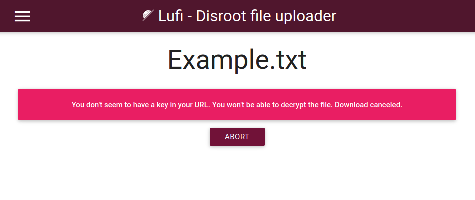
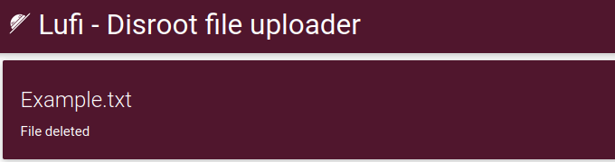
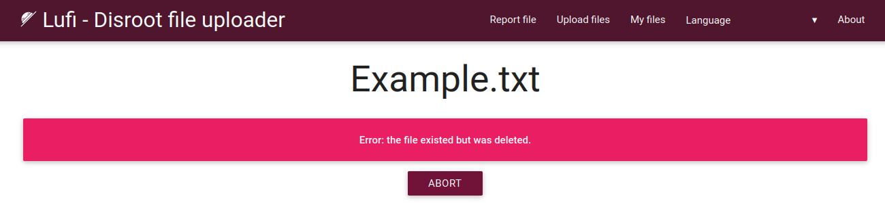

# Upload

**Disroot Upload** est un service d'hébergement temporaire de fichiers basé sur **Lufi**, un logiciel en ligne open source permettant de télécharger et de partager des fichiers de manière sécurisée et privée avec d'autres personnes. On peut le considérer comme une alternative aux services propriétaires tels que WeTransfer.

**L'enregistrement n'est pas nécessaire pour utiliser ce service.**
# Comment cela fonctionne-t-il ?
Si nous avons un fichier que nous voulons ou devons partager, il suffit de le glisser et de le déposer dans la zone de téléchargement, il est mis en morceaux, crypté et envoyé au serveur. Nous obtenons alors deux liens par fichier : un lien de téléchargement, que nous donnons aux personnes avec lesquelles nous voulons partager le fichier et un lien de suppression, qui nous permet de supprimer le fichier quand nous le voulons.

Oui, c'est aussi simple que cela.

## Est-ce que c'est sécurisé ?

**Lufi** est un service de partage de fichiers [**E2EE (Chiffré de bout en bout)**](https://fr.wikipedia.org/wiki/Chiffrement_de_bout_en_bout) qui crypte nos fichiers par le biais du navigateur Web avant qu'ils ne quittent notre ordinateur, de sorte que non seulement notre **Fournisseur d'accès Internet (FAI)** ne peut pas voir le contenu du fichier, mais les administrateurs de **Disroot** non plus. Les administrateurs ne peuvent voir que le nom du fichier, sa taille et son [mimetype](https://fr.wikipedia.org/wiki/Multipurpose_Internet_Mail_Extensions) (quel type de fichier il s'agit : vidéo, texte, etc.).  
Lorsque quelqu'un télécharge notre fichier, celui-ci est décrypté localement dans le navigateur de cette personne après le téléchargement. Comme nous venons de le mentionner, ni les administrateurs du réseau ni le FAI ne pourront voir ce que contient le fichier téléchargé.

Nous pouvons l'utiliser, par exemple :

   - **pour stocker** (temporairement) des fichiers en ligne, les télécharger ou les partager avec d'autres personnes, et/ou
   - **pour envoyer** à quelqu'un des fichiers qui s'effaceront d'eux-mêmes du serveur après le premier téléchargement.

!! #### NOTE  
!!**Upload** n'est pas un service de cloud car les fichiers ne sont stockés en ligne que pendant un certain temps, après quoi ils sont supprimés.  Pour les services de cloud, nous avons le [**Cloud Disroot**](https://cloud.disroot.org). C'est également un service différent de [**PrivateBin**](../03.Bin/docs.fr.md/) car il ne peut partager que du texte, alors que **Upload** peut être utilisé pour partager et télécharger tout type de fichier.

On peut en savoir plus sur **Lufi** [**ici**](https://git.framasoft.org/luc/lufi).

## Comprendre le processus de chiffrement

L'ensemble du processus de chiffrement et de déchiffrement est effectué automatiquement par les navigateurs. Il n'est donc pas nécessaire de chiffrer manuellement les fichiers avant, ni de les déchiffrer manuellement au moment du téléchargement.

La clé de chiffrement (celle qui permet à la personne qui télécharge le fichier de le déchiffrer) fait partie du lien qui nous est présenté par notre navigateur après que nous ayons téléchargé un fichier.

Voyons un exemple.

Voici un exemple de lien vers un fichier dans **Upload** (https://upload.disroot.org) :

`https://upload.disroot.org/r/FA7MHOOL`**#**`AgsmqnJEyUZAcybZmOGKljqYRtDhJKsvZC/Qt05N8dE=`

Il a deux composantes :

* A gauche du symbole **#** dans le lien se trouve l'URL du fichier :
`https://upload.disroot.org/r/FA7MHOOL`

* A droite du symbole **#** dans le lien se trouve **la clé de chiffrement** du fichier :`AgsmqnJEyUZAcybZmOGKljqYRtDhJKsvZC/Qt05N8dE=`

Cette partie de l'URL contenant la clé de chiffrement est en fait ce que l'on appelle un [**fragments d'URL**](https://en.wikipedia.org/wiki/URI_fragment). Elle n'est traitée que par le client (dans notre ordinateur) et n'atteint pas le serveur du fournisseur de Lufi, qui ne peut donc pas déchiffrer le fichier.

En bref, **seules les personnes qui ont le lien complet pourront télécharger et décrypter le fichier.**

Si nous essayons d'utiliser uniquement `https://upload.disroot.org/r/FA7MHOOL` sans la deuxième partie (la clé de cryptage), nous obtiendrons un message comme celui-ci :

OK. Voyons comment utiliser le service **Upload**.
# L'interface

L'interface est assez simple.

## 1.Les options de la barre supérieure

Ici, nous avons les options suivantes :

* **Rapport de fichier** : pour signaler un fichier suspect ou illégal aux administrateurs de **Disroot**. En cliquant sur cette option, une boîte de dialogue s'ouvrira pour choisir le client de messagerie que nous voulons utiliser pour envoyer le rapport par e-mail.
* **Transférer des fichiers** : l'écran principal par défaut avec la zone de téléchargement.
* **Mes fichiers** : pour vérifier et gérer les fichiers que nous avons téléchargés (_nous verrons cela en détail ci-dessous_).

* **Langue** : pour changer la langue de l'interface.

## 2. Les options de téléversement

Dans cette section se trouvent les options de téléversement où nous pouvons choisir :

* combien de jours un fichier restera en ligne. Le maximum est de 30 jours (pour les petits fichiers)**_ ;
* si nous voulons que le fichier soit supprimé après le premier téléchargement ;
* si nous voulons que le fichier soit compressé au format zip avant d'être téléchargé ; et
* si nous voulons ajouter un mot de passe au fichier.

## 3. La zone de téléchargement

C'est ici que nous téléversons nos fichiers en les faisant glisser et en les déposant. Nous pouvons également le faire de manière traditionnelle, en ouvrant le navigateur de fichiers et en sélectionnant le fichier.

La taille limite des fichiers que nous pouvons télécharger est de **2 Go**. Et la durée maximale de stockage d'un fichier en ligne varie en fonction de sa taille. Une fois ce délai écoulé, le fichier est supprimé.

Ainsi, plus la taille du fichier est importante, plus le temps de stockage est court. Le délai d'expiration de nos fichiers sera le minimum entre ce que nous choisissons et les limites suivantes :

* entre 0 et 96MB, le fichier sera conservé 30 jours.
* entre 96MB et 954MB, le fichier sera conservé 15 jours
* pour 954MB et plus, le fichier sera conservé 2 jours.

# Téléversement et téléchargement
Comme indiqué ci-dessus, après avoir défini les options de téléversement (combien de jours le fichier reste en ligne, s'il doit être supprimé après le téléchargement ou non et s'il doit être protégé par un mot de passe), nous pouvons téléverser des fichiers en les faisant glisser vers la zone de téléversement et en les déposant. Ou nous pouvons choisir de "cliquer pour ouvrir le navigateur de fichiers", naviguer jusqu'à notre fichier et le sélectionner.

Une fois le téléchargement terminé, nous obtiendrons deux liens :

* Le premier est le **lien de téléchargement**, c'est l'URL du fichier que nous pouvons partager ou télécharger, et
* Le second est le **lien de suppression** qui nous permet de supprimer le fichier téléchargé sur le serveur à tout moment. Pour l'utiliser, il suffit de le coller dans notre navigateur et d'appuyer sur la touche "Entrée" du clavier.

Nous obtiendrons le message suivant :

Si nous supprimons un fichier ou si la date d'expiration fixée est dépassée, toute personne essayant de télécharger le fichier recevra un message comme celui-ci :

Nous aurons également les options suivantes : **Copier tous les liens dans le presse-papiers** (il est recommandé de le faire et de les enregistrer ailleurs) et **Envoyer tous les liens par courriel**.

# Partager un fichier
C'est également très simple. On peut soit :

* copier le lien manuellement et le coller dans un email, un fichier texte, ou toute autre option ; ou bien

* l'envoyer directement par email depuis Upload.

Dans le cas de cette dernière option, il suffit de cliquer sur le bouton **Envoyer tous les liens par e-mail**, d'écrire l'adresse e-mail dans l'écran suivant et (éventuellement) un message au destinataire. Notez maintenant qu'il existe deux options d'envoi :

* **Envoyer avec ce serveur** : cette option n'est pas recommandée pour des raisons de sécurité, car si nous envoyons l'e-mail depuis le serveur du fournisseur de services, les liens seront d'abord envoyés vers ce serveur, puis envoyés depuis l'e-mail du fournisseur, et non depuis notre e-mail personnel. Cela signifie que les liens complets pourraient être vus par les administrateurs du serveur et qu'ils seraient donc en mesure de télécharger et de déchiffrer les fichiers. **Disroot** est un fournisseur soucieux du respect de la vie privée, mais par principe, la meilleure pratique pour préserver notre vie privée est d'éviter cette option.

**Envoyer avec votre propre logiciel de messagerie** : si nous avons un client de messagerie installé sur notre ordinateur ou notre appareil (par exemple Thunderbird, Evolution, etc.), le fait de cliquer sur cette option l'ouvrira avec l'e-mail prêt à être envoyé.

# Gestion des fichiers téléchargés
Nous pouvons gérer nos téléversements en cliquant sur l'option **Mes fichiers** dans la barre supérieure.

Ici, nous pouvons voir les fichiers que nous avons téléversés ainsi que :

* voir les liens de téléchargement/suppression pour chacun d'entre eux ;
* voir lesquels ont été configurés pour être supprimés après le premier téléchargement ;
* sélectionner ceux que nous voulons supprimer du serveur ; ou
* sélectionner un ou plusieurs d'entre eux pour les envoyer à nouveau par e-mail (comme indiqué ci-dessus).

Cette liste de fichiers téléchargés est conservée localement dans notre navigateur à l'aide du ["_localStorage_"](https://ng-girls.gitbook.io/todo-list-tutorial/workshop-todo-list/local-storage)(stockage web local) dans un fichier [.json](https://en.wikipedia.org/wiki/JSON). Ainsi, si nous supprimons nos données "localStorage" ou si nous utilisons un autre navigateur ou un autre ordinateur, nous ne pourrons plus y accéder.

Les autres options dont nous disposons et que nous pouvons utiliser dans cet écran sont les suivantes :

* **Exporter les données du stockage local** : pour télécharger sur notre ordinateur le fichier .json contenant les informations sur les fichiers téléchargés.
* **Purger les fichiers expirés de localStorage** : pour effacer les informations relatives aux fichiers expirés du stockage local de notre navigateur.
* **Importer les données du stockage local** : pour importer un fichier .json précédemment exporté vers le stockage local de notre navigateur.
* **Supprimer les fichiers sélectionnés** : pour supprimer des fichiers du serveur.

