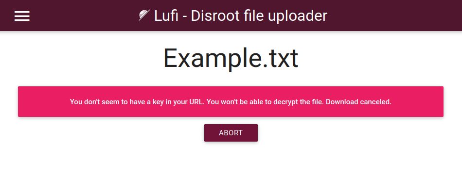
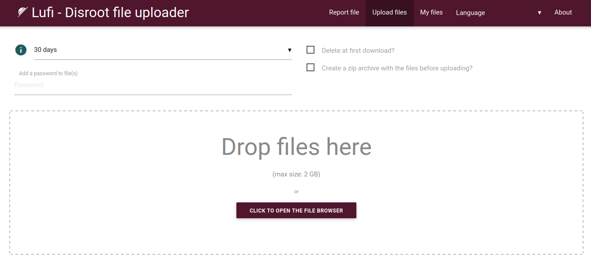
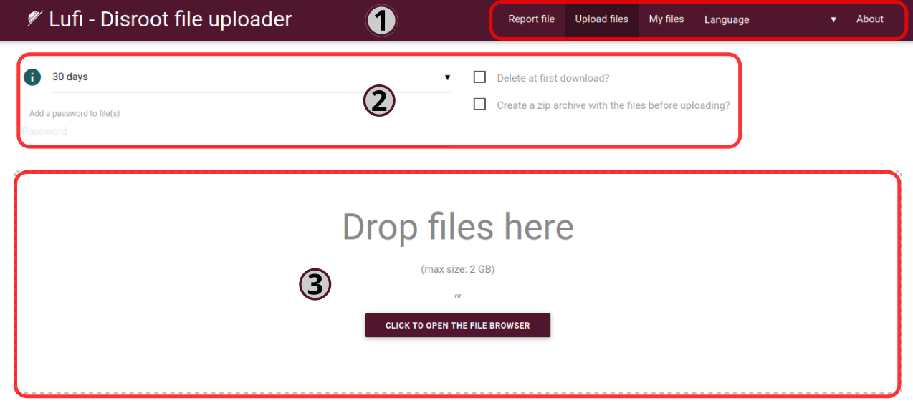
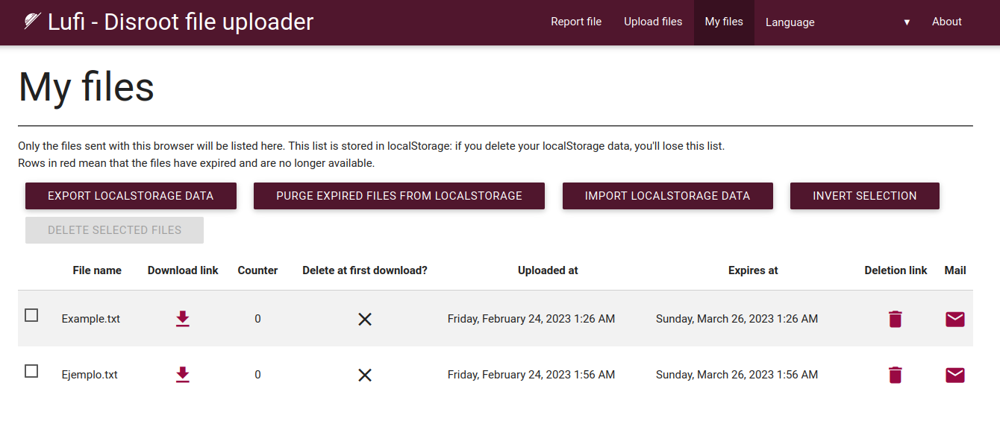
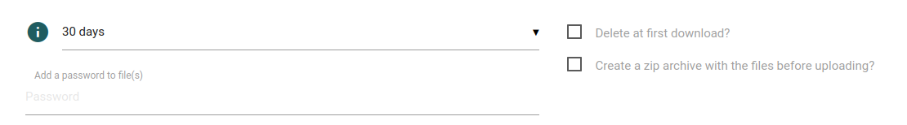
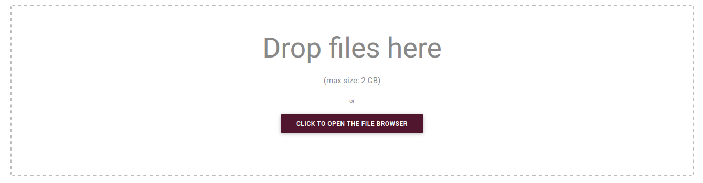
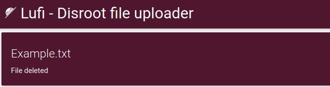
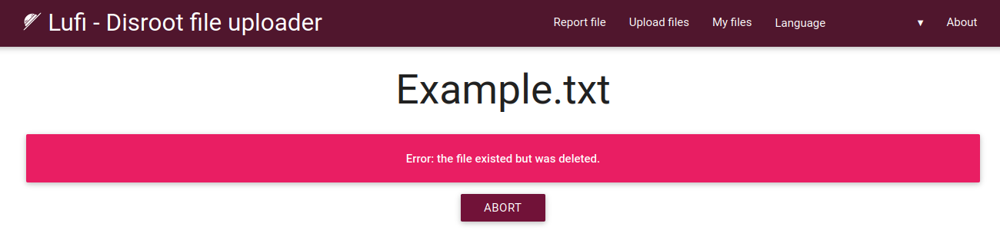
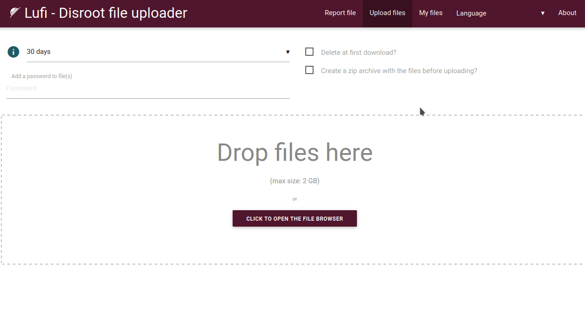
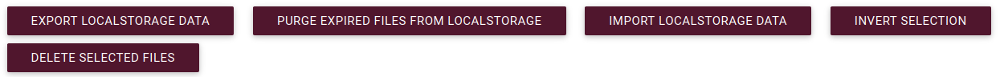

# Upload

**Disroot Upload** è un servizio di file hosting temporaneo basato su **Lufi**, un software online open source per caricare e condividere file in modo sicuro e privato con altre persone. Può essere considerato un'alternativa a servizi proprietari come WeTransfer.

**La registrazione non è necessaria per utilizzare questo servizio.**
# Come funziona?
Se abbiamo un file che vogliamo o dobbiamo condividere, basta trascinarlo e rilasciarlo nell'area di upload; il file viene smistato, crittografato e inviato al server. Otteniamo quindi due link per ogni file: un link per il download, da dare alle persone con cui vogliamo condividere il file, e un link per la cancellazione, che ci permette di eliminare il file quando vogliamo.

È veramente così semplice? Sì, lo è.

## Quanto è sicuro?

**Lufi** è un servizio di condivisione di file [**E2EE (End-to-End Encryption)**](https://en.wikipedia.org/wiki/End-to-end_encryption) che cripta i nostri file attraverso il browser web prima che lascino il nostro computer, quindi non solo il nostro **Internet Service Provider (ISP)** non può vedere il contenuto del file, ma nemmeno gli amministratori di **Disroot**. Gli amministratori possono solo vedere il nome del file, la sua dimensione e il suo [mimetype](https://en.wikipedia.org/wiki/MIME) (ch tipo di file è: video, testo, ecc.).  
Quando qualcuno scarica il nostro file, questo viene decifrato localmente nel browser della persona in questione dopo il download. Come abbiamo appena detto, né gli amministratori di rete né l'ISP potranno vedere il contenuto del file scaricato.

Ora vedremo degli esempi per:

   - **archiviare** (temporaneamente) i file online, scaricarli o condividerli con altre persone
   - **inviare** a qualcuno file che si cancelleranno dal server dopo il primo download.

!! #### NOTE  
!! **Upload** non è un servizio cloud in quanto i file vengono memorizzati online solo per un certo periodo di tempo, dopodiché vengono cancellati. Per i servizi cloud abbiamo il [**Disroot Cloud**](https://cloud.disroot.org). Si tratta inoltre di un servizio diverso da [**PrivateBin**](../03.Bin/docs.en.md/) in quanto può condividere solo testo, mentre **Upload** può essere utilizzato per condividere e scaricare qualsiasi tipo di file.

Si può leggere di più su **Lufi** [**qui**](https://git.framasoft.org/luc/lufi).

## Comprendere il processo di crittografia

L'intero processo di crittografia/decrittografia viene eseguito automaticamente dai browser, quindi non è necessario crittografare manualmente i file prima o decrittografarli manualmente al momento del download.

La chiave di crittografia (che consente a chi scarica il file di decifrarlo) fa parte del link che ci viene presentato dal browser dopo aver caricato un file.

Vediamo un esempio.

Di seguito è riportato un esempio di collegamento a un file in **Upload** (https://upload.disroot.org):

`https://upload.disroot.org/r/FA7MHOOL`**#**`AgsmqnJEyUZAcybZmOGKljqYRtDhJKsvZC/Qt05N8dE=`

Ha due componenti:

* A sinistra del simbolo **#** nel link si trova l'URL del file:
`https://upload.disroot.org/r/FA7MHOOL`

* A destra del simbolo **#** nel link si trova la **chiave di crittografia** del file:
`AgsmqnJEyUZAcybZmOGKljqYRtDhJKsvZC/Qt05N8dE=`

Questa parte di chiave di crittografia dell'URL è in realtà ciò che viene chiamato [**URI** fragment](https://en.wikipedia.org/wiki/URI_fragment), viene elaborata solo lato client (nel nostro computer) e non raggiunge il server del provider Lufi, che quindi non può decifrare il file.

In breve, **solo le persone in possesso del link completo saranno in grado di scaricare e decriptare il file.**

Se proviamo a usare solo `https://upload.disroot.org/r/FA7MHOOL` senza la seconda parte (la chiave di crittografia), otterremo un messaggio come questo:

OK. Vediamo come utilizzare il servizio **Upload**.

# L'interfaccia

L'interfaccia è abbastanza semplice.

##  1. Le opzioni della barra superiore

Qui sono disponibili le seguenti opzioni:

* **Segnala file**: per segnalare un file sospetto o illegale agli amministratori di **Disroot**. Facendo clic su questa opzione si aprirà una finestra di dialogo per scegliere il client di posta elettronica da utilizzare per inviare la segnalazione via e-mail.
* **Carica file**: la schermata principale predefinita con l'area di caricamento.
* **I miei file**: per controllare e gestire i file che abbiamo caricato (_lo vedremo in dettaglio più avanti_).

**Lingua**: per cambiare l'interfaccia della lingua.

## 2. Le opzioni di upload

In questa sezione si trovano le opzioni di caricamento in cui è possibile scegliere:

* per quanti giorni il file rimarrà online. Il massimo è 30 giorni (per i file più piccoli)**_;
* se vogliamo che il file venga cancellato dopo il primo download;
* se vogliamo che il file sia compresso in formato zip prima di caricarlo; e
* se vogliamo aggiungere una password al file.

## 3. L'area di upload

Qui si caricano i file trascinandoli e rilasciandoli. Possiamo anche farlo in modo tradizionale, aprendo il browser dei file e selezionando il file.

Il limite di dimensione dei file che possiamo caricare è di **2GB**. Il tempo massimo in cui un file rimane memorizzato online varia in base alle sue dimensioni. Una volta scaduto il tempo, il file viene eliminato.

Quindi, maggiore è la dimensione del file, minore è il tempo di archiviazione. Il tempo di scadenza dei nostri file sarà il minimo tra quello scelto e le seguenti limitazioni:

* tra 0 e 96MB, il file sarà conservato per 30 giorni
* tra 96MB e 954MB, il file sarà conservato per 15 giorni
* per 954MB e oltre, il file sarà conservato per 2 giorni

# Caricare e scaricare
Come già detto, dopo aver impostato le opzioni di caricamento (per quanti giorni rimarrà online, se cancellarlo o meno dopo il download e se sarà protetto da password) possiamo caricare i file trascinandoli nell'area di caricamento e rilasciandoli. Oppure possiamo scegliere di "cliccare per aprire il browser dei file", navigare fino al nostro file e selezionarlo.

Al termine del caricamento otterremo due link:

Il primo è il **Collegamento al download**, che è l'URL del file che possiamo condividere o scaricare.
* Il secondo è il **Collegamento di cancellazione** che ci permette di cancellare il file caricato sul server in qualsiasi momento. Per utilizzarlo basta incollarlo nel browser e premere "Invio" sulla tastiera.

Otterremo il seguente messaggio:

Se si elimina un file o la data di scadenza impostata è passata, chiunque cerchi di scaricare il file riceverà un messaggio come questo:

Avremo anche la possibilità di **copiare tutti i link negli appunti** (si consiglia di farlo e di salvarli da qualche altra parte) e di **inviare tutti i link via e-mail**.

# Condivisione di un file
Anche questo è molto semplice. Possiamo scegliere tra:

* copiare manualmente il link e incollarlo in un'e-mail, in un file di testo o in qualsiasi altra opzione; oppure

* inviarlo direttamente via e-mail da Upload.

Nel caso di quest'ultima opzione, basta fare clic sul pulsante **Invia tutti i link via e-mail**, scrivere l'indirizzo e-mail nella schermata successiva e (facoltativamente) un messaggio per il destinatario. Si noti che esistono due opzioni di invio:

* **Invia con questo server**: questa soluzione non è consigliata per motivi di sicurezza, perché se inviamo l'e-mail dal server del fornitore di servizi, i link saranno inviati prima a quel server e poi inviati dall'e-mail del fornitore, non da quella personale. Questo significa che i link completi potrebbero essere visti dagli amministratori del server e quindi sarebbero in grado di scaricare e decriptare i file. **Disroot** è un provider attento alla privacy, ma in linea di principio la pratica migliore per mantenere la nostra privacy al sicuro è evitare questa opzione.

* **Invia con il tuo client di posta**: se abbiamo un client di posta elettronica installato sul nostro computer o dispositivo (ad esempio Thunderbird, Evolution, ecc.), cliccando su questa opzione lo apriremo con l'e-mail pronta per essere inviata.

# Gestione dei file caricati
Possiamo gestire i nostri upload facendo clic sull'opzione **I miei file** nella barra superiore.

Qui possiamo vedere i file che abbiamo caricato e anche:

* vedere i link di download/cancellazione per ognuno di essi;
* vedere quali sono stati impostati per la cancellazione dopo il primo download;
* selezionare quelli che vogliamo cancellare dal server; oppure
* selezionare uno o più di essi per inviarli nuovamente via e-mail (come visto sopra).

Questo elenco di file caricati viene conservato localmente nel nostro browser utilizzando il ["_localStorage_"](https://ng-girls.gitbook.io/todo-list-tutorial/workshop-todo-list/local-storage) (archivio web locale) in un file [.json](https://en.wikipedia.org/wiki/JSON). Pertanto, se cancelliamo i dati di "localStorage" o utilizziamo un browser o un computer diverso, non potremo più accedervi.

Altre opzioni disponibili e utilizzabili in questa schermata sono:

3
**Esporta i dati di localStorage**: per scaricare il file .json contenente le informazioni sui file caricati sul nostro computer.
**Purge expired files from localStorage**: per cancellare le informazioni relative ai file scaduti dalla memoria locale del nostro browser.
* **Importa dati localStorage**: per importare un file .json precedentemente esportato nell'archivio locale del browser.
* **Elimina i file selezionati**: per rimuovere i file dal server.
