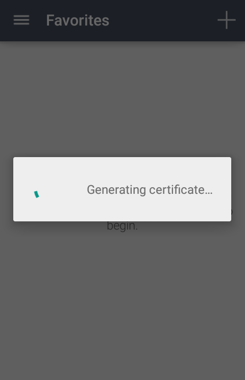
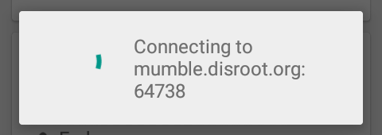
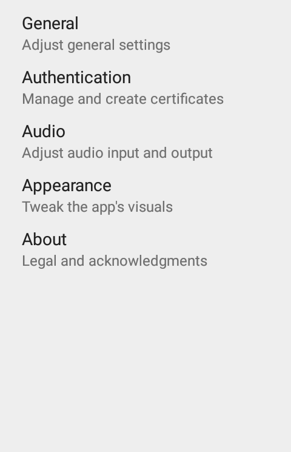
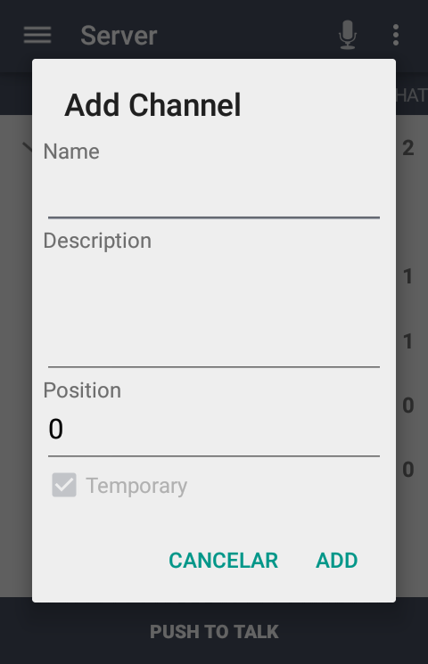

# Download and install

You can download and install **Plumble**, the movile app for **Mumble** from [**F-Droid**](https://f-droid.org/en/packages/com.morlunk.mumbleclient).

Please check for the latest version of **Plumble** (Version 3.3.0-rc1) since it has an **Import/Export Certificate** feature -which is very important- and better languages support.

# Previous Notes

**Mumble** software has some important Administration and Permissions features that can only be configured from the desktop application. **Access Control Lists** and **Groups** are examples of these missing features in **Plumble**.

To learn more about **ACL**, **Groups** and other **Mumble** settings, please check our [**Mumble** howto](../mumble).

----

# Configuration

When you first launch **Plumble**, a welcome message appears and you are required to generate a cerficate, which is what **Mumble** uses to identify you as user and avoid asking for username and password every time you log in.

If you already have a Certificate generated on another device (for example, the laptop via the desktop app) you can **import** it. You can also do it the other way around by **exporting** the Certificate generated on the mobile, for example, to a Mumble file that you can then import from another device or computer.

To learn more about Certificates on Mumble, please check [here](https://wiki.mumble.info/wiki/Mumble_Certificates)

Once the certificate has been generated, you will see the screen to add servers with the instructions to do it.

Fill in the fields with the following information:

1. **Label**: the name you want to use to identify the server in Plumble.
2. **Address**: the server address. For **Disroot**, it is *mumble.disroot.org*
3. **Port**: make sure the port number is **64738**.
4. **Username**: the username you want to use.
5. **Password**: a password for this user (not mandatory)

Tap on **ADD** to finish. Now you should see the server info.

You can add as many servers as you want. But **you cannot be connected to more than one server or channel at the same time**.

Tap on the server you want to join.

# Basic Settings and Usage

Now you are in. By tapping on the menu icon you can access some information about the servers and the applications settings.

## Settings
In the **Settings** section you will find the following adjustments:

### 1. **General**
Here you can set and configure notifications and connections settings
  - Chat notifications
  - Text-to-Speach
  - Load External Images
  - Auto Reconnect
  - Force TCP
  - Connect via Tor

### 2. **Authentication**
Certificates related and default username settings
  - Generate Certificate
  - Certificate
  - Import Certificate
  - Export Certificate
  - Clear Server Certificates
  - Default Username

### 3. **Audio**
Here is where you can configure and adjust the audio quality and settings
  - Transmit Mode (*we suggest you to use **Push to Talk** option*)
  - Handset Mode
  - Microphone Volume
  - Detection Threshold  
  - Push to Talk settings
    - Push to Talk key
    - Push to Talk Hot Corner
    - Push to Talk Sound
    - Hide Push to Talk Button
    - Toggle Push to Talk
  - Half Duplex Mode
  - Advanced and detailed audio settings
    - Input Sample Rate
    - Input Quality
    - Audio per packet
    - Enable Input Preprocessor
    - Disable Opus Codec

### 4. **Appearance**
You can choose Light or Dark themes for the app

### 5. **About**
**Plumble** information (Version, Contributors and Licenses)

## Other options
You can also set the way you prefer to handle the audio output, i.e. the behaviour of the microphone, among other options.

Tap the three dot icon menu in the right corner next to the microphone icon (1). The options are:
- **Transmit Mode**(2):
    - a. **Voice activity** - the microphone is activated when it detects the sound of the voice (3)
    - b. **Push to Talk** - the microphone is activated by pressing the Push to Talk button (3)
    - c. **Continuous** - the microphone remains activated whether you speak or not (3)
- **Deafen** - disable the listening
- **Search** - help find a channel
- **Bluetooth** - activates the Bluetooth connection
- **Disconnect** - disconnects you from the server

## Basic Usage

Once you have taken a look around and set the adjustments, you can join or create a channel to talk and/or chat.

### Joining a Channel

1. **Root** 
This is the server main space, where Channels lives.
2. **Channel** 
A channel is like a category and can contain several channels. In our example the server (Root) contains two channels: **Disroot** and **Quarantine hangout**. This is the place where the communication takes place.

Now, to joining a channel is simple as tapping the name (1) and then the arrow icon on the top bar (2)

### What if the channel is password protected?
If a channel is password protected you will need to create an **Access Token**.

Tap on the menu, up to the left (1), then tap **Access Token** (2) and finally write the password (3) and tap the plus icon (+) to add it.

You can now access to the password protected channel.

Remember that **you cannot be connected to more than one server or channel at the same time**

### Creating a Channel

Creating a channel is similar to joining one. By default, the channel you create will be temporary unless you register your user. Although you do not need to register to participate in a public channel, doing so allows you not only to keep the username you choose, but also to create permanent channels.

To register your user is really simple. Just long tap on your username and select **Register** when the options pop up. Remember that you already set the username and the password when you first launched **Plumble**.

Now, to create a channel:

1. Tap the channel where the new channel will be created (1) and the the three dots menu icon on the top bar (2)

2. Tap on **Add**

3. Fill in with the necessary information about the channel

- **Name**: the name of the channel you are creating
- **Description**: a brief description about the channel topic
- **Position**: the position in which the channel will appear on your channels list
- **Temporary**: When allowed by the server admins, you can select whether the channel will be permanent or temporary, that is, it will be deleted when the last user leaves it.
