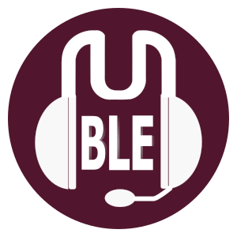

**Mumble** is an open source, low-latency, high quality voice chat software primarily intended for use while gaming, but that you can use for any audioconference / chatting.
 No user account is needed to use it.

## Several Clients
You can use Mumble from your desktop or from your phone.

### [Desktop: Mumble](mumble)
- Access channels from you desktop.

### [Android: Plumble](plumble)
- Access channels from you Android device.

### [iOS: Mumble](mumbleios)
- Access channels from you iOS device.
