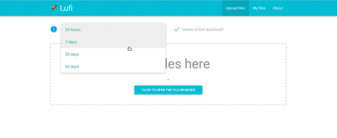
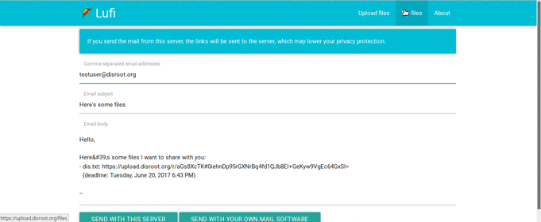
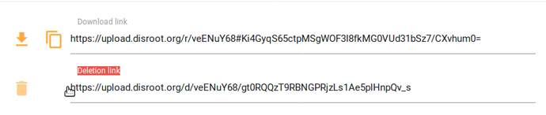
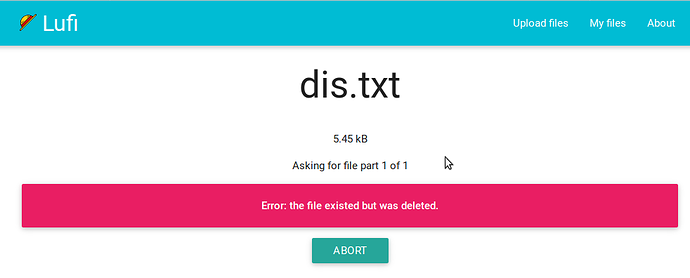

# Lufi/Upload
Lufi est un logiciel en ligne à code source ouvert permettant de télécharger et de partager des fichiers de manière sécurisée et privée avec d'autres personnes, comme alternative à des services tels que wetransfer.

Lufi travaille dans une logique de connaissance zéro.

Ce qui signifie que les fichiers sont chiffrés avant qu'ils ne quittent votre ordinateur, de sorte que votre fournisseur d'accès Internet et "l'administrateur de Disroot" ne peuvent pas voir le contenu du fichier. L'administrateur ne peut voir que le nom du fichier, sa taille et son type de mimetype (quel type de fichier c'est: vidéo, texte, etc.)".

**Vous "n'avez pas besoin de créer un compte pour téléverser des fichiers."**

Entre autres choses, vous pouvez l'utiliser pour:

   - Stockez (temporairement) des fichiers en ligne, les téléchargez les partagez avec d'autres personnes.
   - Envoyer des fichiers qui s'effaceront du serveur après le premier téléchargement

Dans ce tutoriel, nous allons vous montrer comment l'utiliser. Vous pouvez accéder à Uploads/Lufi sur [upload.disroot.org](https://upload.disroot.org)

!! 
!! REMARQUE: Lufi n'est pas un service cloud (les fichiers ne sont stockés en ligne que pendant un certain temps, après quoi ils sont supprimés). Pour les services cloud, vous avez votre [cloud](https//:cloud.disroot.org) fourni par disroot.    C'est différent de [PrivateBin](projects_office/bin/privatebin). PrivateBin peut seulement partager du texte, tandis que Lufi peut être utilisé pour partager et télécharger n'importe quel type de fichier.

# A quel point Lufi est sûr et comment ça marche

Lorsque vous utilisez Lufi pour téléverser des fichiers, "Tous les fichiers sont chifrés par votre navigateur! Cela signifie que vos fichiers ne quittent jamais votre ordinateur sans chiffrement. L'administrateur de l'instance Lufi que vous utilisez ne pourra pas voir ce qu'il y a dans votre fichier, ni votre administrateur réseau, ni votre FAI".

Lorsque quelqu'un télécharge votre fichier, il est décrypté localement dans le navigateur de cette personne après le téléchargement. Autrement dit, l'administrateur réseau ou le FAI ne pourra pas voir ce qu'il y a dans le fichier téléchargé.

Pour en savoir plus [ici](https://git.framasoft.org/luc/lufi).

L'ensemble du processus de chiffrement / déchiffrement est effectué automatiquement par les navigateurs, donc pas besoin de chiffrer manuellement les fichiers avant, ou de déchiffrer manuellement au téléchargement.

La clé de chiffrement (la chose qui permet à quiconque télécharge le fichier de le déchiffrer) fait partie du lien qui vous est présenté par votre navigateur après que vous ayez téléchargé un fichier.

C'est une ancre (Cf. Identificateur de Fragment). Cela signifie que cette partie (la clé de chiffrement) est uniquement traitée côté client (dans votre ordinateur) et n'atteint pas le serveur de votre fournisseur Lufi, ils ne peuvent donc pas déchiffrer le fichier.

**Seules les personnes qui ont le lien complet pourront télécharger et déchiffrer le fichier.**

Par exemple, il s'agit d'un lien vers un fichier dans upload.disroot.org:

[https://upload.disroot.org/r/FA7MHOOL#AgsmqnJEyUZAcybZmOGKljqYRtDhJKsvZC/Qt05N8dE=](https://upload.disroot.org/r/FA7MHOOL#AgsmqnJEyUZAcybZmOGKljqYRtDhJKsvZC/Qt05N8dE=)

Il comporte deux volets:

* A gauche du symbole **#** dans le lien se trouve l'URL du fichier:
"https://upload.disroot.org/r/FA7MHOOL"

* A droite du symbole **#** dans le lien se trouve la clé de chiffrement du fichier:
"#AgsmqnJEyUZAcybZmOGKljqYRtDhJKsvZC/Qt05N8dE="

Si vous essayez juste d'utiliser [https://upload.disroot.org/r/FA7MHOOL](https://upload.disroot.org/r/FA7MHOOL) sans la deuxième partie, vous obtiendrez ce message:

# L'interface

L'interface est assez simple, quand vous téléverser un fichier, vous avez les options suivantes:

* Choisissez combien de jours il reste en ligne. **Le maximum est de 60 jours, (pour les petits fichiers)**
* Choisissez si vous voulez que le fichier soit supprimé après son premier téléchargement.

Dans la partie centrale supérieure du panneau, vous pouvez régler les options mentionnées ci-dessus. Dans la partie en haut à droite vous avez le menu pour aller dans "Mes fichiers" et gérer vos téléversements. Le centre est l'endroit où vous téléversez vos fichiers.

# Taille maximale du fichier

Il n' y a pas de limite de taille pour les fichiers que vous pouvez téléverser. Mais le temps maximum qu'un fichier reste stocké dans Lufi varie en fonction de sa taille. Après ce délai, le fichier est supprimé.

Les fichiers volumineux seront stockés pour une durée plus courte. "Le délai d'expiration de votre fichier sera le minimum entre ce que vous choisissez et les limitations suivantes":

* entre 0 et 48M, le fichier sera conservé 60 jour (s).
* entre 48M et 96M, le dossier sera conservé 30 jour (s).
* entre 96M et 954M, le dossier sera conservé 15 jour (s).
* pour 954M et plus, le dossier sera conservé 2 jour (s)

Vous pouvez également vérifier ces informations à tout moment en appuyant sur le bouton  dans l'interface principale de Lufi.

# Comment téléverser et télécharger un fichier

Pour téléverser un fichier, il vous suffit de choisir les options que vous souhaitez (supprimer après le téléchargement ou non, combien de jours il reste en ligne) et "cliquez pour ouvrir le navigateur de fichiers" au centre de l'écran, et naviguez jusqu'à votre fichier et sélectionnez-le, ou faites simplement glisser votre fichier au centre de l'écran.

Une fois le transfert terminé, votre navigateur vous présentera le lien (URL et clé de chiffrement) du fichier transféré, copiez-le ailleurs.

Vous obtiendrez également le lien de suppression qui vous permet de supprimer le fichier transféré du serveur à tout moment.

Pour télécharger le fichier, il suffit d'utiliser le lien dans le navigateur:

# Comment partager un fichier

Eh bien, c'est aussi très simple, vous pouvez soit:

* Copiez le lien manuellement vers votre email ou un fichier texte, ou toute autre option

* l'envoyer directement par email à Lufi

Pour la dernière option (si vous avez un client de messagerie électronique dans votre machine, par exemple Thunderbird, Evolution, etc.) cliquez simplement sur le bouton , une fois votre fichier téléversé avec succès. Écrivez l'adresse e-mail et le texte, puis appuyez sur . Votre client de messagerie apparaîtra avec l'email prêt à être envoyé.

**L'option**  **ne devrait pas être utilisé par principe.**

La raison en est que, si vous utilisez cette option, le lien est envoyé en utilisant un email de votre fournisseur Lufi, pas votre email personnel. Ce qui signifie que les administrateurs de l'instance Lufi peuvent voir le lien complet, et sont donc capables de le télécharger, et de le déchiffrer s'ils le souhaitent.

Disroot est un fournisseur soucieux de la vie privée, mais par principe vous devriez éviter de faire cela.  

# Comment gérer/supprimer vos téléversements

Vous pouvez gérer vos envois en appuyant sur le bouton  dans le panneau principal.

Vous y verrez tous vos téléchargements et vous pourrez:

* Voir les liens de téléchargement de tous vos envois
* Voir lesquels ont été effacés après le premier téléchargement
* Choisir les envois que vous voulez supprimer du serveur

 Cette liste de téléversements est conservée localement dans votre navigateur dans un fichier. json. Ce qui laisse un enregistrement dans votre navigateur des fichiers que vous avez téléversés. Ainsi, vous ne pourrez pas voir la liste de vos fichiers transférés lorsque vous utilisez un navigateur ou un ordinateur différent.

Si vous le souhaitez, vous pouvez également dans ce panneau:

* Purgez cette information du stockage local de votre navigateur (cela effacera les informations des fichiers envoyés et leurs liens de votre navigateur, mais il ne supprimera pas les fichiers du serveur, et le lien est toujours valide)

* Exportez sur votre ordinateur le fichier json contenant les informations suivantes

* Importez dans votre navigateur un fichier json contenant des informations sur les envois et les liens.

Une autre façon de supprimer un fichier du serveur à tout moment est d'utiliser le lien de suppression, fourni lorsque vous transférez le fichier pour la première fois. Copiez-le et conservez-le dans un fichier texte pour la prochaine fois où vous voudrez l'utiliser.
Pour l'utiliser, il suffit de le mettre dans votre navigateur et d'appuyer sur Entrée.

Si vous supprimez un fichier ou si la date d'expiration définie est dépassée, tous ceux qui tentent de télécharger le fichier verront un message comme celui-ci:

