# Download

Download Mumble [here](https://www.mumble.info/downloads/) and install it.

# First settings
The first time you launch Mumble, a wizard will pop up to help you configure your audio and mic. If not, click on **Configure** and select **Audio wizard**.

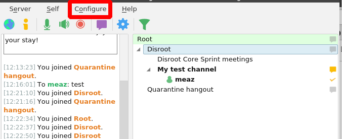

Here is the **Audio wizard** first page.

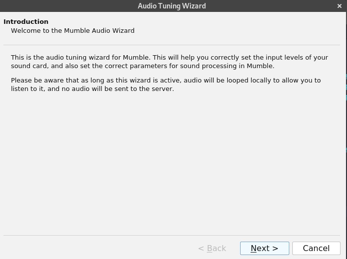

 
Default installation settings should be enough except for:
- Voice activity detection for which it is advisable to use a key to speak as voice detection parameter. This setting is called **Push To Talk**. Just click in the white box and press the key you want to use. In this example, it is set for **space**.

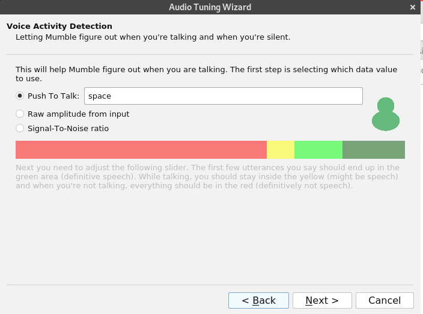

- Choose **Disable Text-To-Speech...** to disable the voice synthesis. Text-to-speech is the voice output of Mumble's Instant Messenger messages, which can be disruptive when chatting.

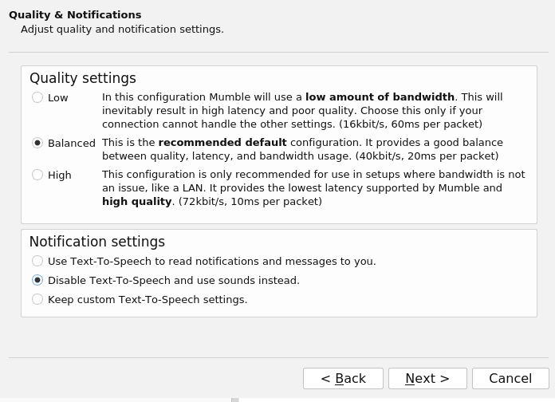

- **We strongly suggest to use headphones** for a better audio experience. If so, check the **Use headphones** box.

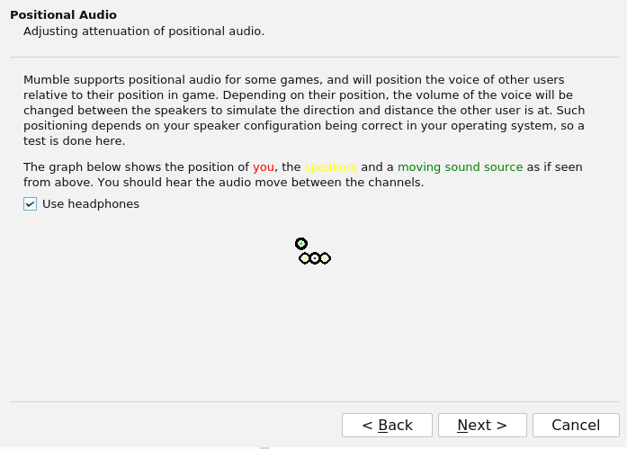

# Server config
You should see this:

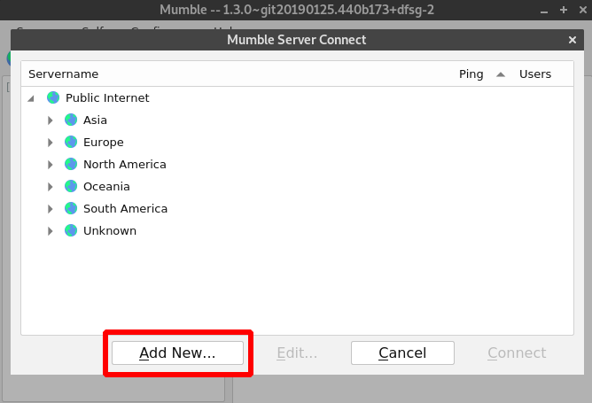

Click on **Add New**.

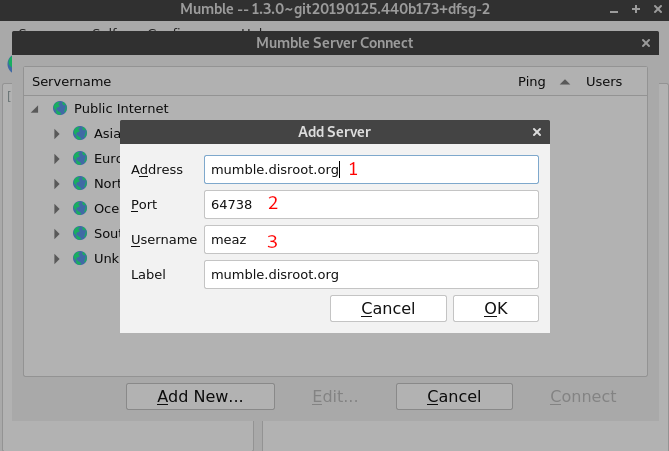

1. **Address**: the server address. For **Disroot**, it is *mumble.disroot.org*
2. **Port**: make sure the port number is **64738**.
3. **Username**: whatever you want!
4. **Label**: the name you want to use to identify the server in your client.

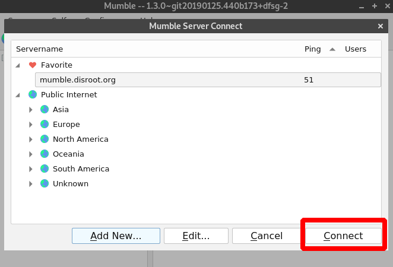

Now, just select the **mumble.disroot.org** server and click on **Connect**.

You're in!

# Join a channel
**Root** displays the list of channels on the choosen server. As you can see on the image, there are two channels at the moment: **Disroot** and **Quarantine hangout**.

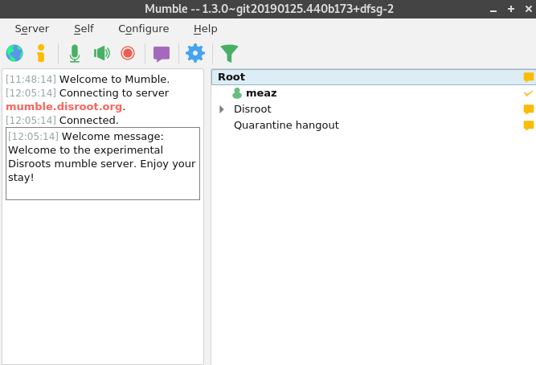

To join **Quarantine hangout** for example, right click on it and choose **Join Channel**

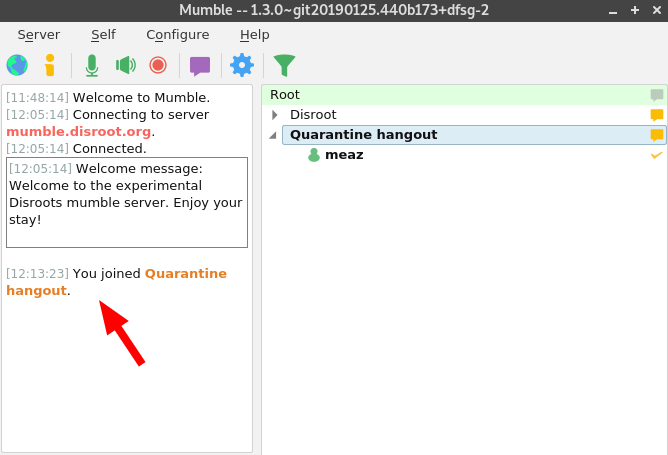

Now you can see your username under the joined channel. You can also see on the left a message saying that you joined **Quarantine hangout** channel.

!! You can only be connected to one channel at once. So if you join another channel, you'll automatically leave the one you're in.

## And if the channel is password protected?
If a channel is password protected, you need to create an **Access tokens**. To do so, click on **Server** and choose **Access tokens**.

There, simply write down the password, validate by pressing enter and then click on **OK**.
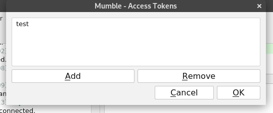

You can know access the password protected channel.

# Create a channel
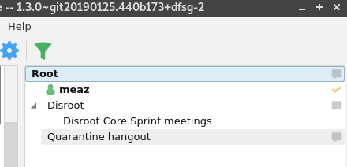

You can create a channel in different places:
- In **Root**, this is the case here of  **Disroot** and **Quarantine hangout**.
- In another channel, for example here, in the **Disroot** channel, there is another channel called **Disroot Core Sprint mettings**.

So as you can see, Mumble channels can be organized hierarchically. Channels can have "Children", "Parents", and "Siblings". This can go on for several "Generations", so that one channel can be a child of a channel and it can also be the parent of other channels. The depth of this parents/children hierarchy is endless.

To create a channel, just right click where you want to create your channel: **Root** or another channel name, for example in **Disroot** or whatever channel you want.

Choose **Add...**.

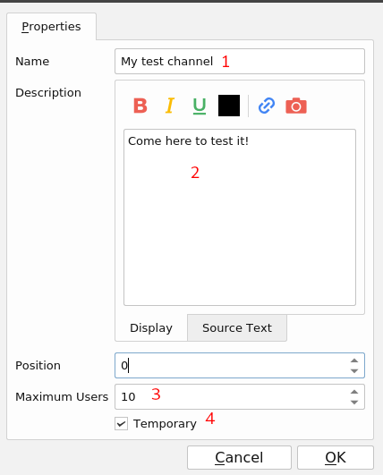

1. **Name**: your channel name.
2. **Description**: if you want to add a description of your channel. It is not mandatory.
3. **Maximum Users**: it seems pretty obvious. It is the maximun amount of users the room can host.
4. **Temporary**: if checked, the channel is destroyed the moment the last user leaves it. Otherwise, it stays there until you decide to remove it. *Note**: this option is availble only if you're a registered user (see below).

Keep in mind that when you create a channel, you automatically become its admin.

## Add a password to your channel
At the moment, anyone connected can access to your channel. To add a password to your channel, first create your channel, and then, right-click on its name and choose **Edit...**

You now have the option to add a password:
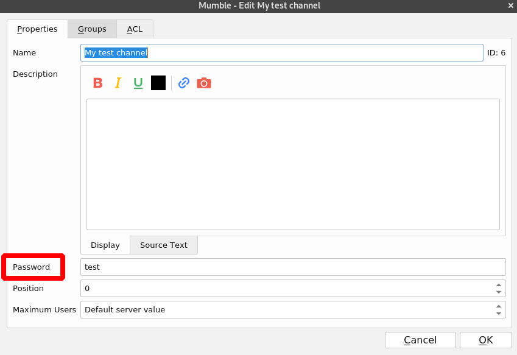

Note: you can also configure groups and ACL instead of setting a password (see below).

# More advanced settings

## Certificate
Mumble uses certificates for authentication. This allows a user to authenticate to a protected server without entering a password.
The certificate is automatically created when you first join a server. It is very important that you save this certificate so that you can log in with the same username on another device.

To save your certificate, click on  **Configure** and choose **Certificate wizard**.

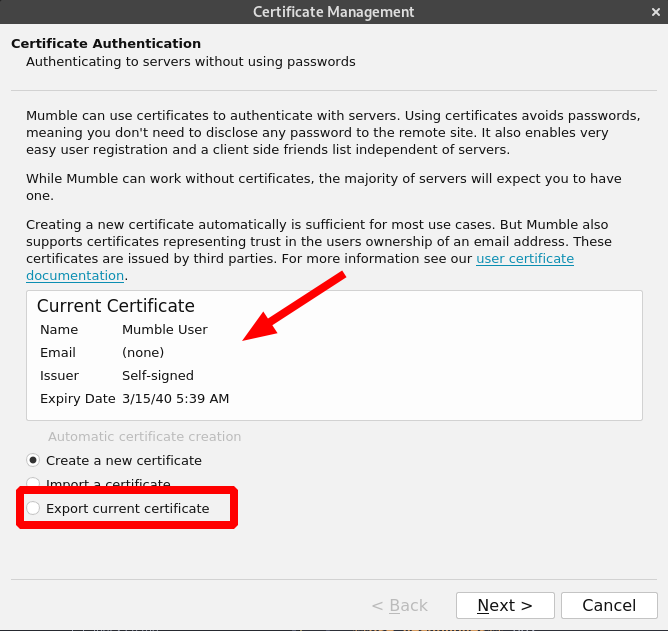

You can see here your certificate, which is self-signed.

Just click on **Export current certificate** to save it on your computer.

## Register your username
Once connected to a server, you can register your username which creates a unique account linked to your user certificate. No one will be allowed to use your username, it will be just yours.

To register your username on a server:
- Connect to the Mumble server you wish to register with.
- Right-click on your username in the list of channels.
- Choose **Register...**

Attention: after registering you can not change your username or unregister it.

## Groups
You can create groups of users. This is useful if you want to then create specific permissions.

Right-click on the channel you want to create groups for, and choose **Edit...** and go on the **Groups** pannel.
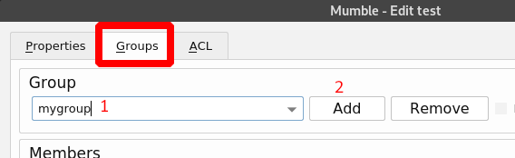

1. Write down the name of the group you want to create.
2. The **Add** button will then be available, so click on it.

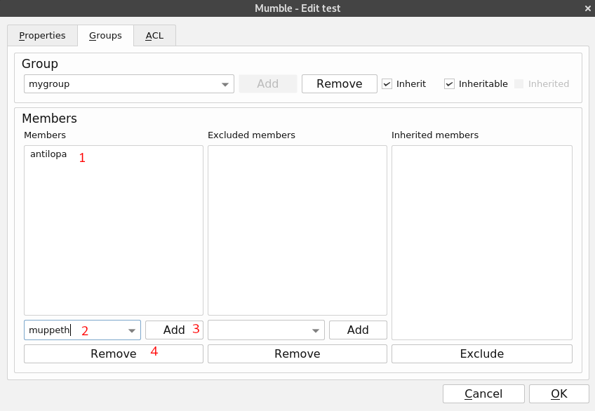
You then add members to your group. For example here, (1) antilopa is a member of the mygroup group.
To populate your group:
2. Write down the name of the user you want to add. Note: only registered users can be added to groups.
3. Click on **Add**.
4. Select a member and click on **Remove** if you want to remove it from the group.

## Groups and ACL: manage permissions

### Presentation

You can set specific permission to your channels, groups and users. To do that, right-click on the channel you want to create ACL for, and choose **Edit...** and go on the **ACL** pannel.
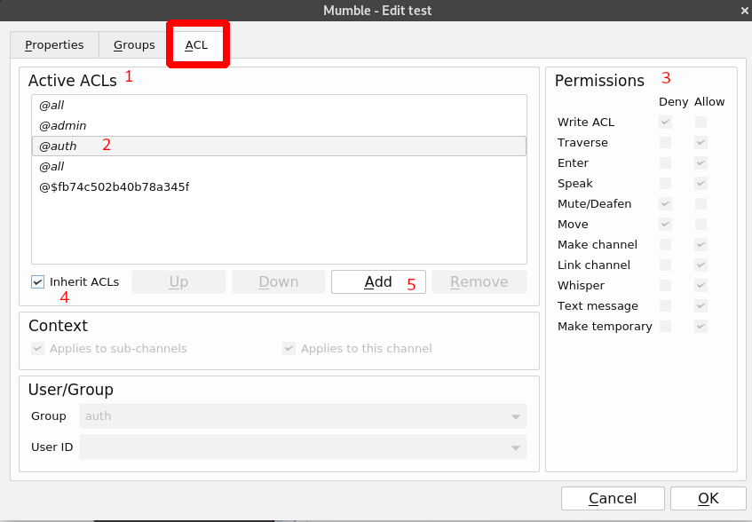
1. Here is the list of Active ACLs. The first ones are inherited from the server config and from parent channel. It is important to understand that the ACLs under are more important than the one above. So here for example, *@$fb7...* is more important than *@all*.
2. Select of the ACL to check the list of permissions
3. Here is the list of permissions set for **@auth** ACL. As you can see, some are denied, others are allowed.
4. You can decide by unchecking this box that you don't want to keep the inherited ACL's
5. Click on **Add** to add specific permission to users or groups.

### Permissions explanation
- **Write ACL**: gives total control over the channel including changing the ACLs.
- **Traverse**: without this privilege, a player will be unable to access the channel or any subchannels in any way, regardless of privileges in the subchannel. Don't deny this unless you really know what you're doing; you can probably achieve the effect you want by denying a player the *Enter* privilege.
- **Enter**: allows to enter a channel.
- **Speak**: allows to transmit audio into the channel.
- **Mute/Deafen**: allows to mute or deafen another user.
- **Move**: allows to move a user to or from a channel.
- **Make Channel**: allows to create channels.
- **Link Channel**: allows to link a channel. A linked channel will mirror audio broadcast into one channel into the linked channel (so if channel 1 and channel 2 are linked, you can hear audio from channel 2 if you're in channel 1).
- **Whisper**: allows to whisper to other users.
- **Text Message**: allows send text messages to other users.
- **Make temporary**: allows to make a temporary channel that disappears when all users leave the channel.

### Add permissions to users or groups
You have some default groups:

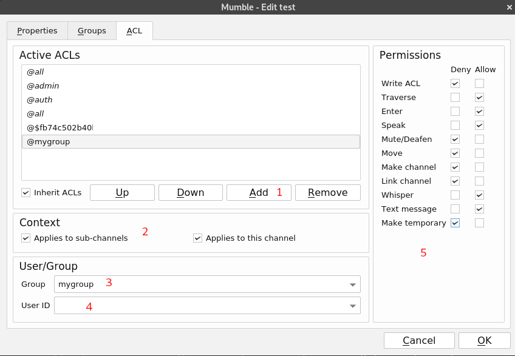

To set permissions:
1. Click on **Add**
2. Change the **Context** , for example if you want your permissions to apply to any sub-channels or to this channel only.
3. Either select your **Group**
4. Or select the **User ID** if you want to apply permissions to a specific user.
5. Set the **Permissions** as you want and click on **OK**.

A new rule will overwrite the inherited one, because inherited rules are always put at top, and a new one on the bottom. So for exemple if you have a top rule set for @all to allow enter, but then in the bottom a @all rule that deny enter, then no one will be allow to enter your channel.
You can move rules up and down using the **Up** and **Down** buttons.

The default groups are:
- *all*: everybody using this channel by any means
- *admin*: people with administrative authority for this channel
- *auth*: people that registered onto the server
- *in*: everybody tuned to this channel
- *sub*: everybody in a channel with parent or ancestor in common with this channel.
- *out*: everybody NOT tuned to this channel
- *~in*
- *~sub*
- *~out*

The tilde ("~") character limits the associated group to the channel in which it is defined, eliminating any effect of inheritance or links.

- The string (*$fb74c...* in this example) is the channel creator id.
- *#test*: the channel, here the *test* channel.

To know more about how to set groups and ACL, check this [howto](https://wiki.mumble.info/wiki/ACL_and_Groups) and this [video](https://www.youtube.com/watch?v=VOeMsMjQRoM)
