# Descarga

Descarga **Mumble** desde [aquí](https://www.mumble.info/downloads/) e instálalo.

# Primeras configuraciones
La primera vez que inicias **Mumble**, un asistente aparecerá para ayudarte a configurar el audio y el micrófono. Si no es así, haz en **Configurar** y selecciona **Audio wizard**.

Esta es la primera página del **Audio wizard** (Asistente para el ajuste de Audio).

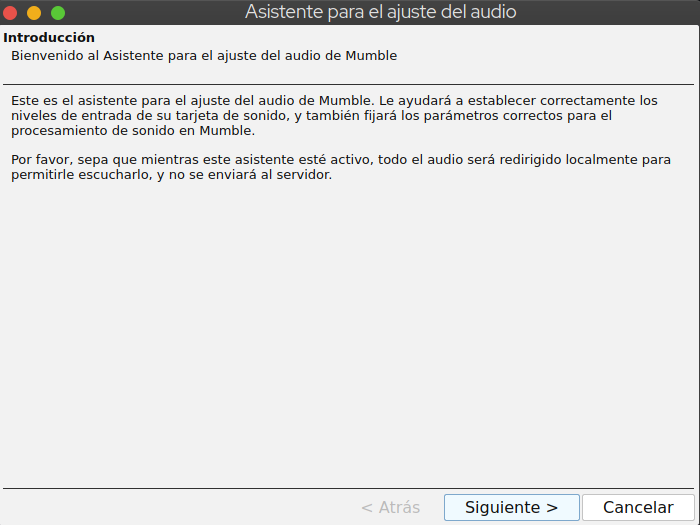

 
Los ajustes por defecto de la instalación deberían ser suficientes excepto por:

- **Detección de la Actividad Vocal**, para el cual es recomendable utilizar una tecla como parámetro para hablar. Esta configuración se llama **Presionar para Hablar**. Solo haz click en el campo en blanco y presiona la tecla que quieras utilizar. En este ejemplo, está establecida la **barra espaciadora**.

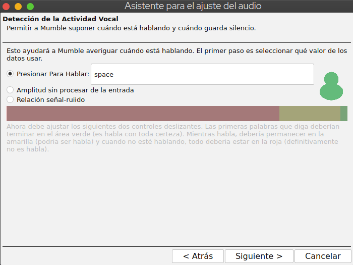

- Selecciona **Inhabilitar Texto-A-Voz** para desactivar la síntesis de voz. Texto-A-Voz es la salida de voz de los mensajes de texto del Mensajero Instantáneo de **Mumble** y puede ser molesto cuando estás chateando.

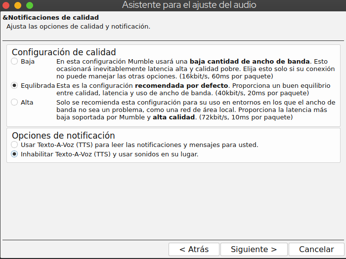

- **Sugerimos enfáticamente el uso de auriculares** para una mejor experiencia de audio. Si lo haces, marca la casilla **Usar auriculares**.

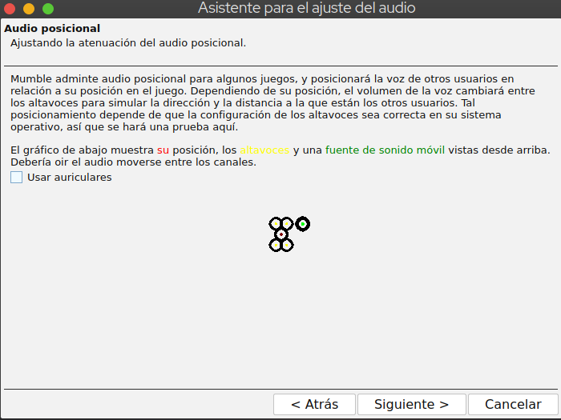

Bien, ahora **Siguiente** para finalizar el ajuste del audio.

# Configuración del Servidor
Deberías ver una pantalla como esta:

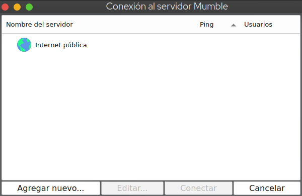

Haz click en **Agregar nuevo...**

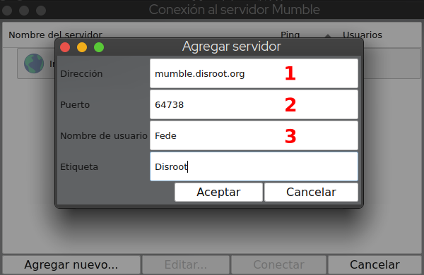

1. **Dirección**: la dirección del servidor. Para **Disroot**, es *mumble.disroot.org*
2. **Puerto**: asegúrate que el número del puerto sea **64738**
3. **Nombre de usuario**: el que quieras
4. **Etiqueta**: el nombte que quieras utilizar para identificar el servidor en tu cliente.

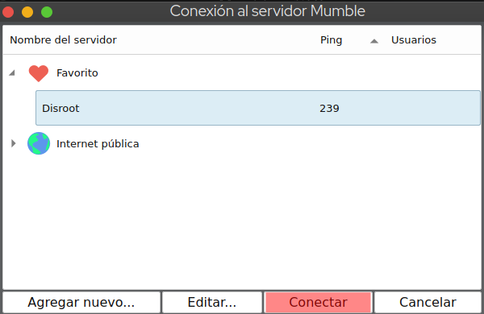

Ahora, simplemente selecciona el servidor **Disroot** y haz click en  **Conectar**.

¡Listo! ¡Ya estás dentro!

# Unirse a un Canal
**Root** muestra la lista de canales en el servidor elegido. Como puedes ver en la imagen de abajo, hay varios canales en este momento: **Disroot**, **Quarantine hangout**, **HG** y uno de prueba.

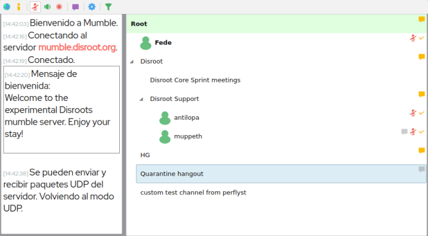

Para unirte a **Quarantine hangout**, por ejemplo, haz click derecho sobre el nombre del canal y selecciona **Unirse al canal**.

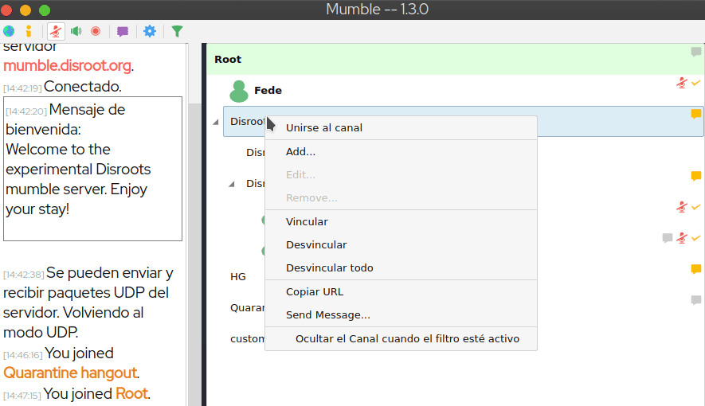

Ahora puedes ver tu nombre de usuarix debajo del canal al que te has unido. También puedes ver que a la izquierda aparece un mensaje que informa que te has unido al canal **Quarantine hangout** (1).

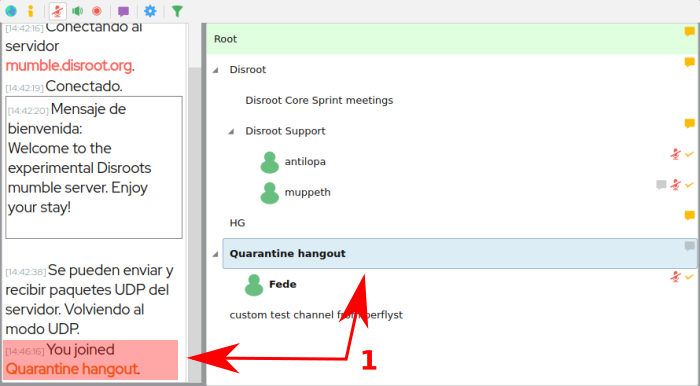

!! Solo puedes estar conectadx a un canal a la vez. Así que si te unes a otro canal, automáticamente dejarás el que estás. !!

## ¿Qué pasa si un canal está protegido con contraseña?
Si un canal está protegido con contraseña, necesitas crear una ficha de acceso o **Access tokens**. Para hacerlo, haz click en el menú **Servidor** (1) y elige **Access tokens**. Luego selecciona **Agregar** (2), escribe la contraseña (3), valídala presionando Enter y finalmente haz click en **Aceptar** (4).

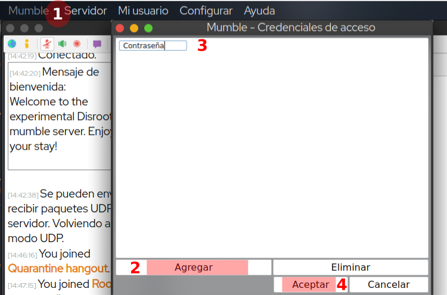

Ahora puedes unirte a un canal protegido con contraseña.

# Creando un canal
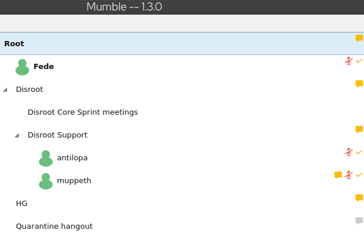

Puedes crear canales en diferentes lugares:
1. En **Root**, este es el caso aquí, por ejemplo, de **Disroot**, **Quarantine hangout** y **HG**.
2. En otro canal, en el ejemplo de arriba, dentro del canal de **Disroot**, hay otros llamados **Disroot Core Sprint mettings** y **Disroot Support**.

Como puedes ver, los canales de **Mumble** se pueden organizar jerárquicamente. Los canales pueden tener "Hijxs", "Padres", y "Hermanxs". Esto puede seguir por "Generaciones", y así, por ejemplo, un canal puede ser hijx de otro canal y este a su vez ser el padre de otros canales. La extensión de esta jerarquía padres/hijxs es infinita.

Para crear un canal, solo haz click derecho en el nombre del lugar donde quieres crearlo: dentro de **Root** o de otro canal, por ejemplo, en **Disroot**.

Selecciona **Add...** (Agregar).

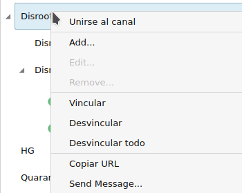

Se abrirán las **Propiedades** del canal que quieras a crear.

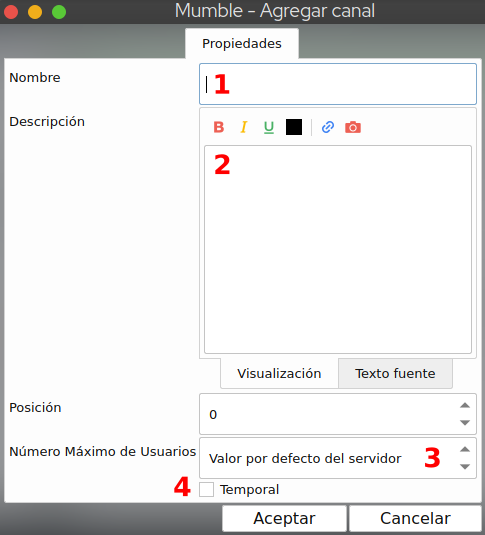

1. **Nombre**: el nombre de tu canal
2. **Descripción**: puedes agregar una descripción sobre el canal. No es obligatorio.
3. **Número Máximo de Usuarios**: parece bastante evidente. Es la cantidad máxima de usuarixs que el canal puede albergar.
4. **Temporal**: si está marcado, el canal es destruido luego que el último o última usuarix lo abandona. Si no está marcado permanece ahí hasta que decidas quitarlo. ***Aviso***: esta opción está disponible solo si eres usuarix registradx (ver más adelante).

Ten presente que cuando creas un canal, automáticamente te conviertes en su Administrador.

## Agregando una contraseña a tu canal
De momento, cualquiera que esté conectadx puede acceder a tu canal. Para protegerlo con una contraseña, primero créalo, luego haz click derecho sobre él y elige **Edit...** (Editar)

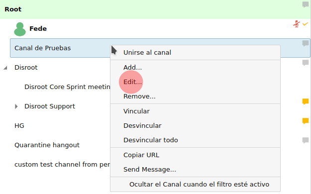

Ahora podrás establecer la contraseña:

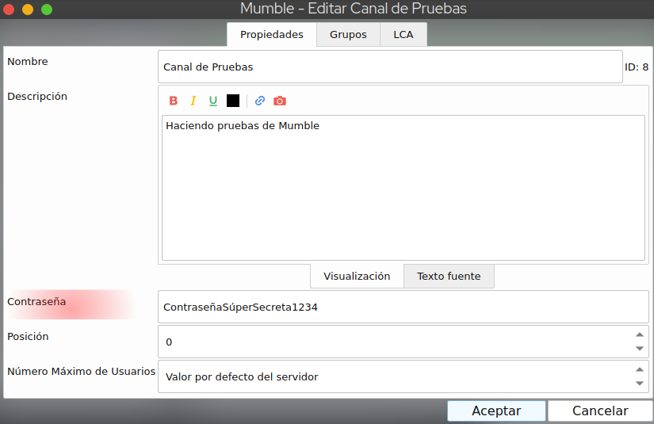

**Aviso**: también puedes configurar grupos y Listas de Control de Acceso (LCA) en lugar de establecer una contraseña (ver más adelante).

# Más configuraciones avanzadas

## Certificado
**Mumble** utiliza certificados como método de validación. Esto permite autentificar usuarixs en servidores protegidos sin necesidad que ingresen una contraseña. 
El certificado es generado automáticamente cuando te unes por primera vez al servidor. Es muy importante que guardes este certificado así puedes conectarte con el mismo nombre de usuarix en otro dispositivo.

Para guardar el certificado, haz click en  **Configurar** y selecciona **Certificate wizard** (Gestión de certificados).

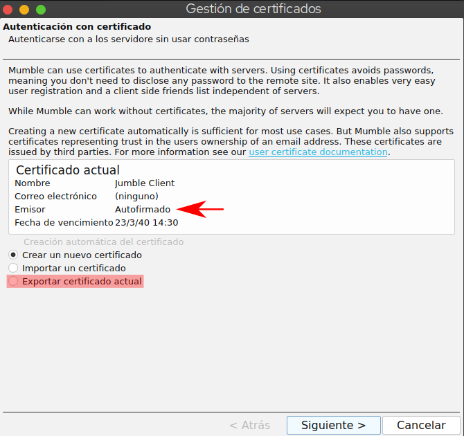

Aquí puedes ver tu certificado, que está autofirmado.

Haz click en **Exportar certificado actual** para guardarlo en tu computadora.

## Registrando tu usuarix
Una vez conectadx al servidor, puedes registrar tu nombre de usuarix, lo que crea una cuenta única vinculada a tu certificado de usuarix. Nadie podrá utilizar tu nombre de usuarix, será solo tuyo.

Para registrar tu usuarix en el servidor:
- Conectate al servidor **Mumble** en el que quieras registrarte.
- Haz click derecho sobre tu nombre de usuarix en la lista de canales.
- Selecciona **Registrar...**

!! ATENCIÓN: después de registrarte no puedes cambiar tu nombre de usuarix o darte de baja. !!

## Grupos
Puedes crear grupos de usuarixs. Esto es útil si quieres crear permisos específicos.

Haz click derecho sobre el canal en que quieras crear grupos y selecciona **Edit...** (Editar)

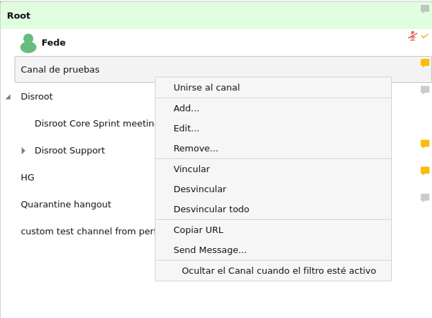

1. Selecciona la pestaña Grupos
2. Escribe el nombre del grupo a crear (1)
3. Ahora el botón de **Agregar** será habilitado, haz click en él (2).

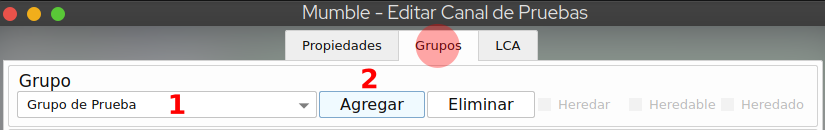

Ahora puedes agregar miembros a tu grupo. En el ejemplo de aquí, (1) Muppeth es un miembro del grupo "grupo de pruebas.

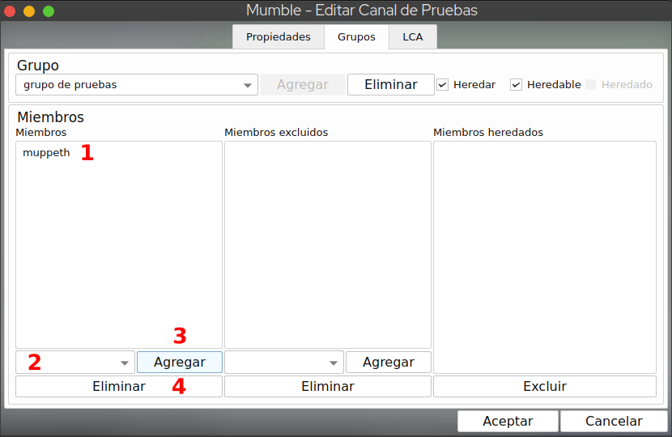

Para ingresar usuarixs a tu grupo:

1. Escribe el nombre de usuarix de la persona que quieras agregar (2). **Aviso**: solo lxs usuarixs registradxs pueden ser agregadxs a los grupos
2. Haz click en **Agregar** (3)
3. Para eliminar a un o una miembro de un grupo, selecciona su nombre de usuarix y luego click en **Eliminar** (4)

## Grupos y LCA: gestionando permisos

**Lista de Control de Acceso (LCA)** es una lista de reglas que permiten acceso con algunas restricciones. La mayoría de las veces, estas reglas serán "heredadas" del canal "padre". Los administradores de **Mumble** pueden modificar la LCA (eliminar/modificar las existentes o agregar nuevas).

Los **Grupos** son definidos o limitados por el alcance de las reglas en la **LCA**. Cada regla en cada LCA opera sobre ciertos grupos de usuarixs para garantizar o limitar lo que puede hacerse en un canal de **Mumble**. Así que es importante comprender qué son los **Grupos** en **Mumble** antes de crear las LCAs.

### Presentación

Puedes establecer permisos específicos para tus canales, grupos o usuarixs. Para hacerlo, haz click derecho en sobre canal en el que quieras crear una LCA, y elige **Edit...** (Editar) y ve a la pestaña **LCA**.

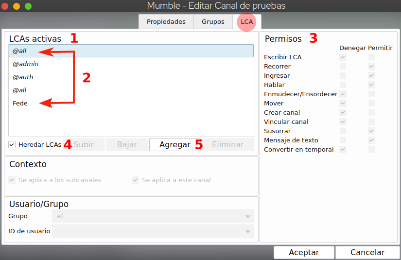

1. **LCAs Activas**: aquí se ven las listas activas. Las primeras son heredadas de la configuración del servidor y del canal padre. Es importante entender que las LCAs que están abajo tienen más importancia que las de arriba. En el ejemplo de la imagen, *Fede* es más importante que *@all*
2. Selecciona una de las LCA para verificar la lista de permisos
3. **Permisos**: aquí ves los permisos establecidos en una LCA. En el ejemplo de la imagen, se observan los permisos de correspondientes a la LCA **@auth**. Como puedes ver, algunos están denegados y otros permitidos
4. Puedes decidir desmarcar esta opción si no quieres mantener las LCAs heredadas
5. Haz click en **Agregar** para introducir permisos específicos para usuarixs o grupos.

### Permisos explicados
- **Escribir LCA**: otorga control total sobre el canal incluyendo cambiar las LCAs.
- **Recorrer**: lxs usuarixs sin este privilegio no podrán acceder al canal o cualquier subcanal de ningura manera, independientemente de los privilegios que tengan asignados los subcanales. No lo deniegues a menos que sepas realmente lo que estás haciendo; probablemente podrías lograr un efecto similar denegando en su lugar el permiso *Ingresar*.
- **Ingresar**: permite el acceso a un canal.
- **Hablar**: permite transmitir audio en el canal.
- **Enmudecer/Ensordecer**: permite enmudecer o ensordecer a otrx usuarix.
- **Mover**: permite mover usuarixs de un canal a otro.
- **Crear canal**: permite crear canales.
- **Vincular canal**: permite vincular a un canal. Un canal vinculado recibe el audio emitido en otro canal. Por ejemplo, si los canales 1 y 2 están vinculados, puedes escuchar el audio del canal 2 aún si estás en el canal 1).
- **Susurrar**: permite susurrar a otrxs usuarixs.
- **Mensaje de texto**: permite el envío de mensajes de texto a otrxs usuarixs.
- **Convertir en temporal**: permite crear un canal temporal que se destruye cuando todxs lxs usuarixs dejan el canal.

### Agregar permisos a usuarixs o grupos

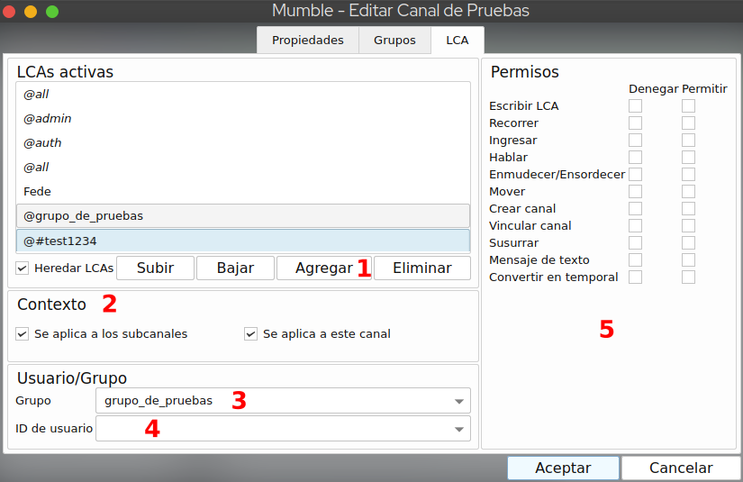

Para establecer permisos:
- Haz click en **Agregar** (1)
- En **Contexto** (2) puedes elegir que los permisos apliquen a cualquier subcanal o a este canal solamente.
- En **Usuario/Grupo** puedes seleccionar que apliquen por **Grupo** (3) o por **ID de usuario** (4) si quieres que apliquen solo a un o una usuarix específicx.
- Establece los **Permisos** (5) según te parezca, y una vez que estés listx, presiona **Aceptar**.

Ten presente que una nueva regla sobrescribirá a la heredada, porque las reglas heredadas siempre son ubicadas arriba y las nuevas abajo. Mencionamos anteriormente que las LCAs que están más abajo tienen prioridad sobre las que están más arriba. Entonces, si por ejemplo tienes una regla arriba establecida para @all para permitir el acceso, pero más abajo tienes otra regla para @all que deniega el acceso, lo que sucederá es que nadie tendrá permitido el ingreso a tu canal. Puedes mover las reglas hacia arriba o hacia abajo usando los botones **Subir** y **Bajar**.

Los grupos por defecto son:
- *all*: toda persona que esté utilizando este canal por cualquier medio
- *admin*: personas con autoridad administrativa sobre este canal
- *auth*: personas que se han registrado en el servidor
- *in*: toda persona que esté sintonizando este canal
- *sub*: toda persona en un canal con padre o ancestros en común con este canal
- *out*: toda persona que NO esté sintonizando este canal
- *~in*
- *~sub*
- *~out*

El uso del carácter tilde ("~") limita los grupos asociados al canal en el que están definidos, eliminando cualquier efecto de herencia o vínculos.

- Las cadenas alfanuméricas (como *$fb74c...*, por ejemplo) son los ID de lxs creadorxs del canal. Si la o el usuarix está registradx, entonces el nombre de usuarix es lo que se mostrará, no el ID.
- En el ejemplo de la imagen de arriba, el canal está protegido con contraseña y está representado por *#test1234*. Si el canal no tiene ninguna contraseña establecida, esta referencia no aparece.

Para conocer más sobre grupos y cómo establecer LCAs, puedes revisar esta [guía](https://wiki.mumble.info/wiki/ACL_and_Groups) y este [video](https://www.invidio.us/watch?v=VOeMsMjQRoM) *(en inglés)*

## Establecer usuarix como Orador u Oradora prioritarix
Establecer a una o un usuarix como **orador** u **oradora prioritarix** podría ser muy útil: cuando habla el **orador** o la **oradora prioritarix**, todxs lxs demás usuarixs en el canal son atenuadxs.

Para establecer usuarixs como **oradorxs prioritarixs**:
- Click derecho en el nombre de usuarix que quieras establecer como prioritarix.
- Click en "**Orador prioritario**.
