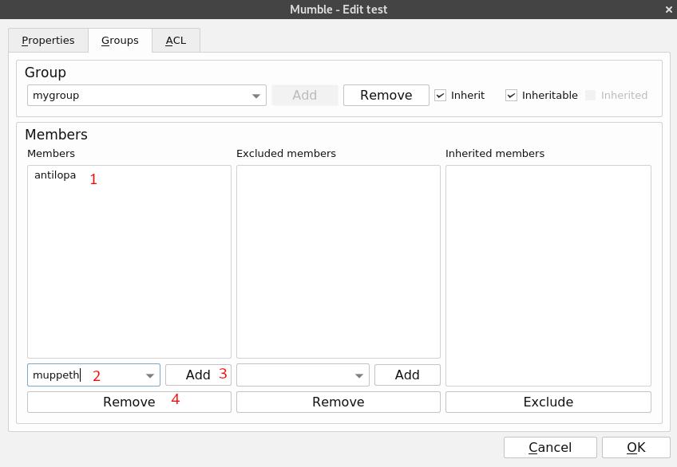

# Télécharger

Téléchargez Mumble [ici](https://www.mumble.info/downloads/) et installez-le.

# Premiers réglages
La première fois que vous lancez Mumble, un assistant apparaîtra pour vous aider à configurer votre audio et votre micro. Sinon, cliquez sur **Configurer** et sélectionnez **Assistant audio**.

[Assistant](en/wizard2.png)

Voici la première page de l' **Assistant Audio**.

[Assistant](en/wizard.png)

 
Les paramètres d'installation par défaut devraient suffire, sauf pour:

- La détection de l'activité vocale pour laquelle il est conseillé d'utiliser une touche pour parler comme paramètre de détection de la voix. Ce paramètre est appelé **Appuyer pur parler**. Il suffit de cliquer dans la case blanche et d'appuyer sur la touche que vous souhaitez utiliser. Dans cet exemple, il est réglé sur **espace**.

! [Assistant](en/push_to_talk.png)

- Choisissez **Désactiver la synthèse vocale...** pour désactiver la synthèse vocale. La synthèse vocale est la sortie vocale des messages de la messagerie instantanée de Mumble, qui peut être perturbatrice lors des discussions.

[Assistant](en/notification.png)

- **Nous suggérons fortement d'utiliser un casque audio** pour une meilleure expérience audio. Si c'est le cas, cochez la case **Utiliser un casque**.

[Assistant](en/headphones.png)

# Configuration du serveur
Vous devriez voir cela :

Cliquez sur **Ajouter Nouveau**.

! [Ajouter nouveau](en/add_config.png)

1. **Adresse** : l'adresse du serveur. Pour **Disroot**, c'est *mumble.disroot.org*
2. **Port** : assurez-vous que le numéro de port est **64738**.
3. **Nom d'utilisateur** : ce que vous voulez !
4. **Label** : le nom que vous voulez utiliser pour identifier le serveur dans votre client.

! [Connection](en/connect.png)

Maintenant, il suffit de sélectionner le serveur **mumble.disroot.org** et de cliquer sur **Connect**.

Vous y êtes !

# Rejoindre une chaîne
**Root** affiche la liste des chaînes sur le serveur choisi. Comme vous pouvez le voir sur l'image, il y a deux chaînes en ce moment : **Disroot** et **Quarantine hangout**.

! [Connected](en/connected.png)

Pour rejoindre **Quarantine hangout** par exemple, faites un clic droit dessus et choisissez **Rejoindre la chaîne**

[Rejoindre](en/join.png)

Vous pouvez maintenant voir votre nom d'utilisateur sous la chaîne jointe. Vous pouvez également voir sur la gauche un message disant que vous avez rejoint la chaîne **Quarantine hangout**.

!! Vous ne pouvez être connecté qu'à une seule chaîne à la fois. Donc si vous rejoignez une autre chaîne, vous quitterez automatiquement celle dans laquelle vous êtes. !!

## Que faire si la chaîne est protégée par un mot de passe ?
Si une chaîne est protégée par un mot de passe, vous devez créer un **jeton d'accès**. Pour ce faire, cliquez sur **Serveur** et choisissez **Jeton d'accès**. Une fois là, il vous suffit de saisir le mot de passe, de valider en appuyant sur la touche entrée et de cliquer sur **OK**.

[Mot de passe](en/password2.png)

Vous pouvez maintenant accéder à la chaîne protégée par un mot de passe.

# Création d'une chaîne
! [Créer](en/create.png)

Vous pouvez créer une chaîne à différents endroits :
- Dans **Root**, c'est le cas ici de **Disroot** et **Quarantine hangout**.
- Dans une autre chaîne, par exemple ici, dans la chaîne **Disroot**, il y a une autre chaîne appelée **Disroot Core Sprint metings**.

Donc comme vous pouvez le voir, les chaînes Mumble peuvent être organisées de manière hiérarchique. Les chaînes peuvent avoir des "Enfants", des "Parents", et des "Frères et soeurs". Cela peut continuer sur plusieurs "Générations", de sorte qu'une chaîne peut être l'enfant d'une chaîne et elle peut aussi être le parent d'autres chaînes. La profondeur de cette hiérarchie parents/enfants est infinie.

Pour créer une chaîne, il suffit de cliquer avec le bouton droit de la souris sur l'endroit où vous souhaitez créer votre chaîne : **Root** ou un autre nom de chaîne, par exemple dans **Disroot** ou la chaîne que vous voulez.

Choisissez **Ajouter...**.

! [Paramètres](en/create_settings.png)

1. **Nom** : le nom de votre chaîne.
2. **Description** : si vous voulez ajouter une description de votre chaîne. Ce n'est pas obligatoire.
3. **Maximum Users** : cela semble assez évident. C'est le nombre maximum d'utilisateurs que la salle peut accueillir.
4. **Temporaire** : si c'est coché, la chaîne est détruite au moment où le dernier utilisateur la quitte. Sinon, il y reste jusqu'à ce que vous décidiez de le supprimer. *Note** : cette option n'est disponible que si vous êtes un utilisateur enregistré (voir ci-dessous).

N'oubliez pas que lorsque vous créez une chaîne, vous en devenez automatiquement l'administrateur.

## Ajout d'un mot de passe à votre chaîne
Pour l'instant, toute personne connectée peut accéder à votre chaîne. Pour y ajouter un mot de passe, créez d'abord une chaîne, puis faites un clic droit sur son nom et choisissez **Editer...**

Vous avez maintenant la possibilité d'ajouter un mot de passe :

! [Mot de passe](en/password.png)

**Note** : vous pouvez également configurer des groupes et des ACL au lieu de définir un mot de passe (voir ci-dessous).

# Paramètres plus avancés

## Certificat
Mumble utilise des certificats pour l'authentification. Cela permet à un utilisateur de s'authentifier sur un serveur protégé sans avoir à entrer de mot de passe.
Le certificat est automatiquement créé lorsque vous rejoignez un serveur pour la première fois. Il est très important que vous enregistriez ce certificat afin de pouvoir vous connecter avec le même nom d'utilisateur sur un autre appareil.

Pour enregistrer votre certificat, cliquez sur **Configurer** et choisissez **Assistant pour les certificats**.

[Certificat](en/certificate.png)

Vous pouvez voir ici votre certificat, qui est auto-signé.

Il suffit de cliquer sur **Exporter le certificat actuel** pour l'enregistrer sur votre ordinateur.

## Enregistrement de votre nom d'utilisateur
Une fois connecté à un serveur, vous pouvez enregistrer votre nom d'utilisateur, ce qui crée un compte unique lié à votre certificat d'utilisateur. Personne ne sera autorisé à utiliser votre nom d'utilisateur, il sera juste le vôtre.

Pour enregistrer votre nom d'utilisateur sur un serveur :
- Connectez-vous au serveur Mumble sur lequel vous souhaitez vous enregistrer.
- Faites un clic droit sur votre nom d'utilisateur dans la liste des canaux.
- Choisissez **Enregistrer...**

Attention : après l'enregistrement, vous ne pouvez pas modifier votre nom d'utilisateur ni le désinscrire.

## Groupes
Vous pouvez créer des groupes d'utilisateurs. Cela est utile si vous souhaitez créer des autorisations spécifiques.

Faites un clic droit sur la chaîne pour lequel vous voulez créer des groupes, puis choisissez **Editer...** et allez dans la section **Groupes**.

! [Groupes](en/groupes.png)

1. Ecrivez le nom du groupe que vous voulez créer.
2. Le bouton **Ajouter** sera alors disponible, cliquez dessus.

Vous pouvez maintenant ajouter des membres à votre groupe. Par exemple ici, (1) antilopa est un membre du groupe mygroup.

Pour peupler votre groupe :

1. Ecrivez le nom de l'utilisateur que vous voulez ajouter. Note : seuls les utilisateurs enregistrés peuvent être ajoutés aux groupes.
2. Cliquez sur **Ajouter**.
3. Sélectionnez un membre et cliquez sur **Supprimer** si vous voulez le retirer du groupe.

## Groupes et ACL : gérer les permissions

**La liste de contrôle d'accès (LCA)** est une liste de règles qui permettent un accès raisonnable avec peu de restrictions. La plupart du temps, ces règles seront "héritées" du parent de la chaîne. Les administrateurs de Mumble peuvent modifier la LCA (éliminer/modifier les règles existantes ou en ajouter de nouvelles).

Les **Groupes** sont définis ou limités par la portée des règles d'une **LCA**. Chaque règle de chaque LCA s'applique à un groupe d'utilisateurs afin d'autoriser ou de limiter ce qui peut être fait dans un canal Mumble. Il est donc important de comprendre ce que sont les groupes de Mumble avant de créer des LCA.

### Présentation

Vous pouvez définir des autorisations spécifiques pour vos chaînes, groupes et utilisateurs. Pour ce faire, faites un clic droit sur la chaîne pour laquelle vous souhaitez créer des LCA, puis choisissez **Editer...** et allez dans le panneau **LCA**.

! [ACL](en/acl.png)

1. Voici la liste des LCA actives. Les premières sont héritées de la configuration du serveur et du canal parent. Il est important de comprendre que les LCA sous sont plus importantes que celles ci-dessus. Ainsi, ici par exemple, *@$fb7...* est plus important que *@all*.
2. Sélectionnez une LCA pour vérifier la liste des autorisations
3. Voici la liste des autorisations fixées pour la LCA **@auth**. Comme vous pouvez le voir, certaines sont refusées, d'autres sont autorisées.
4. Vous pouvez décider en décochant cette case que vous ne voulez pas conserver les LCA héritées
5. Cliquez sur **Ajouter** pour ajouter une autorisation spécifique à des utilisateurs ou des groupes.

### Explication des autorisations
- **Ecrire des LCA** : donne un contrôle total sur le canal, y compris la modification des ACL.
- **Traverser** : sans ce privilège, un utilisateur ne pourra pas accéder à une chaîne ou à une sous-chaîne de quelque manière que ce soit, quels que soient les privilèges de la sous-chaîne. Ne refusez pas ce privilège à moins que vous ne sachiez vraiment ce que vous faites ; vous pouvez probablement obtenir l'effet désiré en refusant à une personne le privilège *Entrer*.
- **Entrer** : permet d'entrer dans un canal.
- **Parler** : permet de transmettre l'audio dans la chaîne.
- **Muet/Sourdine** : permet de mettre en sourdine ou de rendre sourd un autre utilisateur.
- **Bouger** : permet de déplacer un utilisateur vers ou depuis une chaîne.
- **Créer une chaîne** : permet de créer des chaînes.
- **Lier une chaîne** : permet de lier une chaîne. Une chaîne liée reflétera la diffusion audio d'une chaîne dans la chaîne liée (donc si la chaîne 1 et la chaîne 2 sont liées, vous pouvez entendre l'audio de la chaîne 2 si vous êtes dans la chaîne 1).
- **Murmurer** : permet de chuchoter aux autres utilisateurs.
- **Message Texte** : permet d'envoyer des messages textes à d'autres utilisateurs.
- **Rendre temporaire** : permet de faire une chaîne temporaire qui disparaît lorsque tous les utilisateurs quittent la chaîne.

### Ajouter des autorisations aux utilisateurs ou aux groupes

Pour définir les autorisations :
1. Cliquez sur **Ajouter**.
2. Modifiez le **Contexte**, par exemple si vous souhaitez que vos autorisations s'appliquent à n'importe quel sous-chaîne ou à cette seule chaîne.
3. Sélectionnez votre **Groupe**.
4. Ou sélectionnez l' **Identifiant de l'utilisateur** si vous souhaitez appliquer des autorisations à un utilisateur spécifique.
5. Définissez les **Permissions** comme vous le souhaitez et cliquez sur **OK**.

Une nouvelle règle écrasera la règle héritée, car les règles héritées sont toujours placées en haut, et une nouvelle en bas. Par exemple, si vous avez une règle supérieure pour @all pour autoriser l'entrée, mais une règle inférieure pour @all qui refuse l'entrée, alors personne ne sera autorisé à entrer dans votre canal.
Vous pouvez déplacer les règles vers le haut et vers le bas en utilisant les boutons **Haut** et **Bas**.

Les groupes par défaut sont les suivants :
- *all* : tous ceux qui utilisent cette chaîne par n'importe quel moyen
- *admin* : personnes ayant une autorité administrative pour cette chaîne
- *auth* : personnes qui se sont enregistrées sur le serveur
- *in* : tout le monde branché cette chaîne
- *sub* : tout le monde dans une chaîne ayant un parent ou un ancêtre en commun avec cette chaîne.
- *out* : tout le monde qui n'est PAS branché sur cette chaîne
- *~in*
- *~sub*
- *~out*

Le caractère tilde ("~") limite le groupe associé au canal dans lequel il est défini, éliminant ainsi tout effet d'héritage ou de liens.

- La chaîne de caractères (*$fb74c...* dans cet exemple) est l'identifiant du créateur de la chaîne. Si l'utilisateur est enregistré, c'est le nom d'utilisateur qui sera affiché, et non l'identifiant.
- *#test* : la chaîne protégée par un mot de passe. Il n'apparaîtra pas s'il n'y a pas de mot de passe défini.

Pour en savoir plus sur la manière de définir les groupes et les LCA, consultez ce tutoriel (https://wiki.mumble.info/wiki/ACL_and_Groups) et cette [vidéo] (https://www.invidio.us/watch?v=VOeMsMjQRoM)

## Définir un utilisateur comme intervenant prioritaire
Il peut être utile de désigner un **intervenant prioritaire**. Lorsqu'un **intervenant prioritaire** parle, tous les autres utilisateurs de la chaîne seront atténués.

Pour définir un utilisateur comme **intervenant prioritaire** :
- Faites un clic droit sur le nom d'utilisateur que vous souhaitez définir comme **intervenant prioritaire**.
- Cliquez sur "**Intervenant prioritaire**".
