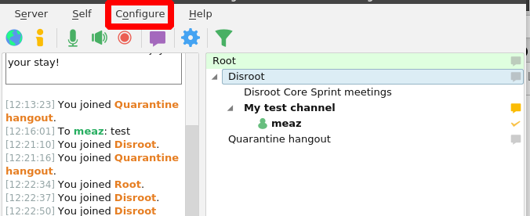
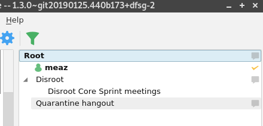
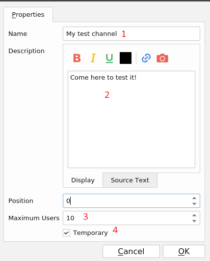
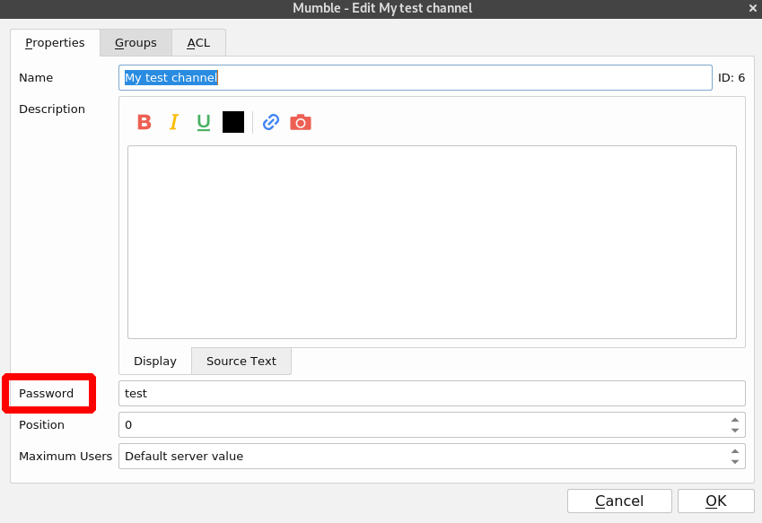
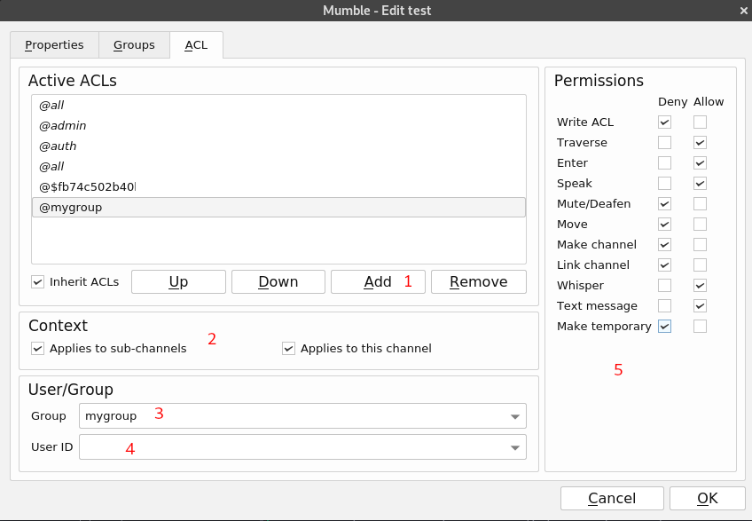

# Download

Scarica Mumble [qui](https://www.mumble.info/downloads/) e installalo.

# Primi settaggi
La prima volta che avvii Mumble, apparirà una procedura guidata per aiutarti a configurare l'audio e il microfono. In caso contrario, fai clic su **Configura** e seleziona **Assistente audio**.

Ecco la prima pagina della **Procedura guidata audio**.

 
Le impostazioni di installazione predefinite dovrebbero essere sufficienti. Unico settaggio utile da modificare:

- Rilevamento attività vocale per il quale è consigliabile utilizzare un tasto per parlare come parametro di rilevamento vocale. Questa impostazione è denominata **Push To Talk**. Basta fare clic nella casella bianca e premere il tasto che si desidera utilizzare. In questo esempio, è impostato per lo **spazio**.

- Scegli **Disabilita sintesi vocale...** per disabilitare la sintesi vocale. La sintesi vocale è l'output vocale dei messaggi di messaggistica istantanea di Mumble, che può essere di disturbo durante le chat.

- Per una migliore esperienza audio **ai consiglia vivamente di utilizzare le cuffie**. In tal caso, seleziona la casella **Utilizza le cuffie**.

# Configurazione del server
Dovresti vedere questo::

Clicca su **aggiungi nuovo**.

1. **Indirizzo**: l'indirizzo del server. Per **Disroot**, è *mumble.disroot.org*
2. **Porta**: assicurati che il numero di porta sia **64738**.
3. **Nome utente**: quello che vuoi;)
4. **Etichetta**: il nome che vuoi utilizzare per identificare il server nel tuo client.

Ora, seleziona il server **mumble.disroot.org** e fai clic su **Connetti**.

Ci siamo!

# Entrare in un canale
**Root** mostra l'elenco dei canali sul server scelto. Come puoi vedere nell'immagine, al momento ci sono due canali: **Disroot** e **Quarantine Hangout**.

Ad esempio, per partecipare a **Quarantine Hangout**, fai clic con il pulsante destro del mouse e scegli **Unisciti al canale**

Ora puoi vedere il tuo nome utente sotto il canale unito. Puoi anche vedere sulla sinistra un messaggio che dice che ti sei iscritto al canale **Quarantine Hangout**.

!! Puoi essere connesso a un solo canale alla volta. Quindi se ti unisci a un altro canale, lascerai automaticamente quello in cui ti trovi. !!

## Cosa succede se il canale è protetto da password?
Se un canale è protetto da password, devi creare un **Token di accesso**. Per farlo, fai clic su **Server** e scegli **Accesso ai token**. Una volta lì, è sufficiente annotare la password, convalidare premendo invio e quindi fare clic su **OK**.

Ora puoi accedere al canale protetto da password.

# Creare un canale

Puoi creare un canale in diversi luoghi:
- In **Root**, questo è il caso di **Disroot** e **Quarantine Hangout**.
- In un altro canale, ad esempio qui, nel canale **Disroot**, c'è un altro canale chiamato **Disroot Core Sprint mettings**.

Quindi, come puoi vedere, i canali di Mumble possono essere organizzati gerarchicamente. I canali possono avere "Figli", "Genitori" e "Fratelli". Questo può andare avanti per diverse "Generazioni", in modo che un canale possa essere figlio di un canale e può anche essere il genitore di altri canali. La profondità di questa gerarchia genitori/figli è infinita.

Per creare un canale, fai clic con il pulsante destro del mouse nel punto in cui desideri creare il tuo canale: **Root** o il nome di un altro canale, ad esempio in **Disroot** o qualsiasi canale desideri.

Scegli **Aggiungi...**.

1. **Nome**: il nome del tuo canale.
2. **Descrizione**: se vuoi aggiungere una descrizione del tuo canale. Non è obbligatorio.
3. **Utenti massimi**: sembra abbastanza ovvio. È il numero massimo di utenti che la stanza può ospitare.
4. **Temporaneo**: se spuntato, il canale viene distrutto nel momento in cui l'ultimo utente lo lascia. Altrimenti, rimane lì finché non decidi di rimuoverlo. *Nota**: questa opzione è disponibile solo se sei un utente registrato (vedi sotto).

Tieni presente che quando crei un canale, diventi automaticamente il suo amministratore.

## Aggiungere una password al tuo canale
Al momento, chiunque sia connesso può accedere al tuo canale. Per aggiungere una password, crea prima un canale, quindi fai clic con il pulsante destro del mouse sul suo nome e scegli **Modifica...**

Ora hai la possibilità di aggiungere una password:

**Nota**: puoi anche configurare gruppi e ACL invece di impostare una password (vedi sotto).

# Altre impostazioni avanzate

## Certificati
Mumble usa i certificati per l'autenticazione. Ciò consente a un utente di autenticarsi su un server protetto senza inserire una password.
Il certificato viene creato automaticamente quando ti unisci per la prima volta a un server. È molto importante salvare questo certificato in modo da poter accedere con lo stesso nome utente su un altro dispositivo.

Per salvare il certificato, fai clic su **Configura** e scegli **Autocomposizione certificato**.

Puoi vedere qui il tuo certificato, che è autofirmato.

Basta fare clic su **Esporta certificato corrente** per salvarlo sul tuo computer.

## Registrazione del tuo nome utente
Una volta connesso a un server, puoi registrare il tuo nome utente che crea un account univoco collegato al tuo certificato utente. Nessuno potrà usare il tuo nome utente, sarà solo tuo.

Per registrare il tuo nome utente su un server:
- Collegati al server Mumble con cui desideri registrarti.
- Fai clic con il pulsante destro del mouse sul tuo nome utente nell'elenco dei canali.
- Scegli **Registrati...**

Attenzione: dopo esserti registrato non puoi cambiare il tuo nome utente o cancellarlo.

## Gruppi
È possibile creare gruppi di utenti. Questo è utile se vuoi creare autorizzazioni specifiche.

Fai clic con il pulsante destro del mouse sul canale per cui desideri creare gruppi, scegli **Modifica...** e vai al pannello **Gruppi**.

1. Scrivi il nome del gruppo che vuoi creare.
2. Il pulsante **Aggiungi** sarà quindi disponibile. Successivamente basterà fare clic su di esso.

Ora puoi aggiungere membri al tuo gruppo. Ad esempio qui, (1) antilopa è un membro del gruppo mygroup.

Per popolare il tuo gruppo:

1. Annotare il nome dell'utente che si desidera aggiungere. Nota: solo gli utenti registrati possono essere aggiunti ai gruppi.
2. Fare clic su **Aggiungi**.
3. Seleziona un membro e fai clic su **Rimuovi** se vuoi rimuoverlo dal gruppo.

## Gruppi e ACL: gestisci i permessi

**Access Control List (ACL)** è un elenco di regole che consentono un accesso ragionevole con poche restrizioni. Il più delle volte, queste regole saranno "ereditate" dal genitore del canale. Gli amministratori di Mumble possono modificare l'ACL (eliminare/modificare quelli esistenti o aggiungerne di nuovi).

**I gruppi** sono definiti o limitati dall'ambito delle regole in un **ACL**. Ogni regola in ogni ACL opera su alcuni gruppi di utenti al fine di concedere o limitare ciò che può essere fatto in un Mumble Channel. Quindi, è importante capire cosa sono i gruppi di Mumble prima di creare ACL.

### Presentatione

Puoi impostare autorizzazioni specifiche per i tuoi canali, gruppi e utenti. Per farlo, fai click con il pulsante destro del mouse sul canale per cui desideri creare l'ACL, scegli **Modifica...** e vai al pannello **ACL**.

1. Ecco l'elenco degli ACL attivi. I primi vengono ereditati dalla configurazione del server e dal canale padre. È importante capire che gli ACL sotto sono più importanti di quello sopra. Quindi qui, ad esempio, *@$fb7...* è più importante di *@all*.
2. Selezionare l'ACL per controllare l'elenco delle autorizzazioni
3. Di seguito è riportato l'elenco delle autorizzazioni impostate per **@auth** ACL. Come puoi vedere, alcuni sono negati, altri sono ammessi.
4. È possibile decidere deselezionando questa casella di non conservare gli ACL ereditati
5. Fare clic su **Aggiungi** per aggiungere autorizzazioni specifiche a utenti o gruppi.

### Spiegazione dei permessi
- **Scrivi ACL**: offre il controllo totale sul canale inclusa la modifica degli ACL.
- **Traverse**: senza questo privilegio, un utente non potrà accedere al canale o a qualsiasi sottocanale in alcun modo, indipendentemente dai privilegi nel sottocanale. Non negarlo a meno che tu non sappia davvero cosa stai facendo. Probabilmente puoi ottenere l'effetto desiderato negando a un utente il privilegio *Invio*.
- **Invio**: permette di entrare in un canale.
- **Parla**: permette di trasmettere l'audio nel canale.
- **Mute/Deafen**: permette di silenziare un altro utente.
- **Sposta**: permette di spostare un utente da o verso un canale.
- **Crea canale**: permette di creare canali.
- **Collega canale**: permette di collegare un canale. Un canale collegato rispecchierà la trasmissione audio in un canale nel canale collegato (quindi se il canale 1 e il canale 2 sono collegati, puoi ascoltare l'audio dal canale 2 se sei nel canale 1).
- **Messaggio di testo**: consente di inviare messaggi di testo ad altri utenti.
- **Rendi temporaneo**: consente di creare un canale temporaneo che scompare quando tutti gli utenti lasciano il canale.

### Aggiungere permessi a utenti o gruppi

Per impostare le autorizzazioni:
1. Clicca su **Aggiungi**
2. Modifica il **Contesto** , ad esempio se desideri che le tue autorizzazioni si applichino a qualsiasi sottocanale o solo a questo canale.
3. Seleziona il tuo **Gruppo**
4. Oppure seleziona **ID utente** se desideri applicare le autorizzazioni a un utente specifico.
5. Imposta le **Autorizzazioni** come desideri e fai clic su **OK**.

Una nuova regola sovrascriverà quella ereditata. Quindi, ad esempio, se hai una regola in alto impostata per @all per consentire l'ingresso, ma poi in fondo una regola @all che nega l'ingresso, nessuno potrà accedere al tuo canale.
Puoi spostare le regole su e giù usando i pulsanti **Su** e **Giù**.
I gruppi predefiniti sono:
- *all*: tutti coloro che utilizzano questo canale con qualsiasi mezzo
- *admin*: persone con autorità amministrativa per questo canale
- *auth*: persone che si sono registrate sul server
- *in*: tutti i sintonizzati sul canale
- *sub*: 
- *out*:  
- *~in*
- *~sub*
- *~out*

Il carattere tilde ("~") limita il gruppo associato al canale in cui è definito, eliminando qualsiasi effetto di eredità o collegamenti.

- La stringa (*$fb74c...* in questo esempio) è l'ID del creatore del canale. Se l'utente è registrato, verrà visualizzato il nome utente, non l'ID.
- *#test*: il canale protetto da password. Non apparirà se non è stata impostata alcuna password.

Per saperne di più su come impostare gruppi e ACL, controlla questa [guida](https://wiki.mumble.info/wiki/ACL_and_Groups) e questo [video](https://www.invidio.us/watch?v =VOeMsMjQRoM)

## Imposta un utente come utente prioritario
Può essere utile impostare un **utente prioritario**. Quando un **utente prioritario** parla, tutti gli altri utenti del canale verranno messi in secondo piano (nel senso che avrà lui la priorità nei turni di parla rispetto agli altri utenti).

Per impostare un utente come **utente prioritario**:
- Fai clic con il pulsante destro del mouse sul nome utente che desideri impostare come **utente prioritario**.
- Fare clic su "**Oratore/utente prioritario**".
