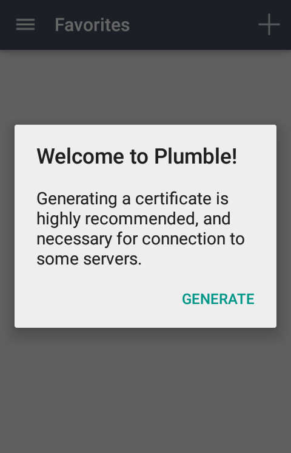
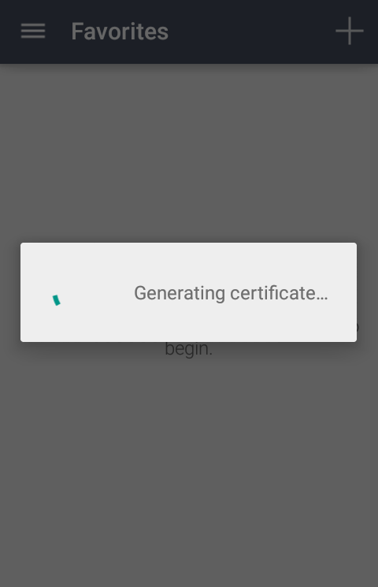
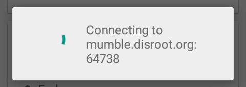
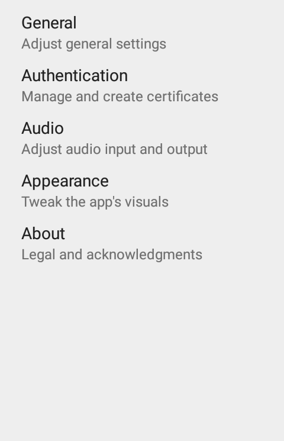
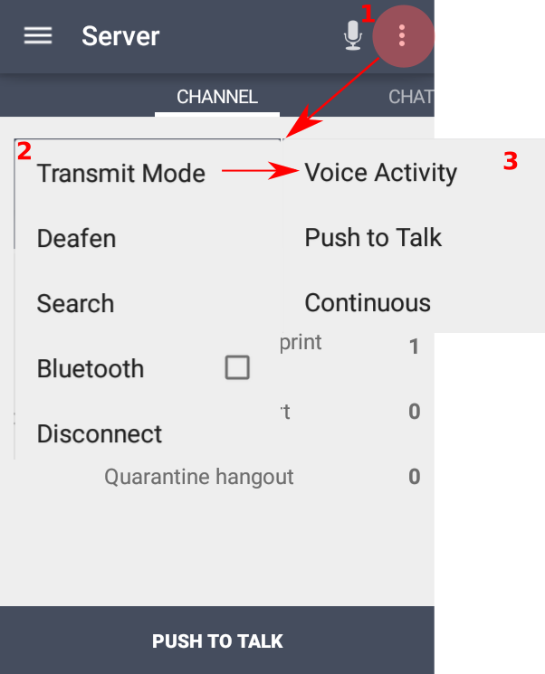
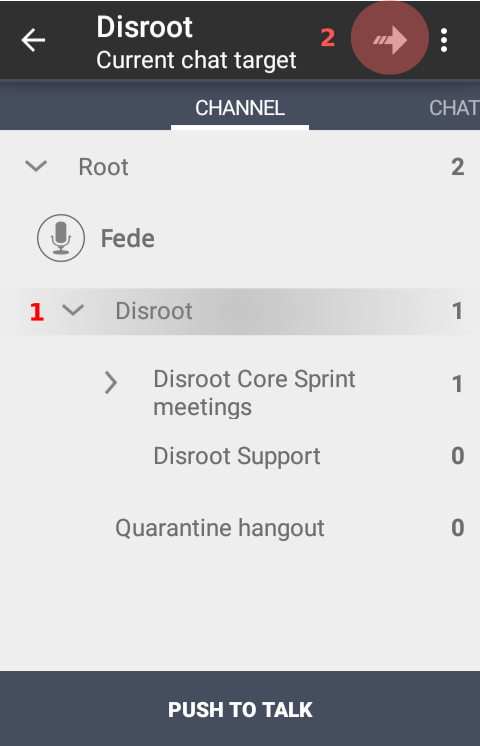
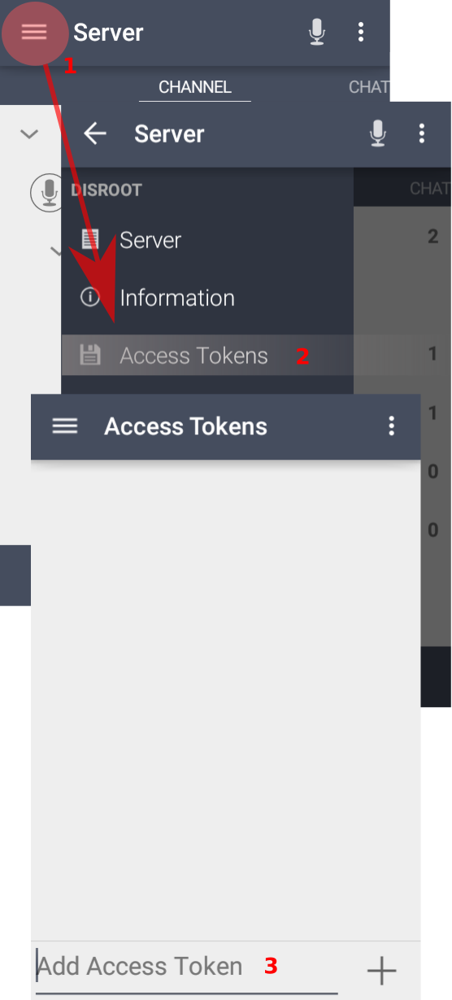
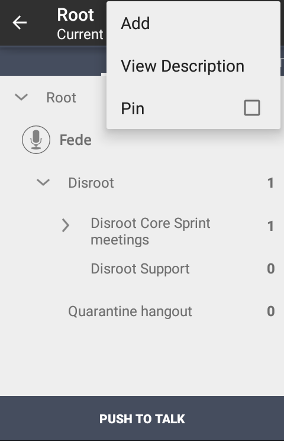

# Télécharger et installer

Vous pouvez télécharger et installer **Plumble**, l'application mobile pour **Mumble** sur [**F-Droid**](https://f-droid.org/en/packages/com.morlunk.mumbleclient).

Veuillez vérifier la dernière version de **Plumble** (Version 3.3.0-rc1) car elle dispose d'une fonction **Certificat d'importation/exportation** - très importante - et d'une meilleure prise en charge des langues.

# Notes précédentes

Le logiciel **Mumble** possède d'importantes fonctions d'administration et d'autorisation qui ne peuvent être configurées qu'à partir de l'application de bureau. Les **Listes de contrôle d'accès** et les **Groupes** sont des exemples de ces fonctionnalités manquantes dans **Mumble**.

Pour en savoir plus sur les **ACL**, **Groupes** et autres paramètres de **Mumble**, veuillez consulter notre [Tutoriel **Mumble**](../mumble).

----

# Configuration

Lorsque vous lancez **Plumble** pour la première fois, un message de bienvenue apparaît et vous devez générer un certificat. C'est ce que **Mumble** utilise pour vous identifier en tant qu'utilisateur et éviter de vous demander votre nom d'utilisateur et votre mot de passe chaque fois que vous vous connectez.

Si vous avez déjà un certificat généré sur un autre appareil (par exemple, l'ordinateur portable via l'application de bureau), vous pouvez l'**importer**. Vous pouvez également faire la même chose dans l'autre sens en **exportant** le certificat généré sur le portable, par exemple, vers un fichier Mumble que vous pouvez ensuite importer depuis un autre appareil ou ordinateur.

Pour en savoir plus sur les Certificats sur Mumble, veuillez consulter [ici](https://wiki.mumble.info/wiki/Mumble_Certificates)

Une fois que le certificat a été généré, vous verrez l'écran pour ajouter des serveurs avec les instructions pour le faire.

Remplissez les champs avec les informations suivantes :

1. **Label** : le nom que vous voulez utiliser pour identifier le serveur dans Plumble.
2. **Adresse** : l'adresse du serveur. Pour **Disroot**, il s'agit de *mumble.disroot.org*
3. **Port** : assurez-vous que le numéro de port soit **64738**.
4. **Nom d'utilisateur** : le nom d'utilisateur que vous voulez utiliser.
5. **Mot de passe** : un mot de passe pour cet utilisateur (facultatif)

Appuyez sur **AJOUTER** pour terminer. Vous devriez maintenant voir les informations sur le serveur.

Vous pouvez ajouter autant de serveurs que vous le souhaitez. Mais **vous ne pouvez pas être connecté à plus d'un serveur ou chaîne en même temps**.

Tapez sur le serveur que vous voulez rejoindre.

# Paramètres de base et utilisation

Maintenant, vous y êtes. En cliquant sur l'icône du menu, vous pouvez accéder à des informations sur les serveurs et les paramètres des applications.

## Paramètres
Dans la section **Paramètres**, vous trouverez les ajustements suivants :

### 1. **Général**
Ici, vous pouvez définir et configurer les paramètres de notification et de connexion
  - Notifications de chat
  - Text-to-Speach
  - Charger des images externes
  - Reconnexion automatique
  - Force TCP
  - Se connecter via Tor

### 2. **Authentification**
Certificats liés et paramètres du nom d'utilisateur par défaut
  - Générer un certificat
  - Certificat
  - Certificat d'importation
  - Certificat d'exportation
  - Certificats de serveur clair
  - Nom d'utilisateur par défaut

### 3. **Audio**
Voici où vous pouvez configurer et ajuster la qualité audio et les paramètres
  - Mode de transmission (*nous vous suggérons d'utiliser l'option **Appuyer pour Parler***)
  - Mode combiné
  - Volume du microphone
  - Seuil de détection  
  - Paramètres de la fonction "Appuyer pour Parler"
    - Touche pour "Appuyer pour Parler"
    - Coin d'activation Appuyer pour Parler
    - Son "Appuyer pour Parler"
    - Masquer le bouton "Appuyer pour Parler"
    - Activer le mode "Appuyer pour Parler"
  - Mode Half Duplex
  - Paramètres audio avancés et détaillés
    - Taux d'échantillonnage d'entrée
    - Qualité des intrants
    - Trames audio par paquet
    - Activer le préprocesseur d'entrée
    - Désactiver Opus Codec

### 4. **Apparence**
Vous pouvez choisir entre les thèmes Light ou Dark pour l'application

### 5. **A propos**
Informations **Plumble** (Version, Contributeurs et licences)

## Autres options
Vous pouvez également définir la manière dont vous préférez traiter la sortie audio, c'est-à-dire le comportement du microphone, entre autres options.

Touchez le menu à trois points dans le coin droit à côté de l'icône du microphone (1). Les options sont les suivantes :
- **Mode de transmission**(2) :
    - a. **Activité vocale** - le microphone est activé lorsqu'il détecte le son de la voix (3)
    - b. **Appuyer pour parler** - le microphone est activé en appuyant sur le bouton Push to Talk (3)
    - c. **Continu** - le microphone reste activé que vous parliez ou non (3)
- **Sourdine** - désactiver l'écoute
- **Recherche** - aider à trouver une chaîne
- **Bluetooth** - active la connexion Bluetooth
- **Déconnectez-vous** - vous déconnecte du serveur

## Utilisation de base

Une fois que vous avez jeté un coup d'œil et défini les réglages, vous pouvez rejoindre ou créer une chaîne pour parler et/ou discuter.

### Rejoindre une chaîne

1. **Root** 
C'est l'espace principal du serveur, où vivent les chaînes.
2. **Chaîne** 
Une chaîne est comme un comme une salle, qui peut contenir plusieurs salles. Dans notre exemple, le serveur (Root) contient deux chaînes : **Disroot** et **Quarantine hangout**

Pour rejoindre une chaîne, il suffit d'appuyer sur le nom (1) puis sur l'icône en forme de flèche dans la barre supérieure (2)

### Que faire si la chaîne est protégée par un mot de passe ?
Si une chaîne est protégée par un mot de passe, vous devrez créer un **jeton d'accès**.

Tapez sur le menu, en haut à gauche (1), puis tapez sur **Jeton d'accès** (2) et enfin écrivez le mot de passe (3) et tapez sur l'icône plus (+) pour l'ajouter.

Vous pouvez désormais accéder à l'espace protégé par un mot de passe.

Rappelez-vous que **vous ne pouvez pas être connecté à plus d'un serveur ou d'une chaîne en même temps**

### Création d'une chaîne

Créer une chaîne est similaire à en rejoindre une. Par défaut, le ou les chaînes que vous créez seront temporaires, à moins que vous n'enregistrez votre utilisateur. Bien qu'il ne soit pas nécessaire de s'enregistrer pour participer à une chaîne publique, cela vous permet non seulement de conserver le nom d'utilisateur que vous avez choisi, mais aussi de créer des chaînes permanentes.

L'enregistrement de votre utilisateur est très simple. Il suffit d'appuyer longuement sur votre nom d'utilisateur et de sélectionner **Enregistrer** lorsque les options apparaissent. N'oubliez pas que vous avez déjà défini le nom d'utilisateur et le mot de passe lorsque vous avez lancé **Plumble** pour la première fois.

Maintenant, pour créer une chaîne :

1. Appuyez sur la chaîne où la nouvelle chaîne sera créée (1) et sur l'icône du menu à trois points dans la barre supérieure (2)

2. Appuyez sur **Ajouter**

3. Remplissez les informations nécessaires sur la chaîne

- **Nom** : le nom de la chaîne que vous créez
- **Description** : une brève description du sujet de la chaîne
- **Position** : la position dans laquelle la chaîne apparaîtra sur votre liste de chambres
- **Temporaire** : Lorsque les administrateurs du serveur l'autorisent, vous pouvez choisir si la chaîne sera permanente ou temporaire, c'est-à-dire qu'elle sera supprimée lorsque le dernier utilisateur la quittera.
