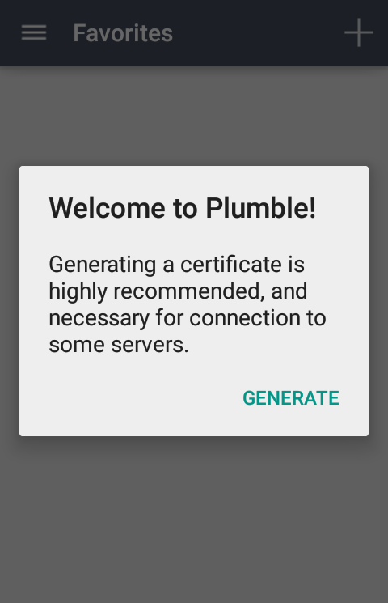
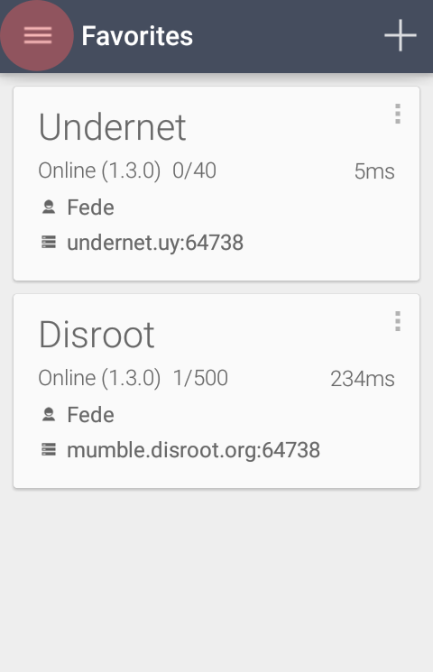
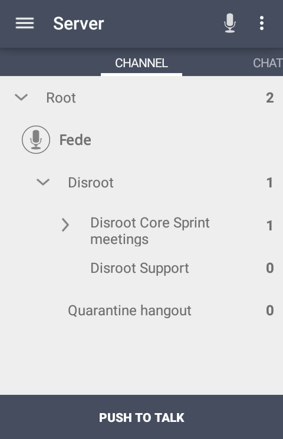
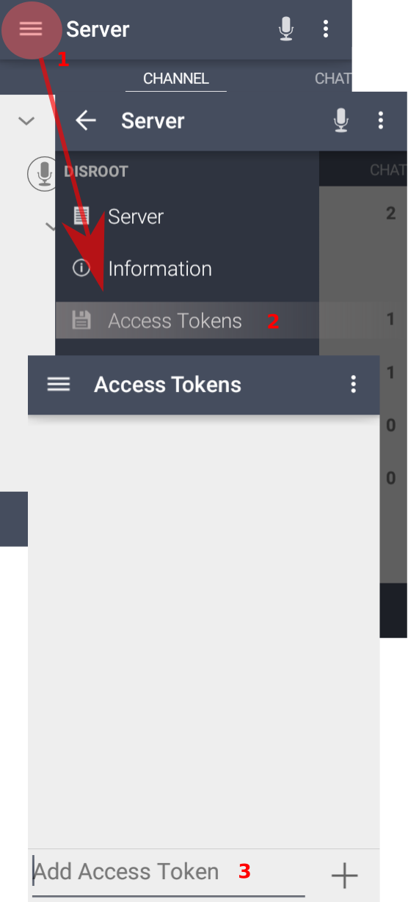
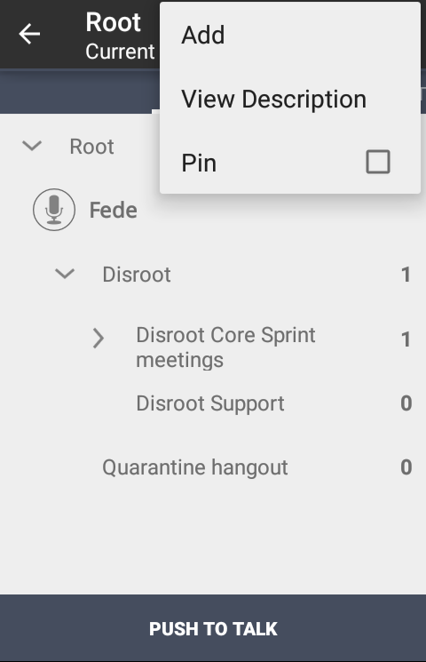

# Scarica e installa

Puoi scaricare e installare **Plumble**, l'app mobile per **Mumble** da [**F-Droid**](https://f-droid.org/en/packages/com.morlunk.mumbleclient).

Verificare l'ultima versione di **Plumble** (versione 3.3.0-rc1) poiché ha una funzione **Importa/Esporta certificato**, che è molto importante, e un migliore supporto delle lingue.

# Note

Il software **Mumble** ha alcune importanti funzioni di amministrazione e autorizzazioni che possono essere configurate solo dall'applicazione desktop. **Elenchi di controllo accessi** e **Gruppi** sono esempi di queste funzioni mancanti in **Plumble**.
Per ulteriori informazioni su **ACL**, **Gruppi** e altre impostazioni di **Mumble**, controlla la nostra [guida a **Mumble**](../mumble).

----

# Configurazione

Quando avvii **Plumble** per la prima volta, viene visualizzato un messaggio di benvenuto e ti viene richiesto di generare un certificato, che è ciò che **Mumble** utilizza per identificarti come utente ed evitare di chiedere nome utente e password ogni volta che accedi.

Se hai già un certificato generato su un altro dispositivo (ad esempio il laptop tramite l'app desktop) puoi **importarlo**. Puoi anche fare il contrario **esportando** il certificato generato sul cellulare, ad esempio, in un file Mumble che puoi quindi importare da un altro dispositivo o computer.

Per saperne di più sui certificati su Mumble, controlla [qui](https://wiki.mumble.info/wiki/Mumble_Certificates)

Una volta generato il certificato, vedrai la schermata per aggiungere i server con le istruzioni per farlo.

Compila i campi con le seguenti informazioni:

1. **Etichetta**: il nome che si desidera utilizzare per identificare il server in Plumble.
2. **Indirizzo**: l'indirizzo del server. Per **Disroot**, è *mumble.disroot.org*
3. **Porta**: assicurati che il numero di porta sia **64738**.
4. **Nome utente**: il nome utente che desideri utilizzare.
5. **Password**: una password per questo utente (non obbligatoria)

Tocca **AGGIUNGI** per finire. Ora dovresti vedere le informazioni sul server.

Puoi aggiungere tutti i server che vuoi. Ma **non puoi essere connesso a più di un server o canale contemporaneamente**.

Tocca il server a cui vuoi unirti.

# Impostazioni di base e utilizzo

Ora sei dentro. Toccando l'icona del menu puoi accedere ad alcune informazioni sui server e le impostazioni delle applicazioni.

## Impostazioni
Nella sezione **Impostazioni** troverai le seguenti regolazioni:

### 1. **Generale**
Qui puoi impostare e configurare le notifiche e le impostazioni di connessione
   - Notifiche di chat
   - Sintesi vocale
   - Carica immagini esterne
   - Riconnessione automatica
   - Forza TCP
   - Connettiti tramite Tor

### 2. **Autenticazione**
Impostazioni relative al nome utente e relative ai certificati
   - Genera certificato
   - Certificato
   - Certificato di importazione
   - Certificato di esportazione
   - Cancella i certificati del server
   - Nome utente predefinito

### 3. **Audio**
Qui è dove puoi configurare e regolare la qualità e le impostazioni dell'audio
   - Modalità di trasmissione (*ti consigliamo di utilizzare l'opzione **Push to Talk***)
   - Modalità portatile
   - Volume del microfono
   - Soglia di rilevamento
   - Impostazioni Push-to-Talk
     - Tasto Premi per parlare
     - Push to Talk Hot Corner
     - Premi per parlare suono
     - Nascondi pulsante Push to Talk
     - Attiva / disattiva Push to Talk
   - Modalità half duplex
   - Impostazioni audio avanzate e dettagliate
     - Input frequenza di campionamento
     - Qualità di input
     - Audio per pacchetto
     - Abilita preprocessore di input
     - Disattiva Opus Codec
	 
### 4. **Aspetto**
Puoi scegliere temi chiari o scuri per l'app

### 5. **Informazioni su**
Informazioni su **Plumble** (versione, contributori e licenze)

## Altre opzioni
Puoi anche impostare il modo in cui preferisci gestire l'uscita audio, ovvero il comportamento del microfono.

Tocca il menu dell'icona dei tre punti nell'angolo destro accanto all'icona del microfono (1). Le opzioni sono:
- **Modalità di trasmissione**(2):
     - a. **Attività vocale** - il microfono si attiva quando rileva il suono della voce (3)
     - b. **Push to Talk** - il microfono si attiva premendo il pulsante Push to Talk (3)
     - c. **Continuo** - il microfono rimane attivo indipendentemente dal fatto che parli o meno (3)
- **Sordo** - disabilita l'ascolto
- **Cerca** - aiuta a trovare un canale
- **Bluetooth** - attiva la connessione Bluetooth
- **Disconnetti** - ti disconnette dal server

## Utilizzo di base

Dopo aver dato un'occhiata e aver impostato le regolazioni, puoi unirti o creare un canale per parlare e/o chattare.

### Entrare in un canale

1. **Root** 
Questo è lo spazio principale del server, dove risiedono i  canali.
2. **Canale** 
Un canale è come una categoria e può contenere più canali. Nel nostro esempio il server (Root) contiene due canali: **Disroot** e **Quarantine Hangout**. Questo è il luogo in cui avviene la comunicazione.

Ora, per entrare in un canale basta cliccare sul nome (1) e poi l'icona della freccia sulla barra in alto (2)

### Cosa succede se il canale è protetto da password?
Se un canale è protetto da password dovrai creare un **Access Token**.

Tocca il menu, in alto a sinistra (1), quindi tocca **Access Token** (2) e infine scrivi la password (3) e clicca sull'icona più (+) per aggiungerla.

Ora puoi accedere al canale protetto da password.

Ricorda che **non puoi essere connesso a più di un server o canale contemporaneamente**

### Creazione di un canale

La creazione di un canale è simile all'adesione a un canale esistente. Per impostazione predefinita, il canale che crei sarà temporaneo a meno che non registri il tuo utente. Sebbene non sia necessario registrarsi per partecipare a un canale pubblico, ciò consente non solo di mantenere il nome utente scelto, ma anche di creare canali permanenti.

Registrare il tuo utente è davvero semplice. Basta toccare a lungo il tuo nome utente e selezionare **Registrati** quando vengono visualizzate le opzioni. Ricorda che hai già impostato il nome utente e la password quando hai avviato **Plumble** per la prima volta.

Ora, per creare un canale:

1. Toccare il canale in cui verrà creato il nuovo canale (1) e l'icona del menu con tre punti sulla barra in alto (2)

2. Clicca su **Aggiungi**

3. Completare con le informazioni necessarie sul canale

- **Nome**: il nome del canale che stai creando
- **Descrizione**: una breve descrizione sull'argomento del canale
- **Posizione**: la posizione in cui il canale apparirà nell'elenco dei tuoi canali
- **Temporaneo**: quando consentito dagli amministratori del server, puoi selezionare se il canale sarà permanente o temporaneo, ovvero verrà eliminato quando l'ultimo utente lo lascia.
