# Download and install

You can download and install **Plumble**, the movile app for **Mumble** from [**F-Droid**](https://f-droid.org/en/packages/com.morlunk.mumbleclient).

# Configuration

When you first launch **Pumble**, a welcome message appears and you are required to generate a cerficate, which is what Mumble uses to identify a user.

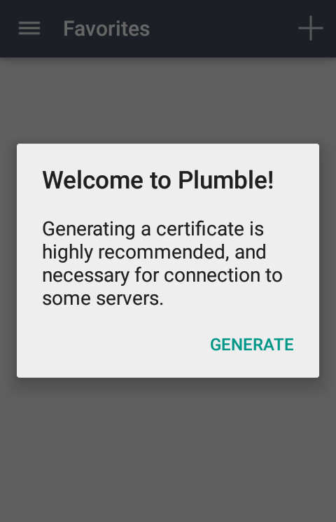

To learn more about Certificates on Mumble, please check [here](https://wiki.mumble.info/wiki/Mumble_Certificates)

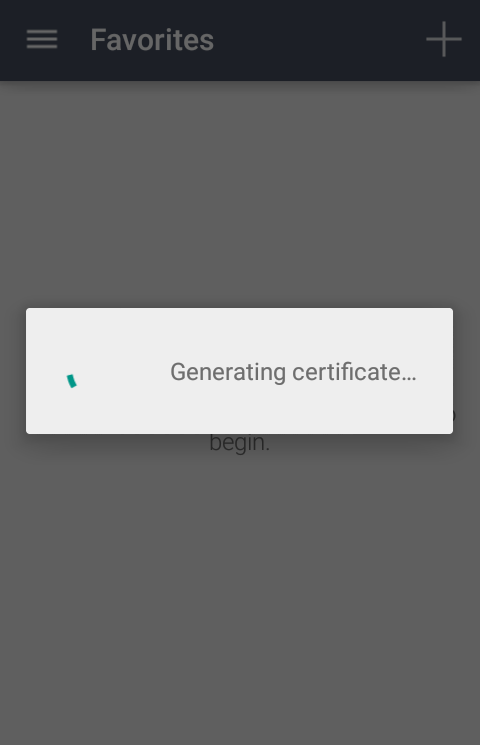

Once the certificate has been generated, you will see the screen to add servers with the instructions to do it.

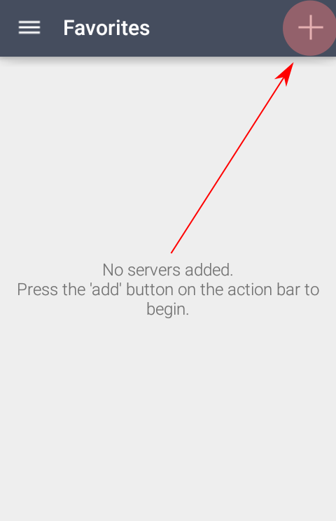

Fill in the fields with the following information:

1. **Label**: the name you want to use to identify the server in Pumble.
2. **Address**: the server address. For **Disroot**, it is *mumble.disroot.org*
3. **Port**: make sure the port number is **64738**.
4. **Username**: the username you want to use.
5. **Password**: a password for this user

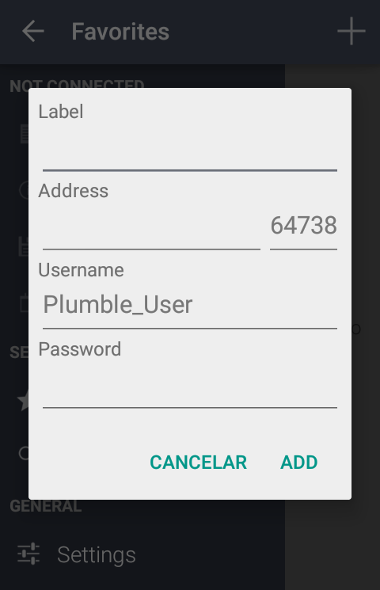

Tap on **ADD** to finish. Now you should see the server info.

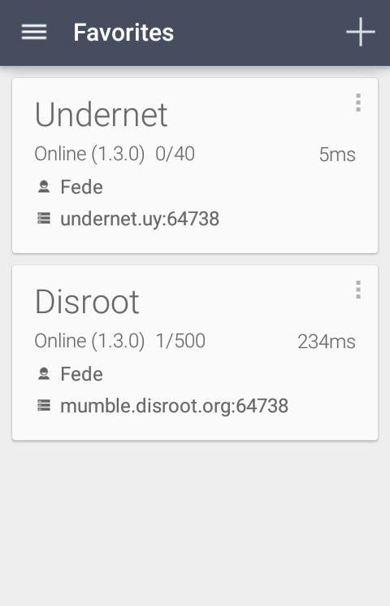

You can add as many servers as you want. But **you cannot be connected to more than one server, channel or room at the same time**.

Tap on the server you want to join.

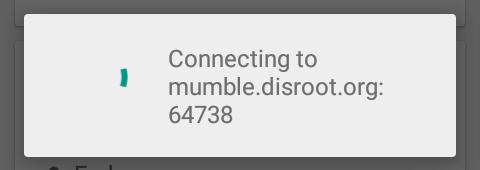

# Basic Settings and Usage

Now you are in. By tapping on the menu icon you can access some information about the servers and the applications settings.

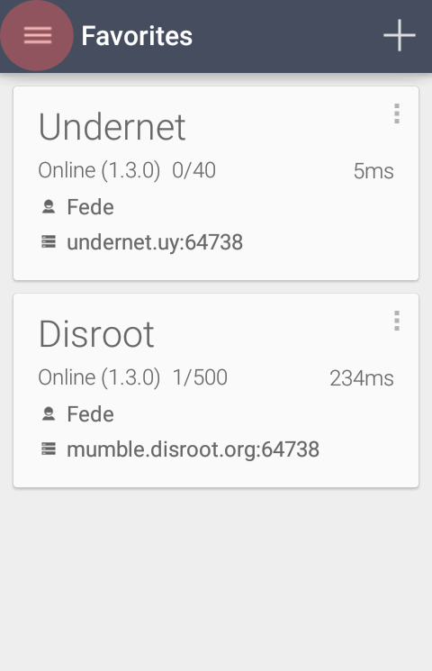

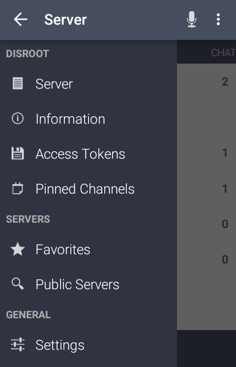

## Settings
In the **Settings** section you will find the following adjustments:

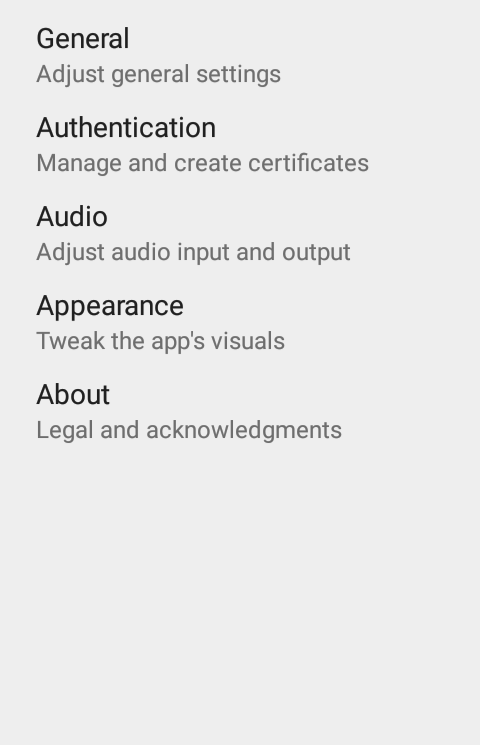

### 1. **General**
Here you can set and configure notifications and connections settings
  - Chat notifications
  - Text-to-Speach
  - Load External Images
  - Auto Reconnect
  - Force TCP
  - Connect via Tor

### 2. **Authentication**
Certificates related and default username settings
  - Generate Certificate
  - Certificate file
  - Default Username
  - Clear Server Certificates

### 3. **Audio**
Here is where you can configure and adjust the audio quality and settings
  - Transmit Mode (*we suggest you to use **Push to Talk** option*)
  - Handset Mode
  - Microphone Volume
  - Detection Threshold  
  - Push to Talk settings
    - Push to Talk key
    - Push to Talk Hot Corner
    - Push to Talk Sound
    - Hide Push to Talk Button
    - Toggle Push to Talk
  - Half Duplex Mode
  - Advanced and detailed audio settings
    - Input Sample Rate
    - Input Quality
    - Audio per packet
    - Enable Input Preprocessor
    - Disable Opus Codec

### 4. **Appearance**
You can choose Light or Dark themes for the app

### 5. **About**
**Pumble** information (Version, Contributors and Licenses)

**NOTE** 
The Pumble application lacks of some administrative and features settings - like the **Access Control List** - that are only available through the desktop app.

To learn about **Mumble** desktop app and its settings, please, check [here](../1.Mumble)

## Basic Usage

Once you have taken a look around and set the adjustments, you can join or create a room to talk and/or chat.

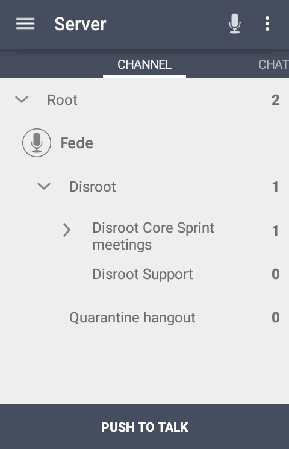

### Joining a Channel or a room

1. **Root** 
This is the server main space, where Channels and rooms lives.
2. **Channel** 
A channel is like a category and can contain several rooms. In our example the server (Root) contains two channels: **Disroot** and **Quarantine hangout**
3. **Room** 
This is the place where the communication takes place.

Now, to joining a channel or a room is simple as tapping the name (1) and then the arrow icon on the top bar (2)

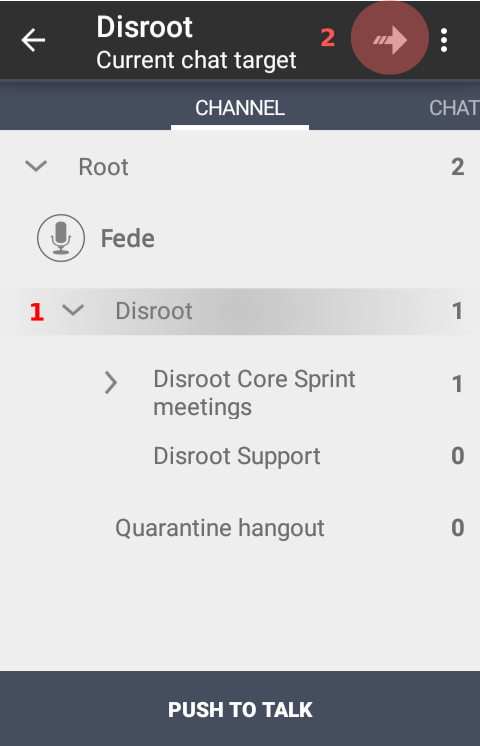

Remember that **you cannot be connected to more than one server, channel or room at the same time**

### Creating a Channel or a room

Creating a channel or a room is similar to joining in one.

1. Tap the channel where the room will be created (1) and the the three dots menu icon on the top bar (2)

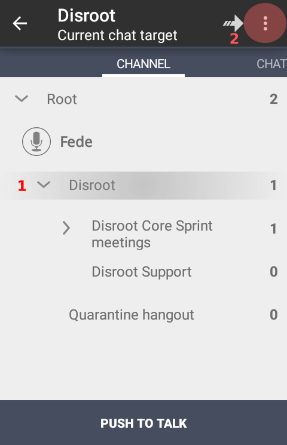

2. Tap on **Add**

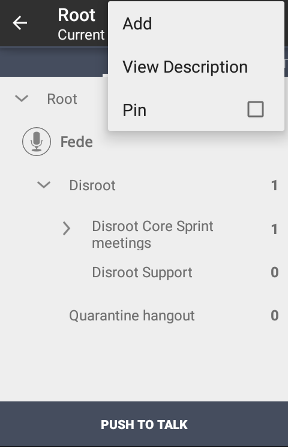

3. Fill in with the necessary information about the room

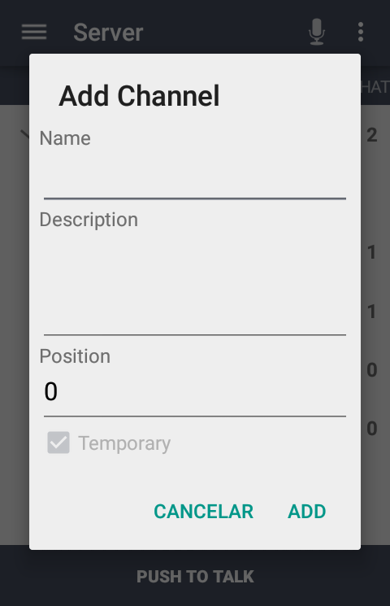

- **Name**: the name of the room you are creating
- **Description**: a brief description about the room topic
- **Position**: the position in which the room will appear on your room list
- **Temporary**: When allowed by the server admins, you can select whether the room will be permanent or temporary, that is, it will be deleted when the last user leaves it. By default, the rooms you create will be temporary unless you register your user.

To **Register** a user on the server, you will only need to make a long tap on your username and select the option. This will allow you to create permanent rooms.
