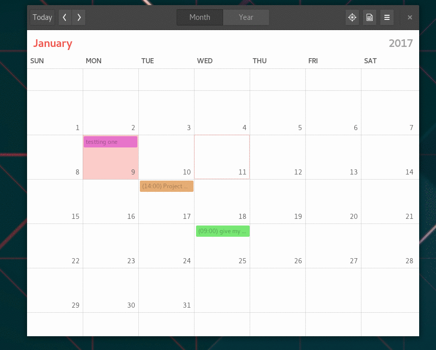

----------

Gnome is a very popular, slick, modern and easy to use graphical desktop environment for Linux. It's my desktop of choice and it is mainly due to it's awesome integration with Disroot's cloud services.

Integration with desktop environment means, you no longer need to login to Disroots cloud via the browser, every time you need to add or lookup information. It means everything you need is available to you directly from your desktop. Furthermore it makes it look and feel unified with all other apps you use while you work. It's definitely **THE** way to get things done.

In this tutorial I would like to show you how easy and handy it is to integrate your cloud calendar on your computer. Setup procedure should take no longer then few minutes of your time.

-------
# Set Online accounts

In order to get up and running, all you need to do is:

 - Go to Gnome **Settings** (eg. type settings in the dashboard search)
 - Open **"Online Accounts"**
 - Select **"Nextcloud"** (or owncloud if using older version)
 - Follow instructions to fill in all your credentials:
    - **Address:** https://cloud.disroot.org
    - **Username:** *yourusername*
    - **Password:** *your_super_secret_password*

If you did that correctly now you can choose which aspects of the cloud you want to integrate. You can switch them on and off at any time depending on your use case. I choose to integrate it all.

--------------
# Calendar

One of the useful features is calendar. You will notice that your calendars are already integrated if you press on the  **current time** in your top bar on the desktop. A popup window with a calendar will automatically display all the events from your disroot's cloud account. You will of course receive all notifications on upcoming events as well.

In order to add/edit/remove events or have better overview on all your calendars, I suggest installing Gnome Calendar app.
Depending on your operating system you should search for it in your "Software" application (linux app store).

Once you get it installed, you'll notice your calendars are already integrated thanks to the global "Online Accounts" you set up earlier. The application is very simple, and still missing some features to be complete (eg. recurrence) but it enables you to do basic things such as create/delete/edit calendar entries. You can select which calendars you would like to see and which ones to disable (in case you have numerous calendars). You can create/modify/delete events, and they'll be all synchronized with disroot cloud, which means also with all the devices connected to it.

-----------
