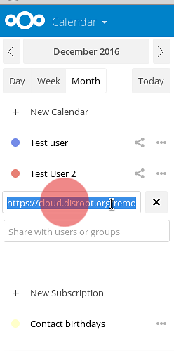
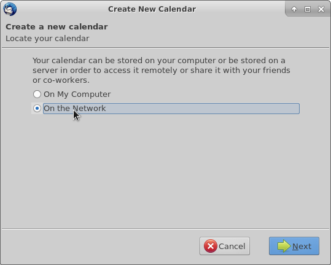
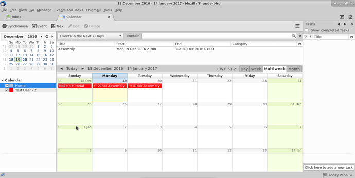

The contact and calendar features in Disroot/Nexcloud are pretty cool but if you have your Disroot email connected to an email client like Thunderbird it's nice to have the contacts and calendars from Disroot integrated with Thunderbird as well and access them from one place on your desktop.

---------

# Installing Needed Add-ons

In order to sync all your calendars, you will need to install those Add-ons:

* **Lightning** - a calendar for Thunderbird

**Note!** Even if you just want to sync your contacts you will still need the lightning add-on. So says the Nextcloud manual [here](https://docs.nextcloud.com/server/9.0/user_manual/pim/sync_thunderbird.html)

## Installing Lightning

In Thunderbird go to > tools > Add-ons

In the Add-ons page on the upper right corner you will find a search bar. Just search for "Lightning". Once thunderbird finds it for you, press install.

You will need to restart Thunderbird in order to finish the installation of both Add-ons

# Integrating calendar with Thunderbird

First login to your [Disroot cloud](https://cloud.disroot.org) and go to calendar app. Select options of the calendar you want to sync to thunderbird.
Now, copy the link URL of your calendar. You will need it to sync with thunderbird.

 

Now in Thunderbird. Either go to: File > New > Calendar or go directly to Calendar window and select *"New calendar"* by right clicking on the calendar list.

Now configure your calendar to sync:
1- select the option **CalDAV**
2 - In the location field, paste the link of your Disroot Calendar that you copied earlier
3 - Select offline support, if you want to keep a local copy of you calendar, in case you need to work offline
4 - Press next

Give your calendar a name and assign a color.
Then press next.

Then press finish.
Your calendar is now synced with Thunderbird. Any event created in thunderbird will apear on disroot cloud and vice versa.

**Note!**
If you have multiple calendars in your Disroot account, just repeat this process for each calendar. You can use a different color to each calendar to set them apart. This method works for any nextcloud/owncloud provider out there.
Additionally you can sync any calendars form any provider as long as they support caldav protocol (check with your provider for more details)

## Adding events with multiple calendars
If you have multiple calendars in Thunderbird, when creating an event you need to to select to which calendar it goes to, otherwise you maybe end up looking for it online in the wrong place

If you right click the calendars in Thunderbird you will have a set of options, from:

* Show or hide a Calendar
* Export Calendar
* Unsubscribe Calendar (remove it from Thunderbird)
* Making it read only (in Thunderbird)
* Synchronize Calendar  

---
