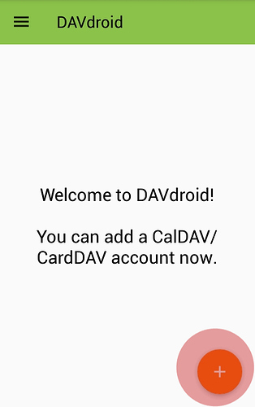
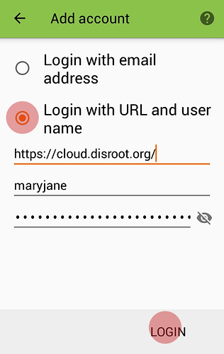
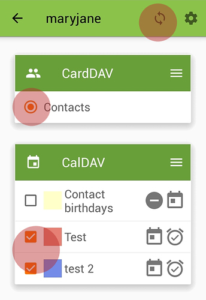
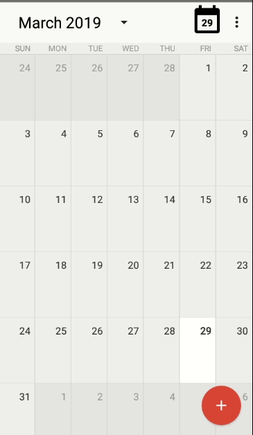
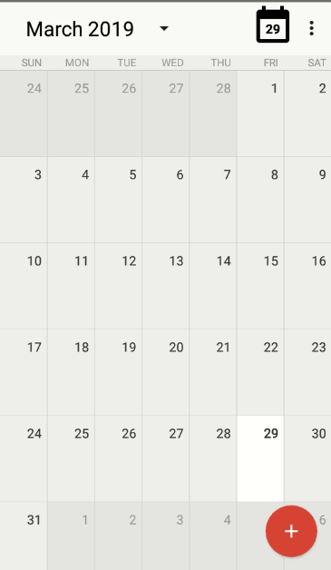

**Disroot** has the Calendar app enabled.

To setup and use your **Disroot** calendar on your **Android** device you'll need to install the **DAVx⁵** and **OpenTasks** apps first.

**OpenTasks** needs **DAVx⁵** installed to work, but if you just want to sync your Calendar or Contacts then you don't need to have **Tasks** installed.

----------
# Install DAVx⁵
## From appstore
**DAVx⁵** is available on most app stores. We encourage you to use [F-Droid](https://f-droid.org/).

## From Nextcloud App
If you have the **Nextcloud** mobile app installed and linked to your **Disroot** cloud, you can install it from there:
 - Open **Nextcloud** Android App
 - Got to settings > **"Sync calendar and contacts"**

 **Nextcloud** App will now fetch, install and configure your account *automagically*.

 ---------------

## Add your Disroot account to DAVx⁵

If you haven't install **DAVx⁵** via **Nextcloud** App you will have to manually setup an account.
To do it, open the "**DAVx⁵ app**" and press the *"plus"* (**+**) button.

Select "Login with url and username", and put server address and credentials.

> **Server address:** https://cloud.disroot.org 
> **Username:** your **Disroot** username 
> **Password:** your **Disroot** password

After setup your account, you'll need to select which calendars and addressbooks you want to sync from **Disroot** to your **Android** device.

Press the big orange button with the account name.

-------------------

# Calendar
If you already have **DAVx⁵** installed on your device then your Calendars from **Disroot** will be synced and will appear in the Calendar app of choice. Any event added on the phone will be automatically synced to **Disroot** and vice versa.

Make sure your **Disroot** calendar is the only one selected (at least if you exclusively want to use **Disroot** calendar) or you will probably syncing with **Google** calendar.

If you want to use multiple calendars, don't forget to select the calendar you want to use every time you want to add an item.

After that, the calendars in your **Disroot** account that you selected will be synced and visible in your **Android** device calendar.

---------------------
