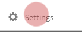

# Contacts
You can access the contacts app by pressing the contacts icon  on the top bar, in **Nextcloud**.

----------------------
## Create a contact

In the contacts app select "*New contact*"

You will prompted with a form on the "*right-bar*" side to create the new contact.

Just type the information you want/have in the fields. If you need, you can just add more fields at the bottom of the form.

-----------------------
## Delete a contact

* Select the contact
* In the contact form header, select the delete icon

-----------------------
## Create contact groups
You can create groups to organize your contacts ex: faculty, work, collective, etc.
In the field group you can assign a new contact to an existing group or create a new group. Or assign a contact to multiple groups by typing the several groups.

On the left side of the screen in your contacts app, you will see the existing groups.
Selecting them will present all contacts in that respective group.

------------------------
## Share address books

Go to "settings" on the lower left corner of the screen in the contacts app.

In settings you can share your address book with other **Disroot** users by: 
 - Selecting share address book
 - Writing the username of the **Disroot** user you want to share the address book with.

You can also use a link to share your address book via **webDAV**, to other contact books (**Thunderbird**, mobile, etc,).

-------------------------
## Import address books

You can import address books or individual contacts, if you have a vcf file of the contact or the address book.

* Selecting "Import".

Then select the file you want to import, and press ok.

-----------------------------
## Create a new address book

Inside settings in the field "Address book name" write the name of the new address book, then press enter.

-----------------------------
# Syncing cloud contacts with webmail
Syncing cloud contacts with Webmail is very easy. It will permit contacts from your webmail and cloud to be in sync.

First go to your **Nexcloud** contacts app. Click on the settings icon in the lower left corner.
Select "Show URL" option of the addressbook you would like to sync with webmail, and copy the given link.

Now go to Webmail app, and click on the settings icon (top right in the webmail app)

In your settings, on the left side bar select: **Contacts**
When in the contacts menu:

1. Select Enable remote synchronization
2. In Addressbook URL, place the URL from your Nexcloud contacts addressbook you have saved before.
3. Provide your username
4. Add your password

And then refresh both pages. Now your contacts will stay in sync.
