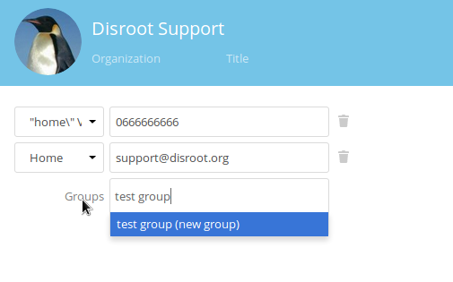
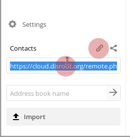

# Contacts
Vous pouvez accéder à l'application Contacts en appuyant sur l'icône Contacts  dans la barre supérieure, dans nexcloud.

----------------------
## Créer un contact

Dans l'application Contacts, sélectionnez "*Nouveau contact*".

Vous serez invité à utiliser un formulaire dans la "*barre de droite*" pour créer le nouveau contact.

Tapez simplement les informations que vous souhaitez/avez dans les champs. Si vous le souhaitez, vous pouvez ajouter d'autres champs au bas du formulaire.

-----------------------
## Supprimer un contact

* sélectionnez le contact
* dans l'en-tête du formulaire de contact, sélectionnez l'icône de suppression

-----------------------
## Créer des groupes de contact
Vous pouvez créer des groupes pour organiser vos contacts ex: faculté, travail, collectif, etc.
Dans le groupe de zones, vous pouvez affecter un nouveau contact à un groupe existant ou en créer un nouveau. Vous pouvez également affecter un contact à plusieurs groupes en tapant les différents groupes.

Sur le côté gauche de l'écran dans l'application Contacts, vous verrez les groupes existants.
En les sélectionnant, tous les contacts de ce groupe seront présentés.

------------------------
## Partager des carnets d'adresses

Allez dans "Paramètres" dans le coin inférieur gauche de l'écran, dans l'application Contacts.

Dans les paramètres, vous pouvez partager votre carnet d'adresses avec d'autres utilisateurs Disroot en:
sélectionnant le partage du carnet d'adresses
écrivant le nom d'utilisateur de l'utilisateur Disroot avec lequel vous souhaitez partager le carnet d'adresses.

Vous pouvez également utiliser un lien pour partager votre carnet d'adresses via webDAV, vers d'autres carnets de contacts (Thunderbird, mobile, etc.).

-------------------------
## Importer des carnets d'adresses

Vous pouvez importer des carnets d'adresses ou des contacts individuels, si vous avez un fichier vcf du contact ou du carnet d'adresses.

* sélectionnez "importer".

Sélectionnez ensuite le fichier que vous voulez importer et appuyez sur ok.

-----------------------------
## Créer un nouveau carnet d'adresses

A l'intérieur de "réglages", dans le champ "Nom du carnet d'adresses", inscrivez le nom du nouveau carnet d'adresses, puis appuyez sur Entrée.

-----------------------------
