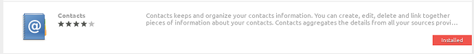
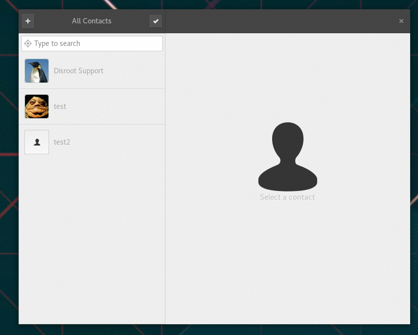

----------

Gnome is a very popular, slick, modern and easy to use graphical desktop environment for Linux. It's my desktop of choice and it is mainly due to it's awesome integration with Disroot's cloud services.

Integration with desktop environment means, you no longer need to login to Disroots cloud via the browser, every time you need to add or lookup information. It means everything you need is available to you directly from your desktop. Furthermore it makes it look and feel unified with all other apps you use while you work. It's definitely **THE** way to get things done.

In this tutorial I would like to show you how easy and handy it is to integrate your cloud on your computer. Setup procedure should take no longer then few minutes of your time.

-------
# Set Online accounts

In order to get up and running, all you need to do is:

 - Go to Gnome **Settings** (eg. type settings in the dashboard search)
 - Open **"Online Accounts"**
 - Select **"Nextcloud"** (or owncloud if using older version)
 - Follow instructions to fill in all your credentials:
    - **Address:** https://cloud.disroot.org
    - **Username:** *yourusername*
    - **Password:** *your_super_secret_password*

If you did that correctly now you can choose which aspects of the cloud you want to integrate. You can switch them on and off at any time depending on your use case. I choose to integrate it all.

--------------

# Contacts

Getting contact integration is as easy as everything else you did so far. Just follow the same pattern. First get "Contacts" application in case you don't have it installed by default.

Next you need to switch your default address book to the one provided by disroot cloud.
Just select "Change Address Book" from the Contact app menu. Once you select your disroot account as the current one, all your contacts will be synced to your computer. All new contacts or any modification will be synced back to your disroot cloud and all the devices connected to it.

----------
