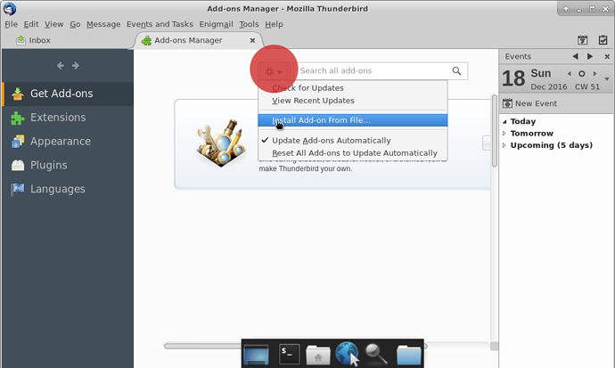
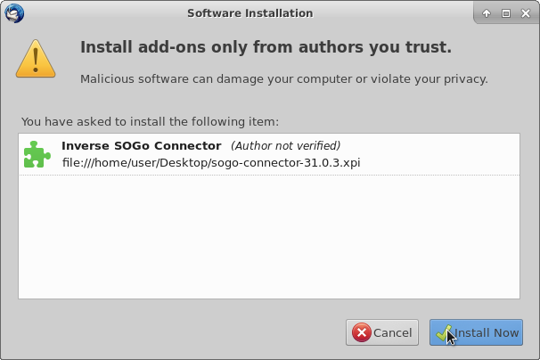
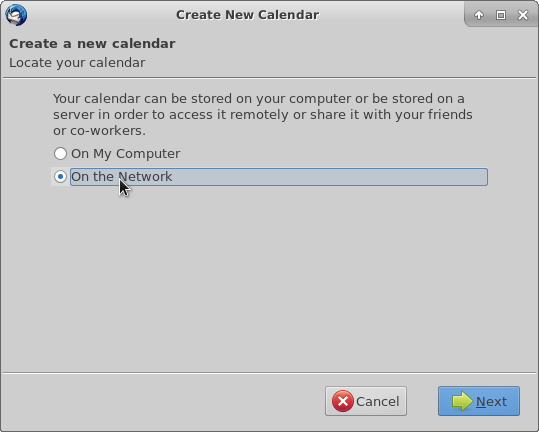
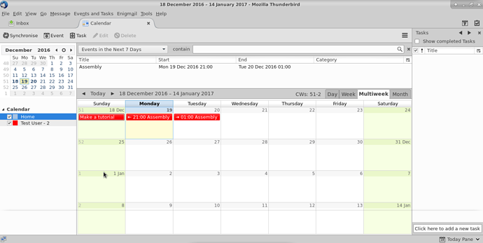
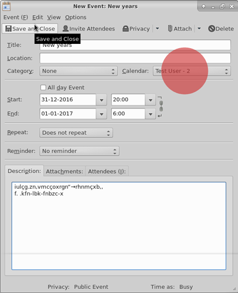
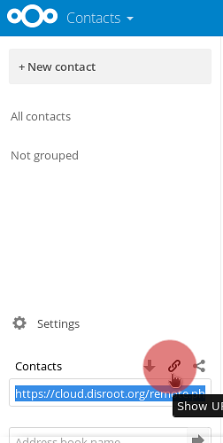

Las herramientas Contactos y Calendario en Disroot/Nexcloud son bastante geniales, pero si además tienes tu cuenta de correo de Disroot conectada a un cliente como Thunderbird entonces es aún mejor porque puedes tenerlas integradas y acceder a ellas desde un solo lugar en tu escritorio.

---------

# Instalando los complementos (add-ons) necesarios

Para sincronizar tus calendarios, tareas y contactos en Thunderbird, necesitarás instalar estos complementos:

* **Lightning** - un calendario para Thunderbird.
* **SoGo Connector**  - para sincronizar tus contactos.

**¡Nota!** Aún cuando sólo quisieras sincronizar tus contactos necesitarás el complemento Lightning. Así lo dice el manual de Nextcloud [aquí](https://docs.nextcloud.com/server/9.0/user_manual/pim/sync_thunderbird.html)

## Instalando Lightning

En Thunderbird ve a > Herramientas > Complementos

En la página de Complementos en la esquina superior derecha encontrarás una barra de búsqueda. Busca "Lightning". Cuando Thunderbird la encuentre, presiona instalar.

Necesitarás reiniciar Thunderbird para finalizar la instalación del complemento.

## Instalando So Go Connector

Este complemento no está listado en el menú así que tenemos que descargarlo directamente del sitio de los desarrolladores. [here](https://sogo.nu/download.html#/frontends)

En el sitio web selecciona **"SoGo Connector"**. Una vez descagado, vuelve al menú de complementos de Thunderbird, en Plugins haz click en el ícono del "engranaje" y selecciona la opción "Instalar desde archivo".

Ahora selecciona el archivo SoGo connector (extensión .xpi) que descargaste del sitio web.
La siguiente imagen debería aparecer, presiona instalar.

Igual que antes, necesitarás reiniciar Thunderbird para finalizar la instalación del complemento.

# Integrando el Calendario a Thunderbird

Primero, accede a tu cuenta de [nube de Disroot](https://cloud.disroot.org) y ve a la aplicación Calendario. Selecciona las opciones del calendario que deseas sincronizar con Thunderbird.
Ahora, copia el link URL de tu calendario. Lo necesitarás para sincronizar con Thunderbird.

 

Ahora, en Thunderbird, puedes ir a: Archivo > Nuevo > Calendario o directamente a la ventana Calendario y seleccionar *"Nuevo calendario"* haciendo click derecho sobre la lista de calendario.

Ahora configura tu calendario para sincronizar:
1: Selecciona la opción **CalDAV**
2: En el campo ubicación, pega el link de tu calendario Disroot que habías copiado antes.
3: Selecciona soporte offline, si quieres mantener una copia local de tu calendario, en caso que necesites trabajar fuera de línea.
4: Presiona Siguiente.

Dale un nombre a tu calendario y asígnale un color.
Luego, presiona Siguiente.

Luego, presiona Finalizar.
Tu calendario está ahora sincronizado con Thunderbird y cualquier evento creado en él aparecerá en la nube de Disroot y viceversa.

**¡Nota!**
Si tienes múltiples calendarios en tu cuenta de Disroot, simplemente repite este proceso para cada uno de ellos. También puedes asignarles un color diferente a cada uno para mantenerlos separados. Este método funciona para todos los proveedores de Nextcloud/Owncloud que hay.
Adicionalmente, puedes sincronizar cualquier calendario de cualquier proveedor en tanto soporten el protocolo caldav (verifica esto con tu proveedor para más detalles).

## Agregando eventos con múltiples calendarios
Si tienes varios calendarios en Thunderbird, cuando creas un evento necesitas seleccionar a qué calendario corresponde, de otra manera, quizás termines buscándolo online en el lugar equivocado.

Si haces click derecho sobre los calendarios en Thunderbird, tendrás una serie de opciones tales como:

* Mostrar/Ocultar Calendario
* Exportar Calendario
* Dar de baja Calendario (quitarlo de Thunderbird)
* Hacerlo de sólo lectura (en Thunderbird)
* Sincronizar Calendario

# Contactos - Integración con Thunderbird

El procedimiento es similar al de integración de Calendarios en Thunderbird. Primero, necesitas obtener el link de los contactos de tu cuenta de Disroot.

Ve a la aplicación Contactos en Disroot, luego a Ajustes (el ícono del "engranaje" abajo en el panel izquierdo). Presiona el botón de "compartir" y te mostrará un link.
Cópialo y guárdalo, lo necesitás luego.

En Thunderbird, selecciona Herramientas > Libreta de Direcciones

Luego selecciona: Archivo > Nuevo > Libreta de direcciones remota

En el siguiente panel se te solicitará establecer un nombre y la URL:

* El nombre es el que quieras darle a tu libreta de direcciones en Thunderbird
* La url es el link que obtuviste ante de la aplicación Contactos en Disroot

En este mismo panel
Puedes establecer sincronizaciones periódicas hasta cada 5 minutos (el valor por defecto es 15 minutos)
Puedes configurar que los contactos sean de sólo lectura si quieres (pero si lo haces no podrás editarlos en Thunderbird)

Cuando hayas terminado, presiona "ok"

Haz click derecho sobre tu nueva libreta de direcciones remota y selecciona Sincronizar.

Se te solicitará ingresar las credenciales de tu cuenta de Disroot
Usuario: tu Usuario de Disroot
Contraseña: tu contraseña de Disroot

Selecciona la opción: **"Usar el Administrador de contraseñas para recordar esta contraseña"** así Thunderbird la recuerda y no te la solicite cada vez que uses el cliente.

Luego presiona **"ok"**

Tus contactos en tu cuenta de Disroot están ahora sincronizados con la libreta de direcciones remota que creaste en Thunderbird.

Cualquier contacto que agregues/quites/edites en tu cuenta de Disroot será modificado consecuentemente en tu calendario remoto de Thunderbird y viceversa.

Si quieres mover los contactos de tu Libreta de direcciones personal o las Direcciones recopiladas, de Thunderbird a tu nueva libreta remota para que sean sincronizadas con tus contactos de Disroot, sólo selecciona y suelta el contacto a tu libreta remota.

De cualquier manera es aconsejable que hagas respaldos de tus contactos. Por las dudas :wink:
