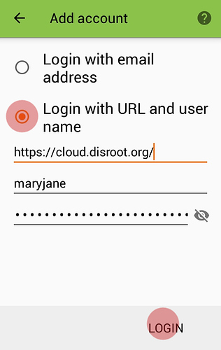

**Disroot** has Contacts app enabled.

In this tutorial we'll see how to setup and use your **Disroot** Contacts on your **Android** device.

To setup it up and sync your contacts on an **Android** device you'll need to install the **DAVx⁵** and **Tasks** apps first.

**Tasks** needs **DAVx⁵** installed to work, but if you just want to sync your Calendar or Contacts then you don't need to have **Tasks** installed.

----------
# Install DAVx⁵
## From appstore
**DAVx⁵** is available on most app stores. We encourage you to use [F-Droid](https://f-droid.org/).

## From Nextcloud App
If you have the **Nextcloud** mobile app installed and linked to your **Disroot** cloud, you can install it from there:
 - Open **Nextcloud** Android App
 - Got to settings > **"Sync calendar and contacts"**

 **Nextcloud** App will now fetch, install and configure your account *automagically*.
 ---------------

 ## Add your Disroot account to DAVx⁵

 If you haven't install **DAVx⁵** via **Nextcloud** App you will have to manually setup an account.
 To do it, open the "**DAVx⁵ app**" and press the *"plus"* (**+**) button.

 

 Select "Login with url and username", and put server address and credentials.

 > **Server address:** https://cloud.disroot.org 
 > **Username:** your **Disroot** username 
 > **Password:** your **Disroot** password

 

 After setup your account, you'll need to select which calendars and addressbooks you want to sync from **Disroot** to your **Android** device.

 Press the big orange button with the account name.

 

 
-------------------
# Contacts
Your Contacts should be available and synced with **Disroot** once you'd set your account up.

If you use multiple accounts, make sure selecting the account you want to save your contacts to when adding one.

If you want to use **Disroot** only, make sure disabling the other accounts. If you don't want to disable the other accounts but just to display **Disroot** contacts only, you can select your **Disroot** account on the "Contacts to display" option.

  

| **Note**|
|:--:|
|If you want to migrate your **Android** contacts to your **Disroot** contacts and stop syncing with **Google**, then follow [this tutorial](/cloud/clients/mobile/android/migrating-contacts-from-google).

---------------------
