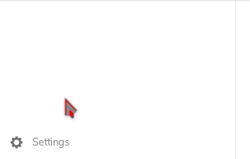
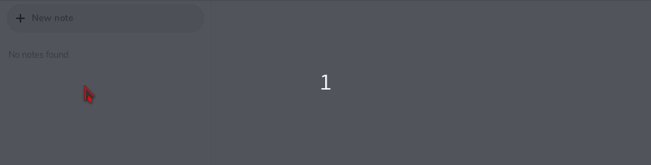
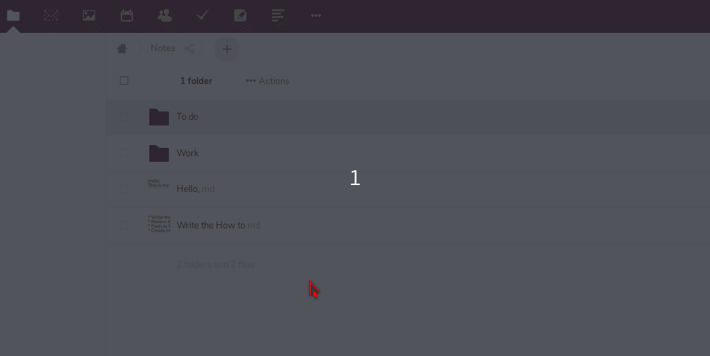
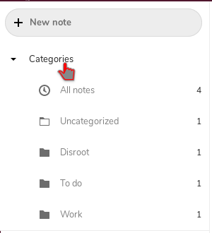

|```Meta information```|
|:--:|
|```This howto was last updated on``` April, 2019 ```and it reffers to:```<br>**- Nextcloud: version - 15**|

You can access the **Notes** app by pressing the notes icon  on the **Nextcloud** navigation bar.

---

# Notes settings

Before you start creating new notes you may want to change settings first.

In the settings (gear icon bottom left) you can choose which folder and what format the notes will be saved in. By default, notes will be saved as .txt files in the Notes folder.




 **Note: You can always change the settings afterwards.**

---

# Create a new note

Once your settings are ready to go, you can start creating notes.

To do so, you just have to click on the **+** icon and start typing your note. The note will be saved automatically.



---

# Favorite notes

You can mark your notes as Favorite, so they will show up in the top of the list. You can do it by clicking on the star icon.<br>
Clicking the star icon again will remove the Favorite mark.


---

# Categories

It is also possible to organize your notes in categories.<br>
Go to the files app of **Nextcloud** and create a new folder with the category name you want to add in the Notes folder. After that, you can move the note file in the desired folder.



Now when you move back in the Notes app you will find your notes ordered in categories.



---

 <center><a rel="license" href="http://creativecommons.org/licenses/by- sa/4.0/"></a><br />This work is licensed under a <br><a rel="license" href="http://creativecommons.org/licenses/by-sa/4.0/">Creative Commons Attribution-ShareAlike 4.0 International License</a>.</center>

---
