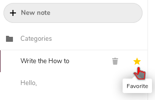

|```Meta information```|
|:--:|
|```This howto was last updated on``` April, 2019 ```and it reffers to:```<br>**- Nextcloud: version - 15**|

**NOTE:**```If the howto refers to an older software version than the provided by``` **Disroot**,```or the one you're using in your device, there could be missing features or small parts of the information that may have changed.```<br> **Disroot's** ```how-to documentation is a community driven process. We try to keep it as updated as we can.```

---

# Notes
You can access the notes app by by pressing the notes icon  on the top bar, in nexcloud.

---

# Notes settings

Before you start creating new notes you may want to change settings first.  
In the settings (gear icon bottom left) you can choose in witch folder and in what format the notes will be saved. By default notes will be saved as .txt files in the Notes folder.


**Note: You can always change the settings afterwards**

---

# Create a new note

Now that your settings are ready to go you can start creating notes.  
To do so you just have to click on the **+** icon and you can start typing your note. The note will be saved automatically.


---

# Favourite notes

You can mark your notes as favourite so they will show up in top of the list. That is easily done by clicking on the star icon.
Clicking the star icon again will remove the favourite mark.



---

# Categories

It is also possible to order your notes in categories. For that you need to go in the files app of Nextcloud and create a new folder with the name of the category you want to add in the Notes folder. After that you move the note file in the desired folder.


Now when you move back in the notes app you will find your notes ordered in categories.


---

 <center><a rel="license" href="http://creativecommons.org/licenses/by- sa/4.0/"></a><br />This work is licensed under a <br><a rel="license" href="http://creativecommons.org/licenses/by-sa/4.0/">Creative Commons Attribution-ShareAlike 4.0 International License</a>.</center>

---
