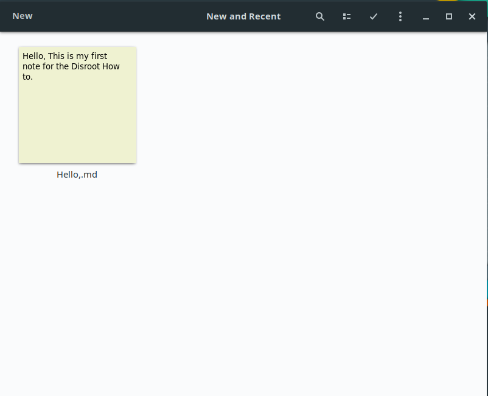
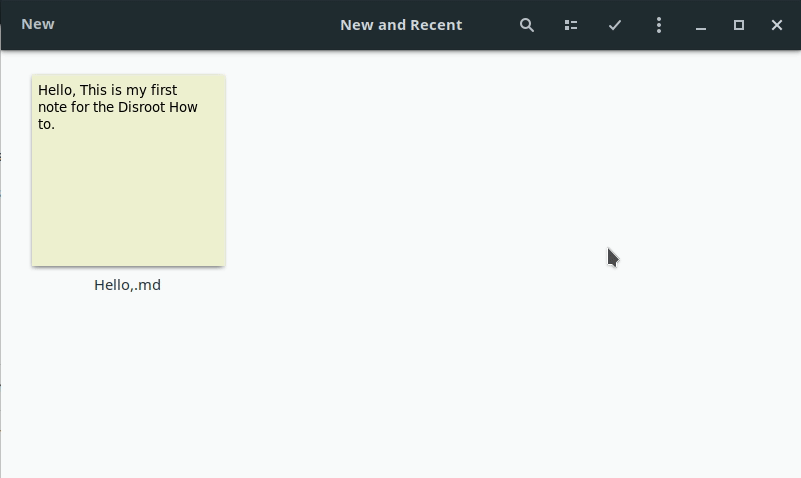

|```Meta information```|
|:--:|
|```This howto was last updated on``` April, 2019 ```and it reffers to:```<br>**- Gnome: version - 3.30.2 For Manjaro Linux**<br>**- Gnome-Notes(Bijiben): version - 3.32.0**|

**NOTE:**```If the howto reffers to an older software version than the provided by``` **Disroot**,```or the one you're using in your device, there could be missing features or small parts of the information that may have changed.```<br> **Disroot's** ```how-to documentation is a community driven procces. We try to keep it as updated as we can.```

---

# Notes

To use Nextcloud notes on your Gnome desktop you will need to add your Nextcloud account following the steps in **Set Online accounts** of the [Gnome desktop integration](../../../clients/desktop/gnu-linux/gnome-desktop-integration) part of the how to.

Now you need to install Gnome-Notes (Bijiben) on your favourite distro. When you launch Gnome notes you will automatically find your notes up and synced.



**Note:** The notes in subfolders(categories) will not be showed/synced in Gnome notes but are synced in your file manager.
If you want to access and edit one of those notes you will need to open them through your file manager and open it with your preferred text editor.

# Set Nextcloud as primary book

You will need to set your Nextcloud account as default if you want your new notes to be automatically synced with Nextcloud.
To do so you follow the next steps:
- click on the three dots menu
- then preferences
- and switch to **Primary Book** tab
- finally select Nextcloud and close.



# Edit new or existent notes

If you want to edit a new note you click on **New** on the bar on top-left and a new note will open and if you want to edit or just view an existent not you click on the note you want.
When the note is open you simply start to write and the note will be autosaved.

---

 <center><a rel="license" href="http://creativecommons.org/licenses/by- sa/4.0/"></a><br />This work is licensed under a <br><a rel="license" href="http://creativecommons.org/licenses/by-sa/4.0/">Creative Commons Attribution-ShareAlike 4.0 International License</a>.</center>

---
