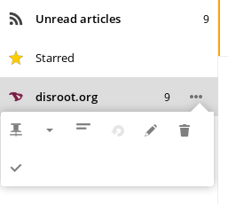

La aplicación Noticias es una herramienta bastante práctica para hacer un seguimiento de los nuevos artículos de noticias y publicaciones de todos los sitios que sigues en un solo lugar. La nube de Disroot provee una aplicación genial y simple de usar que hace el trabajo por ti y lo sincroniza en todos tus dispositivos. Ene ste tutorial trataremos de cubrir el uso básico, si estás interesado en integrarla con tus dispositivos, elige tu sistema operativo preferido en [esta sección](https://howto.disroot.org/nextcloud/sync-with-your-cloud).

----------
# Aplicación de Noticias en Disroot

Para acceder en forma web en la aplicación, sólo haz click en el icono de la aplicación de noticias  en la barra superior. La idea general detrás de la aplicación es muy simple. Agregas el feed RSS de tus sitios favoritos, recibes notificaciones de artículos nuevos, y luego los lees sin necesidad de ir a todos esos sitios web, abriendo montones de pestañas y distrayéndote en el camino.

Así que arranquemos:

## Agregar nuevos feeds
La mayoría de los sitios web provee feeds [RSS](https://es.wikipedia.org/wiki/RSS) o Atom. Una vez que tengas el link del RSS listo, puedes copiarlo y agregarlo a tu aplicación de noticias. Para agregar el feed simplemente haz click en el botón **"+ Suscribir"** y completa con la dirección del feed que previamente copiaste.

Para una mejor visión general y clasificación puedes crear carpetas y asignarles feeds. Para crear una nueva carpeta, haz click en el botón **"+ Nueva Carpeta"** en la barra lateral izquierda. Ahora puedes "arrastrar y soltar" los feeds que desees agregar a las carpetas.

## Opciones de feed
Cada feed puede ser optimizado según tus necesidades, haciendo click en el icono de **"Tres puntos"**:

