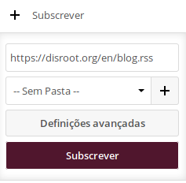
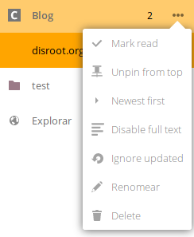

Uma aplicação de notícias (News) é uma ferramenta bastante útil para poder ser informado de novos artigos e posts de todos os sites que você gosta de acompanhar a partir de uma única aplicação. A cloud do Disroot cloud fornece uma ferramenta simples (chamada "News") de usar que permite fazer este trabalho e permite sincronizar com todos os seus dispositivos. Neste tutorial iremos apenas abordar uma utilização básica da mesma. Se está interessado em integrar esta aplicação com os seus dispositivos escolha o seu sistema operativo nesta [secção](https://howto.disroot.org/nextcloud/sync-with-your-cloud).

----------
# Aplicação News no Disroot

Para ir à aplicação News no browser basta carregar no ícone   na barra no topo. A ideia base por detrás desta aplicação é simples. Você adiciona 'feeds' de RSS dos seus sites favoritos, recebe notificações de artigos novos e lê-os sem ter que andar a percorrer os sites todos para ver que novos artigos é que existem.

Então vamos meter as coisas a funcionar:

## Adicionar novos "feeds" de RSS
A maioria dos websites têm disponível  [RSS](https://en.wikipedia.org/wiki/RSS) ou Atom feeds. Uma vez que tenha o link de RSS pronto, pode copiá-lo e adicioná-lo à aplicação News.
Para adicionar o "feed" basta carregar no botão **"+ Subscrever"** e adicionar o link de URL do "feed" que copiou.

Para ter mais organização das suas notícias, você pode criar pastas para organizar os seus "feeds". Para criar uma nova pasta carregue no botão **"+ Nova Pasta"** Na barra lateral esquerda. Agora pode "arrastar" os seus feed para as respetivas pastas.

## Opções dos "Feeds"
Cada "feed" pode ser otimizado para as suas necessidades. carregando no ícone 

