---
|```Meta information```|
|:--:|
|```This howto was last updated on``` **08-04-2019**```and it refers to:```<br>**Thunderbird: version - 60.5.3.1 for Arch Linux**<br>**Lightning Add-on: version 6.2.5.3**<br>**CardBook Add-on: version 35.5**|

**NOTE:**```If the howto refers to an older software version than the provided by``` **Disroot**,```or the one you're using in your device, there could be missing features or small parts of the information that may have changed.```<br> **Disroot's** ```how-to documentation is a community driven procces. We try to keep it as updated as we can.```

---

The contact, calendar and tasks features in **Disroot Cloud** can be connected to an email client like Thunderbird allowing emails, contacts, tasks, calendar to be managed from one place in your desktop.


# Installing the necessary Add-ons

In order to sync all your calendars, tasks and contacts to Thunderbird, you will need to install the following Add-on:

- **CardBook**  -to sync you contacts

- **Lightning** - is already pre-installed in Thunderbird (should be already installed by default in Thunderbird)

**Install CardBook**

- Go to the **Display Thunderbird menu** button on the the upper right corner
- Press the button **Add-ons**
- Go to extentions on the left bar
- You will find a search bar. Just search for **"Cardbook"**, when Thunderbird finds it, press install.
- Restart Thunderbird

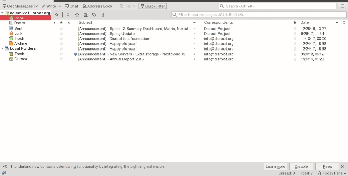

If for some reason you don't have the **Lightning** add-on pre-installed in Thunderbird. You can follow the the same process as above to install it.


# Integrating calendar with Thunderbird

First login to your **[Disroot cloud](https://cloud.disroot.org)**
- Go to calendar app
- Select the calendar you want to sync to Thunderbird.
- Press the **"three dots"** button to the right of the calendar
- Press **"Link"** and copy the link URL of your calendar. You will need it to sync with Thunderbird.


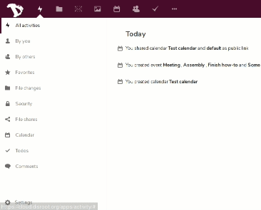


Now in Thunderbird:
- Go to Calendar or go directly to Calendar window and
- Select **"New calendar"** by right clicking on the calendar list with the mouse on the calendar list.

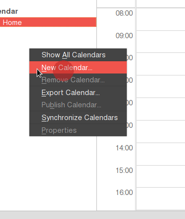

Now configure your new calendar to sync with your remote calendar:
- Select the option **"On the Network"**
- Select the option **CalDAV**
- In the location field, paste the link of your **Disroot** Calendar that you copied earlier
- Select offline support, if you want to keep a local copy of you calendar, in case you need to work offline
- Press next
- Give your calendar a name and assign a color.
- Then press **Next** and them **Finish**.


You will be prompted for your credentials:
- **Username:** *Your_Disroot_username*
- **Password:** *Your_super_secret_Disroot_password*

- Select the option **"Use password manager to remember this password"** (so you don't get asked for it every time you connect)
- Press **"OK"**

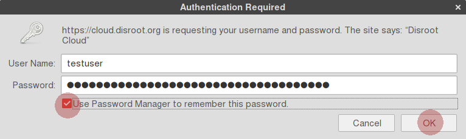

Your calendar is now synced with Thunderbird. Any event created in Thunderbird will appear on **Disroot Cloud** and vice versa.

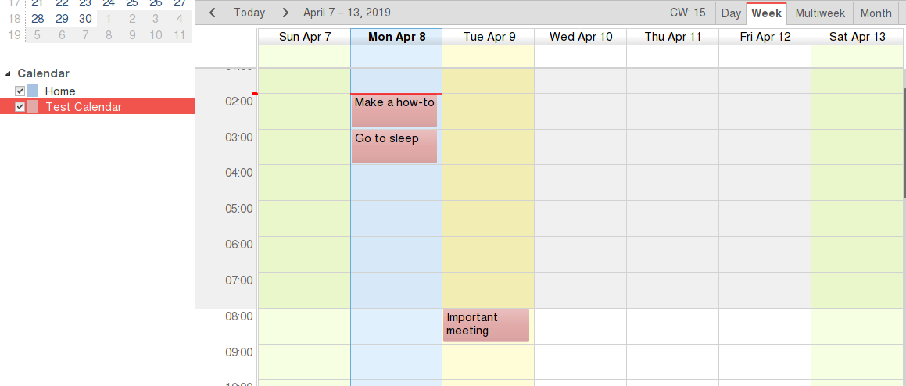

**Note:** If you have multiple calendars in your **Disroot** account, just repeat this process for each calendar. You can use a different color to each calendar to set them apart. This method works for any Nextcloud provider out there.
Additionally you can sync any calendars form any provider as long as they support caldav protocol (check with your provider for more details).


## Adding events with multiple calendars
If you have multiple calendars in Thunderbird, when creating an event you need to to select to which calendar it goes to, otherwise you maybe end up looking for it online in the wrong place

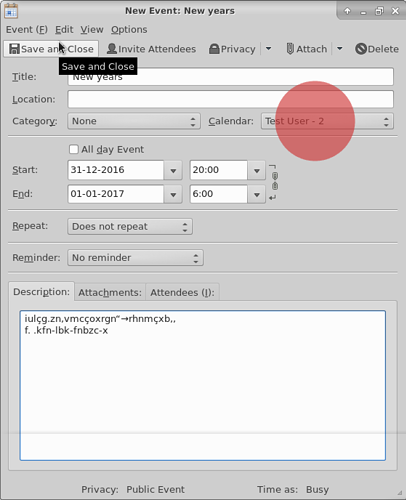


## Extra options
If you right click the calendars in Thunderbird you will have a set of options:

- Show or hide a Calendar
- Export Calendar
- Unsubscribe Calendar (remove it from Thunderbird)
- Making it read only (in Thunderbird)
- Synchronize Calendar  

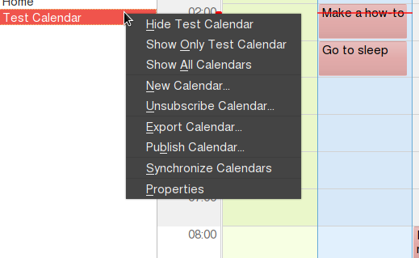

# Tasks - Integration with with Thunderbird
Tasks are automatically synchronized when you integrate a calendar with Thunderbird.

Any task you create in Thunderbird assigned to the calendar in question will be synchronized to your **Disroot Cloud Tasks app**. And vice versa.


# Contacts - Integration with Thunderbird

The process is similar to the integration of calendars in Thunderbird. First you need to get the link from the contacts in your **Disroot** account.

- Go to the contacts app in **Disroot Cloud**
- Go to settings ('gear' icon in the bottom left-panel)
- Select the **three dots** button on the right of the address book you want to synchronize
- Press **"Copy link"**

The link was saved to your machine clipboard, save it, you will need it later.


In Thunderbird
- Select CardBook (In the upper bar)
- Right click and select **"New Address Book"**
- Select **"Remote"**, and press **"Next"**
- Select **"CardDav"**
- In **"URL"**, paste the link to the remote Address Book

Fill your credentials:
- **Username:** *your_Disroot_username*
- **Password:** *your_Disroot_Account_Password*

- Press **"Validate"** to check if the credentials are correct. (you cannot finish the process without this step)
- Press **"Next"**

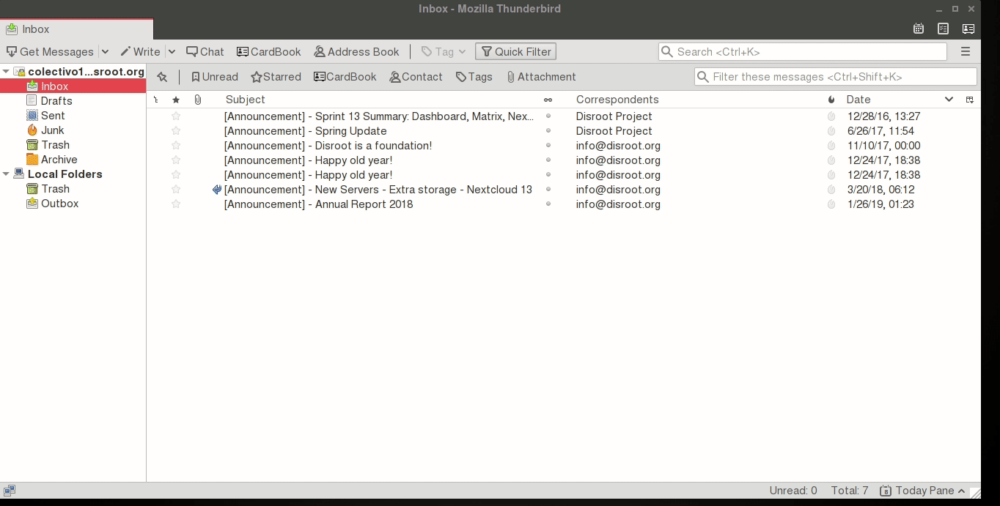

Next you will be asked:
- Select the Address Book you want to sync
- You can change the mane of the Address Book (only affects Thunderbird)
- Set a color for it. In case you have several Address Books, might be a good idea to use different colors.

- Select **"Work Offline"** if you want a copy of the Address Book to be stored locally in Thunderbird
- Press **"Next"**, and then **"Finish"**


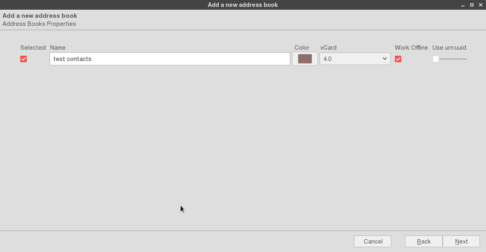

Your contacts in your **Disroot Cloud** contacts app are now synced with the remote contacts address book you created in Thunderbird

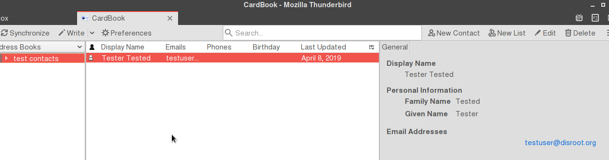

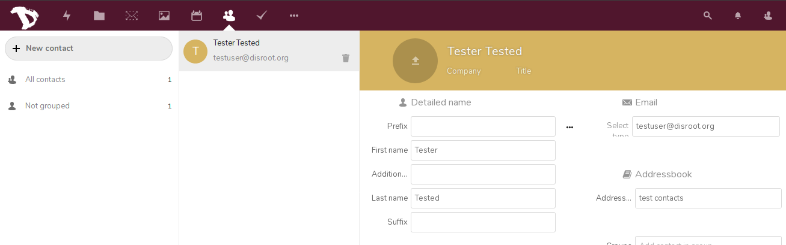

Any contacts you add/remove/edit in your **Disroot Cloud** account will be altered accordingly in your Thunderbird remote calendar and vice versa.

Synchronization between the local and remote calendar happens every few minutes.

But you can force a synchronization by:
- Right click on the calendar in question in Thunderbird
- Press **"Synchronize Address Book"**

If you want to move contacts from your Thunderbird Personal Address Book or Collected Addresses to your new remote address book:

- Select and drag the contact to your remote address book.

However it is advised that you create backups of your contacts.

---

 <center><a rel="license" href="http://creativecommons.org/licenses/by- sa/4.0/"></a><br />This work is licensed under a <br><a rel="license" href="http://creativecommons.org/licenses/by-sa/4.0/">Creative Commons Attribution-ShareAlike 4.0 International License</a>.</center>

---
