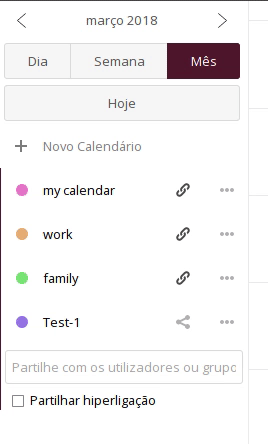
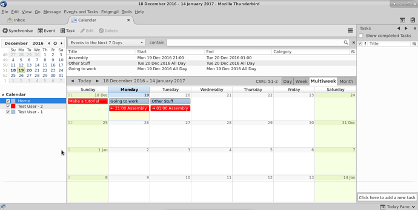
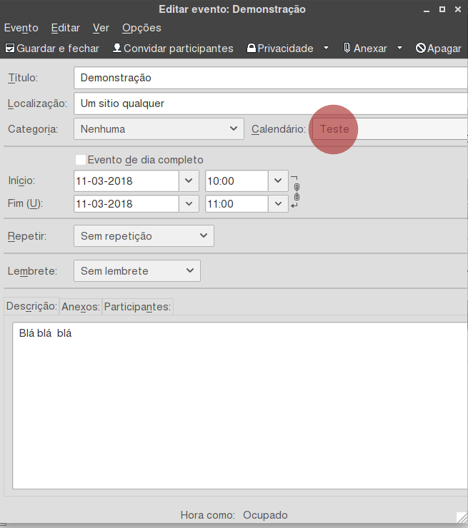
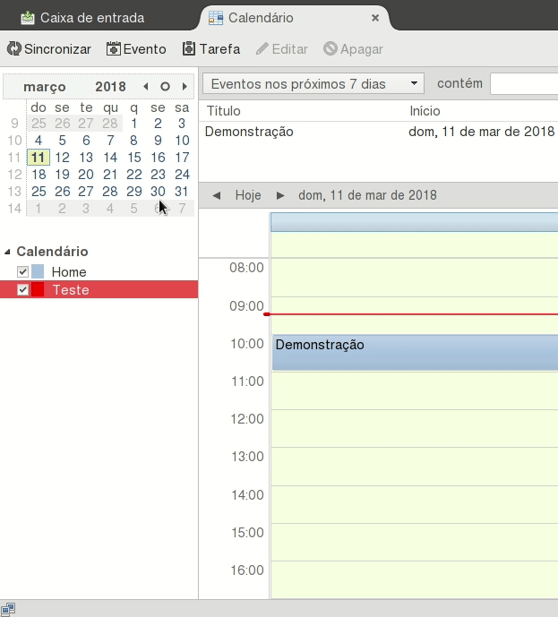
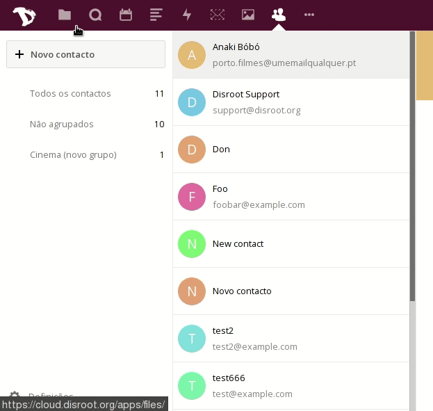
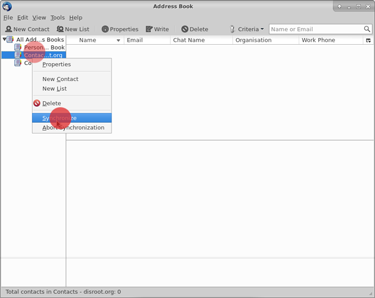

As aplicações de calendário e contactos na instância de Nextcloud fornecida pelo Disroot são muito fixes. Mas se tem o seu email do Disroot ligado a um cliente de email como o Thunderbird é bom ter os contactos e calendários da sua conta de Disroot integrados também com o Thunderbird e poder aceder a eles a partir de um único sítio no seu Desktop.

---------

# Instalar os Extras necessários

De modo a poder sincronizar os seus calendários, tarefas e contactos no Thunderbird precisa de instalar os seguintes extras:

* **Lightning** - um calendário para o Thunderbird
* **SoGo Connector**  - para sincronizar os seus contactos

**Nota!** Mesmo que queira apenas sincronizar os seus contactos, precisa na mesma do Extra **Lightning**. Assim diz o manual de utilizador do Nextcloud [aqui.](https://docs.nextcloud.com/server/9.0/user_manual/pim/sync_thunderbird.html)

## Instalar o Lightning

Neste momento o Lightning já vem pré-instalado no Thunderbird. Se não o tiver presente no seu thunderbird, faça uma atualização do Thunderbird.

Se por algum motivo o Lightning não estiver instalado mesmo após atualizar o Thunderbird pode seguir estes passos:

No Thunderbird vá a > Ferramentas > Extras > Extensões
Na página de Extensões irá encontrar um motor de busca no canto superior direito. Basta pesquisar por "Lightning". Assim que o Lightning aparecer basta carregar em Instalar.

Para acabar a instalação das duas Extensões precisa de reiniciar o Thunderbird.

## Instalar o So Go Connector

Esta Extensão não está listada no menu de Extras por isso temos que a descarregar do site do Sogo [aqui](https://sogo.nu/download.html#/frontends)

No website selecione **"SoGo Connector"**. Uma vez descarregada volte ao Thunderbird e:
* selecione a opção "Instalar Extra a partir de ficheiro".
* Selecione o ficheiro do Sogo Connectior (com a extensão .xpi) que acabou de descarregar do site
* carregue em "Instalar agora"

Para acabar a instalação das duas Extensões precisa de reiniciar o Thunderbird.

# Integrar o seu calendário do Disroot com o  Thunderbird

Primeiro faça login na sua conta de [cloud no Disroot](https://cloud.disroot.org) e vá à aplicação de calendário. Selecione o calendário que quer sincronizar com o Thunderbird.
Agora copie o link de URL do calendário em causa. Irá precisar deste URL para poder sincronizar o calendário com o Thunderbird.

 

Agora no Thunderbird vá a: Gestor de Atividade > Nova Mensagem > Calendário

Se tiver ativada a barra de menu no topo da Janela do Thunderbird também pode ir a:
Ficheiro > Novo > Novo Calendário

Agora configure o calendário: 
* Selecione a opção **Na rede** 
* Carregue em **"seguinte"** 
* Selecione a opção **CalDAV** 
* No campo **"Localização"** coloque o link URL do seu calendário. 
* Selecione a opção **"Suporte offline"** se quiser manter uma cópia local do seu calendário. 
* Carregue em **"Seguinte"** 
* Dê um nome e uma cor ao seu calendário (isto ajuda a distinguir os vários calendários diferentes) 
* Carregue em **Concluir**

No final deste processo o Thunderbird irá pedir as credenciais de acesso ao seu calendário: 
* **Nome de utilizador** *(O seu nome de utilizador da sua conta no Disroot)*
* **Palavra-passe** *(A sua password de utilizador do Disroot)*

Preencha esta informação e selecione a opção **Utilizar o gestor para memorizar esta palavra-passe** (isto permite que o Thunderbird guarde a password e não lha peça sempre que abrir o seu calendário).
No fim carregue em **"OK"**

O seu calendário está agora sincronizado com o Thunderbird. Qualquer evento criado no Thunderbird irá aparecer no Calendário do Disroot e vice versa.

**Nota!**
Se você têm vários calendários na sua conta de utilizador no Disroot, repita este processo para cada calendário. Você pode utilizar cores diferentes para distinguir cada calendário. 
Este método funciona para qualquer fornecedor de uma instância de Nextcloud ou Owncloud (desde que tenha a aplicação de calendário instalada).
Para além disso pode sincronizar no seu thunderbird calendários de outros fornecedores desde que estes suportem o protocolo CalDAV (procure mais informações junto do seu "fornecedor")

## Adicionar eventos com múltiplos calendários
Se tem vários calendários no Thunderbird então quando criar um evento necessita de escolher em qual calendário esse evento será criado. Caso contrário pode acabar a procurar as informações do seu evento no sítio errado.

Se carregar com a tecla direita do rato num calendário irá aparecer uma série de opções:

* Esconder ou mostrar calendários
* Exportar Calendário
* Cancelar a subscrição do calendário (removê-lo do Thunderbird)
* Making it read only (in Thunderbird)
* Synchronize Calendar  
* Em propriedades pode escolher:
  * Tornar o calendário só de leitura
  * Alterar a atualização do calendário de 30 em 30 minutos para 5 em 5 por exemplo

# Contatos - Integração com o Thunderbird

O processo é semelhante  à integração de um calendário no Thunderbird. Primeiro é necessário obter um endereço URL do seu Livro de Endereços na sua conta Distoot.

Vá à aplicação de contactos na sua cloud do Disroot.

* Depois vá a Definições (o ícone 'Roda Dentada' no canto inferior esquerdo).
* Selecione o Livro de Endereços que quer sincronizar com o Thunderbird
* Carregue no botão com 3 pontinhos e selecione **"Compartilhar Hiperligação"**

O link será copiado automaticamente, guarde o link, num documento, vamos precisar dele depois.

No Thunderbird selecione:
* Ferramentas > Livros de Endereços

Em seguida escolha:  
* Ficheiro > Novo > Remote Address Book

Na janela seguinte ser-lhe-á pedido que coloque o nome do livro de endereços e o link:

* O **Name** é o nome que quiser dar a este livro de endereços no Thunderbird
* **URL** é o link URL que copiou anteriormente na sua na aplicação de contactos do Disroot

No mesmo painel:
* Pode alterar o intervalo de sincronização da lista de endereços para de 5 em 5 minutos (por omissão é de 15 em 15 minutos)
* Pode alterar as permissões do calendário para "Read-only" (apenas de leitura) mas se fizer isso não será capaz de editar os seus contactos deste livro de endereços no Thunderbird.
* Configurar notificações **(se não quiser ser notificado cada vez que há uma sincronização, aconselhamos a desativar todas as notificações)**

Quando terminar carregue em **"OK"**

Carregue com a tecla direita do rato no seu novo livro de endereços remoto e selecione **"Sincronize"**

Ser-lhe-à pedido as suas credenciais de acesso à sua conta do Disroot

* **Username:** *o seu nome de utilizador do Disroot*
* **Password:** *a sua password de acesso à sua conta Disroot*

Selecione a opção: **"Use password manager to remember this password"** para que o Thunderbird se lembre da password e não lha peça sempre que usa o thunderbird.

Carregue em **"ok"**

Os contactos do seu livro de endereços no no Disroot está agora sincronizado com o Livro de endereços remoto que acabou de criar no thunderbird

Qualquer contacto que adicione/remova/edite na sua conta Disroot será alterado também no livro de endereços do thunderbird e vice versa.

Se quiser mover contactos do seu Livro de Endereços pessoal do thunderbird ou Outros Endereços, basta selecionar e arrastar o contacto em causa para o Livro de Endereços remoto.

Contudo é aconselhável criar backups dos seus contactos. So pó caso. :wink:
