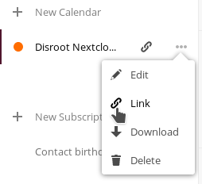

||
|:--:|
|calcurse is "a calendar and scheduling application for the command line", quoting [its website](http://calcurse.org/).|

This tutorial shows you how to set up synchronization between your Nextcloud calendar and calcurse.

Note: the following has been tested on GNU/Linux with the Nextcloud instance hosted on Disroot, although it should work on other Unix-like OS's with other Nextcloud instances, too.

## Before we start

According to the website of the project, CalDAV support is currently experimental. For this reason, making backups, especially *before* the initial setup, is highly recommended.

For more information on how to back up (i.e. download a local copy of) your calendar, look at [this section](https://howto.disroot.org/en/nextcloud/apps/calendar#delete-edit-download-calendar) in the howto on the Nextcloud Calendar app.

Also, if you've already used calcurse locally, you may want to back up the content of the configuration files and database(s) of calcurse as well, typically located at `~/.calcurse/caldav/` (where `~` is your home directory).

## Create a configuration file

Create a new directory at `~/.calcurse/caldav/`, create a new file with the name `config` inside it, and copy and paste the contents of [this sample config file](https://github.com/lfos/calcurse/blob/master/contrib/caldav/config.sample) in it. To do this quickly in the terminal, you can use the following commands (the latter will overwrite your `config` file if it already exists in `~/.calcurse/caldav/`):

```
mkdir ~/.calcurse/caldav/
curl https://raw.githubusercontent.com/lfos/calcurse/master/contrib/caldav/config.sample > ~/.calcurse/caldav/config
```

Next, open the config sample file with your favourite text editor. If it happens to be `nano`, you can do that by

```
nano ~/.calcurse/caldav/config
```

Find the following lines inside `config`:

```
# Host name of the server that hosts CalDAV.
Hostname = some.hostname.com

# Path to the CalDAV calendar on the host specified above.
Path = /path/to/calendar/on/the/server/
```

Replace the host name with `cloud.disroot.org` and the path with `remote.php/dav/calendars/username/calendar-id/`. You can find out what the exact path is by logging into your Nextcloud account, opening the calendar app, and, on the left sidebar, clicking on the three dots next to the calendar name and then "Link". Now, you should be able to see and copy a hyperlink that looks like `https://cloud.disroot.org/remote.php/dav/calendars/username/calendar-id/`.



Inside `config`, there's also the following line:

```
DryRun = Yes
```

This is for safety measures so that you can test your configuration before actually syncing your calendar. Let's leave it as it is for now; we'll return to it soon.

Now, find the following lines:

```
#[Auth]
#Username = user
#Password = pass
```

Uncomment the first two lines (including the header `[Auth]`), i.e. remove the `#` sign from the beginning of each line, and replace "user" with your actual username.

### Multiple ways of handling your password

One way of providing your password is uncomment the line for the password and replacing "pass" with your password in the config file. Although this is convenient as you only need to do it once, anyone who has access to your home folder can normally see what your password is.

For this reason, the [official documentation](https://github.com/lfos/calcurse/tree/master/contrib/caldav#usage) mentions using a password manager together with the `CALCURSE_CALDAV_PASSWORD` variable each time you start the synchronization process as an alternative. In the case of [pass](https://www.passwordstore.org/), this would be something like:

```
CALCURSE_CALDAV_PASSWORD=$(pass show disroot) calcurse-caldav
```

If you use [KeepassXC](https://keepassxc.org/), you would do the same with the command below:

```
CALCURSE_CALDAV_PASSWORD=$(keepassxc-cli show mydatabase.kdbx Disroot -k supersecretkeyfile.png -a Password) calcurse-caldav
```

## Testing your configuration

For syncing for the first time, you need to issue the command `calcurse-caldav` together with one of the following arguments:

```
--init=keep-remote # Remove all local calcurse items and import remote objects
--init=keep-local  # Remove all remote objects and push local calcurse items
--init=two-way     # Copy local objects to the CalDAV server and vice versa
```

In other words, if, for instance, you want to import your calendar from Nextcloud to calcurse *without* making any changes on Nextcloud for the first time, use `calcurse-caldav --init=keep-remote`.

If there are no error messages, go back to your `config` file and change the value of `DryRun` to `No`, and run the above command again. For any subsequent sync requests, `calcurse-caldav` (optionally with the `CALCURSE_CALDAV_PASSWORD` variable, as mentioned earlier) will be enough.

And that's it! If everything went well, you should have synchronization set up between your Nextcloud calendar and calcurse through CalDAV.
