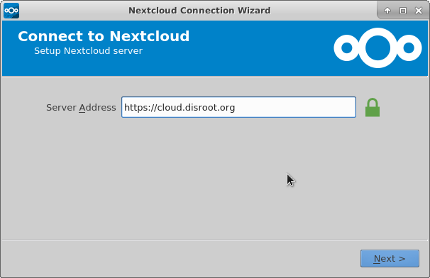
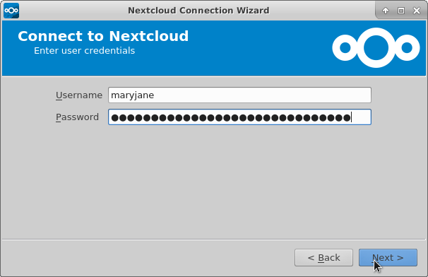
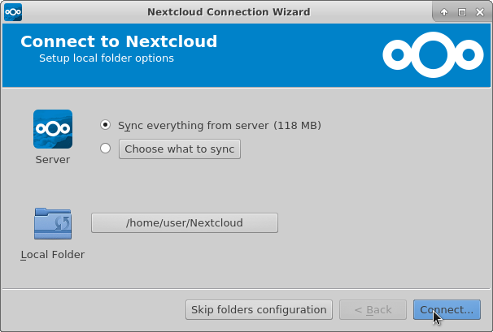
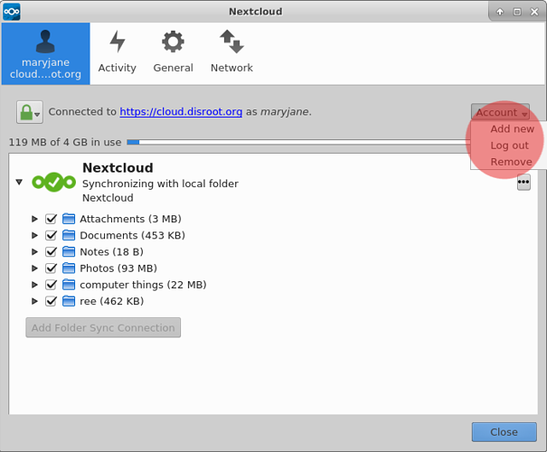
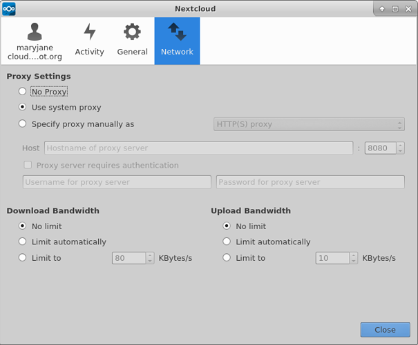
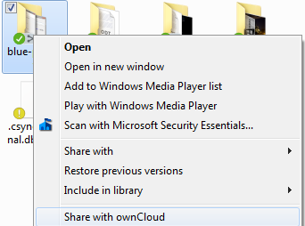
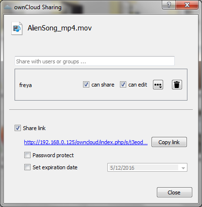

Using the Nexcloud desktop client provides a way to sync your files stored in your Disroot cloud with a local folder on your desktop.
Meaning you can access/add/remove/edit the files in your Disroot account on your desktop without needing to log to your account via
web-browser.

# Install Nexcloud app (client)

If you don't have Nextcloud-client installed on your desktop yet, you can see how to do it [here](https://nextcloud.com/install/#install-clients).
For users of ubuntu or ubuntu based distributions you can find better detailed instructions [here](https://www.c-rieger.de/how-to-install-nextcloud-desktop-client-for-ubuntu/).

# Add a new account

The first time you run Nextcloud-client you will be directly greeted with account setup.
Add disroot's address in URL field **https://cloud.disroot.org**, then press "next".

Next add your disroot account details:
Username: *your Disroot username*
Password: *your Disroot account password*
Then press **"next"**

Now it's time to choose what do you want to sync and where should it be synced on your harddrive. By default Nextcloud wants to create a folder called "Nexcloud" in your home folder. This folder will be used to sync all the files you store on your cloud to.

You can choose to sync everything or select which folders you would like to have synced. This is specially useful if your cloud storage is huge and you don't want to have exact copy of it on your desktop or laptop. This setting can be changed at any time later on.

Once you are happy with the settings, just hit "Connect"

And then **finish**
Any file you edit in this folder (.txt, spreadsheet, word) will be synced with your Disroot cloud. Any files you remove or add will be removed or added in your Disroot cloud. This of course works the other way around. Any change done on Disroot cloud interface will reflect your synced folder on your desktop, unless you opted out from synchronizing a particular file or folder.

# General options

Nextcloud-client opens by default in the background. By interacting with nextcloud systray icon you can focus the app.

The app consists of 4 main tabs:
 - Your account
 - Activities
 - General
 - Network

## Your account
Gives you general sense of what's the current status of your app. You can:
 - see the status of any synchronization
 - choose what folders to sync by clicking in the checkbox option
 - confirm the signature of the ssl keys by pressing the padlock button

The account button let's you remove your account from the desktop client  or add a new one. Nextcloud client work with multiple accounts. You aren't even restricted to only disroot accounts either. You can add any nextcloud/owncloud account from any other server (including your own server of course).

## Adding another account
Adding extra account is the same as adding the first one. You will be asked the same questions during the setup. The important thing to keep in mind. **You can't use the same Nextcloud folder** with multiple active accounts. You should therefore make sure you are syncing to another folder.

After you add a second account your, it will show up on the top bar of the app. This is how you also switch between accounts if you need to change settings.

## Activity tab
**Activity** tab gives you an overview on all the uploaded/downloaded/added/removed files and folders from your accounts. Similar to Activity app in disroot cloud interface.

## General tab
**General** tab lets you:

 - Set the limit for files sizes that you download to you local folder
 - Set to show notifications on your desktop
 - Launch this panel when the system starts

## Network tab

 - Configure your nextcloud desktop client for your proxy setting (if you are using a proxy)
 - Set maximum download and upload bandwidth (can be use full if your bandwidth is limited)

## Sharing From Your Desktop (macos and windows only!)

If you are using Windows or MacOS it's possible to create share links directly from the local folder of a file or sub-folder to send by email to someone else. By right clicking on the file/or folder  

And you will be presented with the same sharing options as if you where accessing your files in your Disroot account using a browser.

This feature does not exist when using Linux :(
Though if you use nautilus file browser (gnome,unity,etc) you could install additional plugin called owncloud-client-nautilus (naming depends on the distribution, could be nextcloud instead).
