# Meta information
This howto was last updated on 06-04-2019 and it reffers to:
- Nextcloud Desktop sync client: version - 2.5.2git
- nautilus-nextcloud integration plugin - 2.5.0-1 AUR

**NOTE:** If the howto reffers to an older software version than the provided by **Disroot**, or the one you're using in your device, there could be missing features or small parts of the information that may have changed.

**Disroot's** how-to documentation is a community driven procces. We try to keep it as updated as we can.

---

Using the Nexcloud desktop client provides a way to sync your files stored in your **Disroot Cloud** with a local folder on your desktop.
Meaning you can access/add/remove/edit the files in your **Disroot** account on your desktop without needing to log to your account via web-browser, and can access them when offline.

# Install Nexcloud app (client)

You can see how to install the Nextcloud desktop app [here](https://nextcloud.com/install/#install-clients).
Users of ubuntu or ubuntu based distributions you can find better detailed instructions [here](https://www.c-rieger.de/how-to-install-nextcloud-desktop-client-for-ubuntu/).

# Add a new account

The first time you run the Nextcloud Desktop client you will be directly greeted with account setup:

- **Select:** Log in
- **Server Address:** [cloud.disroot.org](cloud.disroot.org)
- Press: Next

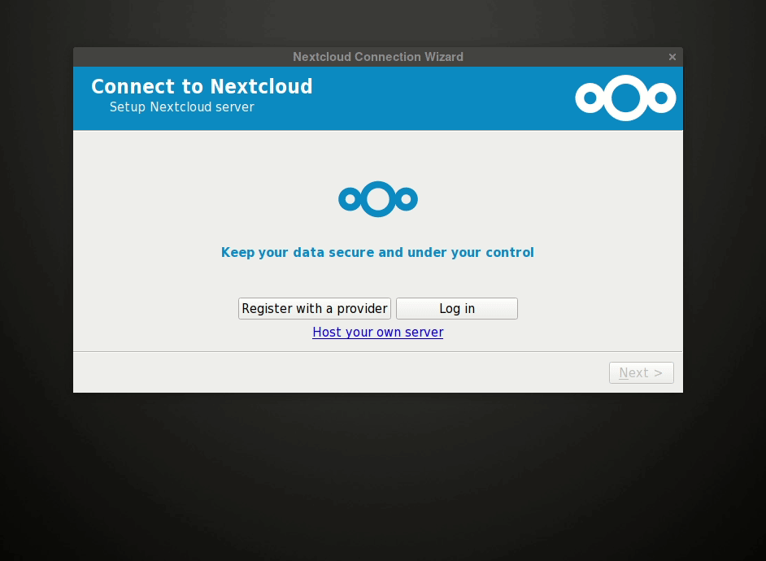

## Login into your account 
There are two ways of doing it:

- **App Password (for Two factor authentication)**
- **Normal Credentials**

## App Password (for Two factor authentication)
If you have enabled **Two-Factor Authentication (2FA)** in your **Disroot Cloud**, then you need to:

- Generate an "App Password", in the **Security** section of your **Disroot Cloud** account web interface, to generate an specific **App Password** for the Nextcloud Desktop Client. You can read on how to do that [here](https://howto.disroot.org/en/cloud/introduction#app-password).

Once you have your **App Password** token **created** and **copied**, in the login menu:

- **Select:** "Alternative login using app token"
- **Username:** *your_disroot_account_username*
- **App Token:** Paste the App Token you created
- **Press:** Grant Access

   

## Normal Credentials (no Two factor authentication)

If you do not have 2FAenabeled then just:
- Press the Log in button
- **Username:** *your_disroot_account_username*
- **Password:** *your_super_secret_password*
- Press the Log in button again
- Then press **"Grant Access"**

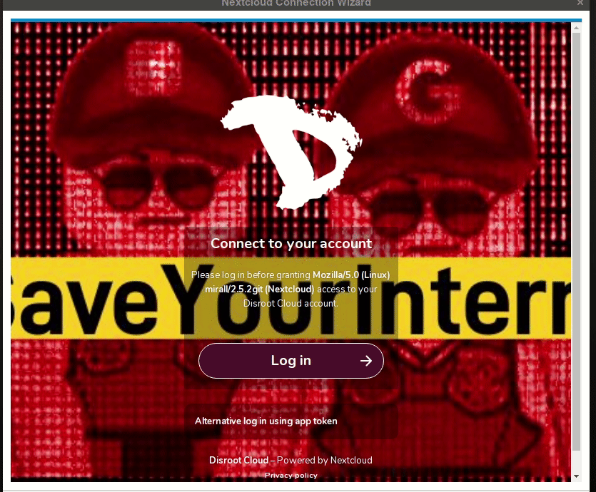   

## Configure sync folder

Final step in adding a new account is to configure the sync folder.
After you successfully log in you will be prompted with a options panel where you can:

- Select what folders to sync from your **Disroot Cloud** to your machine, by pressing "Choose what to sync"
- Set a limit to not sync any file above a certain size you decided (this can be changed later at any point).
- Authorize if you also want to sync External Storage's (you can know more about External Storage's [here](https://howto.disroot.org/en/cloud/introduction#external-storages))
- Change the destination folder where your files will be synced in your hard drive (The Nextcloud Desktop Client will by default create a folder called "Nextcloud", in your home folder).

Once you are happy with the settings, just hit "Connect" at the lower left corner of the menu.

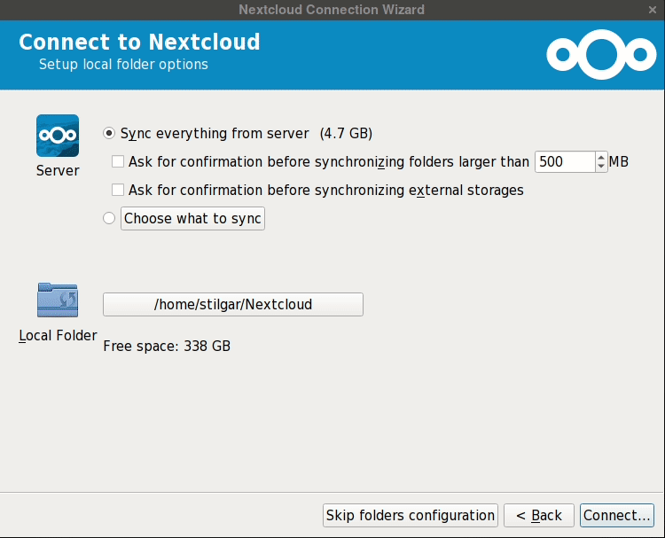

Any file you edit in the local folder in your machine (.txt, spreadsheet, word) will be synced with your **Disroot Cloud**. Any files you remove or add will be removed or added in your **Disroot Cloud**. Any change done from the interface will reflect your synced folder on your desktop, unless you opted out from synchronizing a particular file or folder.

# General options

Nextcloud client opens by default in the background. By interacting with nextcloud systray icon you can focus the app.

The app consists of 4 main tabs:
 - [Your account tab](#your-account-tab)
 - [Activity tab](#activity-tab)
 - [General tab](#general-tab)
 - [Network tab](#network-tab)

# Your account tab
Gives you general sense of what's the current status of your app.

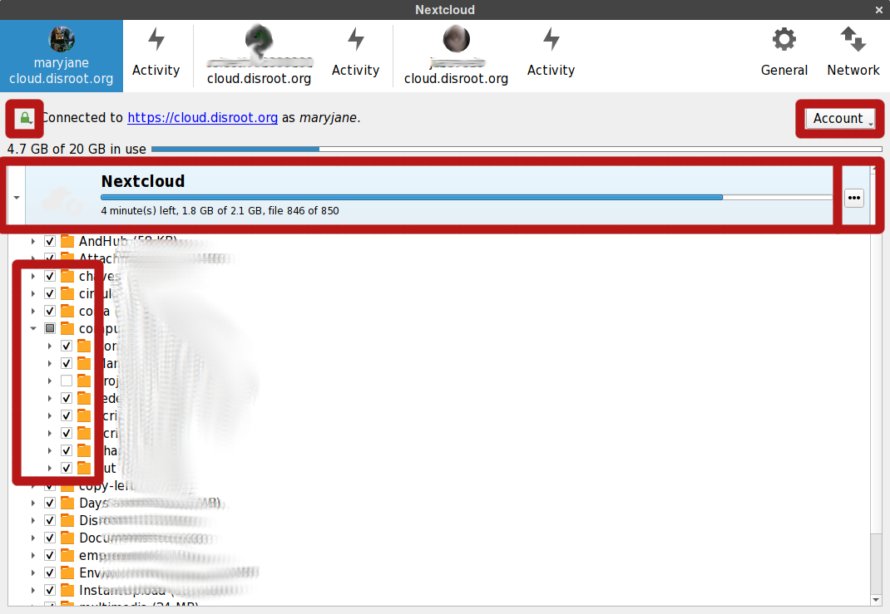

**You can:**
 - See the status of any synchronization, and remaining disk space on your **Disroot Cloud** account

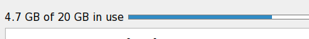

 - Choose what folders to sync or stop syncing by clicking in the checkbox option. You will need to press the Apply button on the lower right corner of the window for the changes to take effect

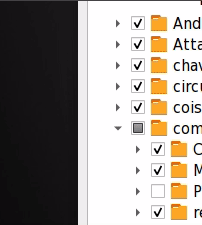

 - Confirm the signature of the ssl keys by pressing the padlock button

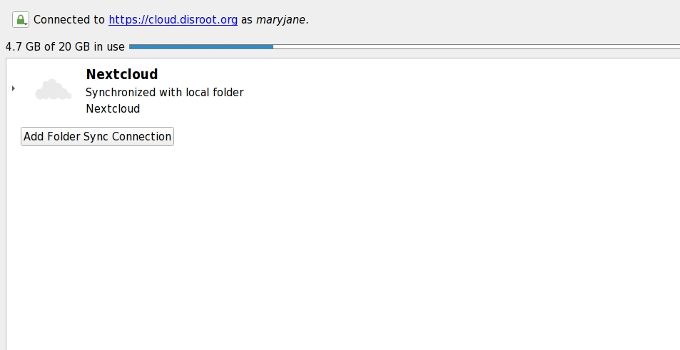

 - Pause/Restart synchronization
 - Open the desktop folder where your files are
 - Remove folder

All by pressing the three dotted button

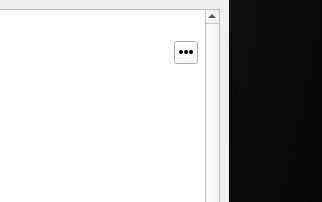

- Add a new account
- Remove account
- Logout

All by pressing the **"Account"** button on the upper right side of the window

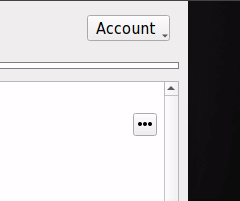

## Adding multiple accounts

Nextcloud Desktop Client works with multiple accounts. You aren't even restricted to only **Disroot** accounts either. You can add any Nextcloud account from any other server (including your own server of course).

Adding extra account is the same as adding the first one.
In the **"Account"** button:
- Press **"Add new"**
- Follow the same steps as you did to register the first account (adjust the URL's if it's a different server)

**NOTE:** The important thing to keep in mind. **You can't use the same Nextcloud folder** with multiple active accounts. 
During the configuration process of a second account, Nextcloud Desktop Client will create in your home folder a folder called **Nextcloud2"**. Keep and eye out for this.

After you add a second account your, it will show up on the top bar of the app. This is how you also switch between accounts if you need to change settings.

You will also see one separate **Activity tab** for each account.

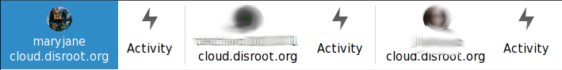

# Activity tab
**Activity** tab gives you an overview on all the uploaded/downloaded/added/removed files and folders from your accounts. Similar to Activity app in **Disroot cloud interface.**

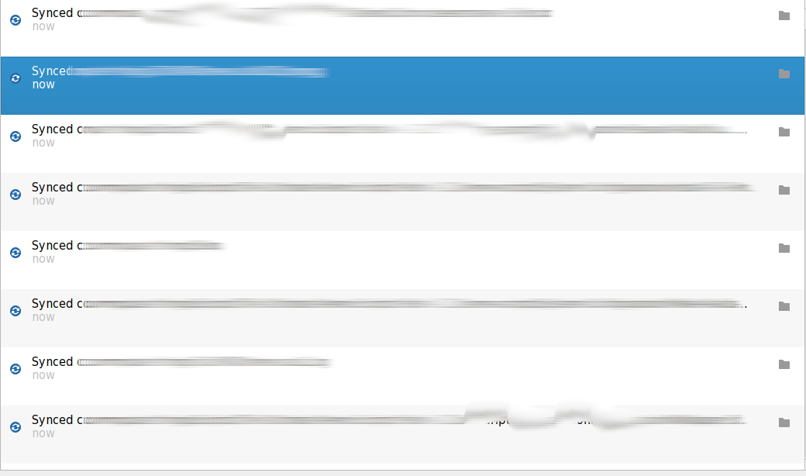

# General tab
**General** tab lets you:

 - Set the limit for files sizes that you download to you local folder
 - Set if the client should ask permission to sync External Storage's
 - Set to show notifications on your desktop
 - Launch Nextcloud Desktop Client when the system starts
 - See legal notice and if there are any updates

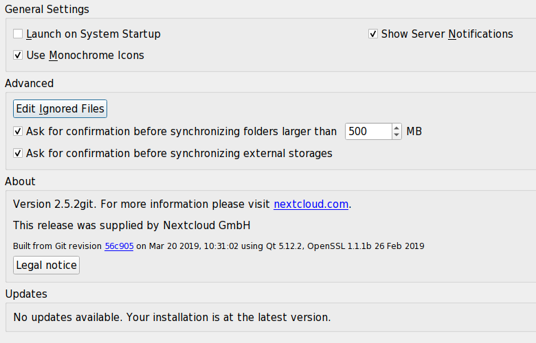

**Edit Ignored Files**
Some files are ignored by default, and not synced by Nextcloud Desktop Client. For example hidden files or files that the name starts with: "~/", "."

If this affects you, you can change this by:
- Pressing the button **"Edit Ignored Files"**
- Press the option **"Sync hidden files"** (if you want to sync all hidden files)
- Press the checkbox options to edit manually what files to allow to sync
- To add new rules for files to ignore press **"Add"**
- At the end press **"ok"**
- You can set the rules back to the original setting by pressing **"Restore Defaults"**

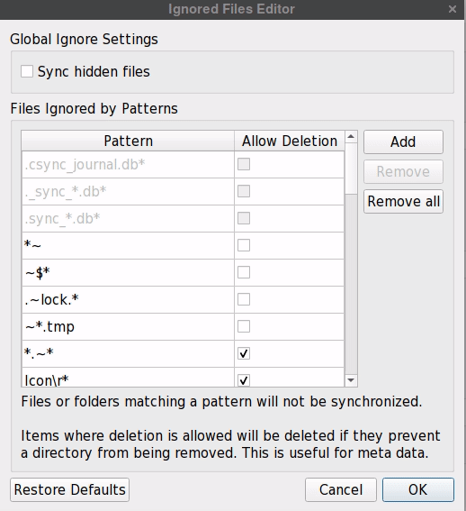

# Network tab

The Network tab allows you to:
 - Configure your nextcloud desktop client for your proxy settings (if you are using a proxy)
 - Set maximum download and upload bandwidth

# Sharing From Your Desktop

Nextcloud Desktop Client allows integration, with some linux file managers, allowing you to share a file without needing to open the web interface of your **Disroot Cloud** account.

Supported file managers at this moment are:
- Nautilus
- Nemo
- Caja
- Dolphin

For the first three file managers you need to install
- `Nextcloud-client-nautilus` plugin.
The plugin name might be different in some linux distributions e.g in Arch Linux it's `nextcloud-nautilus`.

- `python-nautilus` a dependency.

KDE/dolpfin file manager users must install the dolphin plugin for nextcloud.

This integration allows you to:
- Create Share links of files or folders
- Manage those share links
  - Delete them
  - Set expiry date
  - Set a password to open the link
  - Share directly with other users or groups (if you know their usernames, or group name)

To create a **share link** go to the Nextcloud folder on your machine with the file or folder you want to share.

Once you copied the link just send it via email, or some other way.

To share directly with **another user or group** of **Disroot Cloud** (if you the persons username, or the group name)
Just:
- Write the username or group name in question in the text box
- Press the arrow button on the right side of the text box

And you will see in the button of the window information regarding that particular share.

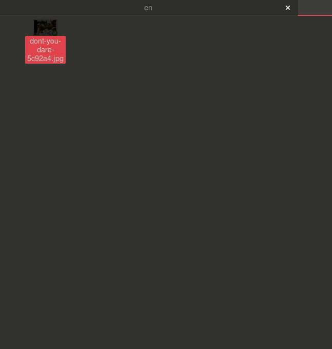

And manage the share with the user in question:
- Deleting the share
- Allow re-sharing
- Allow editing

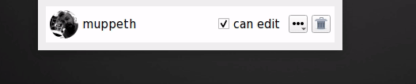

You can manage these shares you create from your file manager at any time by the same process you used to originally create the share:

- Right clicking on the file or folder
- Select the nextcloud option
- And press share

**File status icon**

With file manager integration, the file manager generates icons on the folders and files inside your nextcloud folder.
This allows you to quickly see which files and folders where:
- Successfully synced or not
- That are still syncing
- Shared

||
|:--:|:--:|
|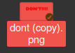|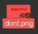|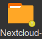|

---

 
 This work is licensed under a  <a rel="license" href="http://creativecommons.org/licenses/by-sa/4.0/">Creative Commons Attribution-ShareAlike 4.0 International License</a>.

---
