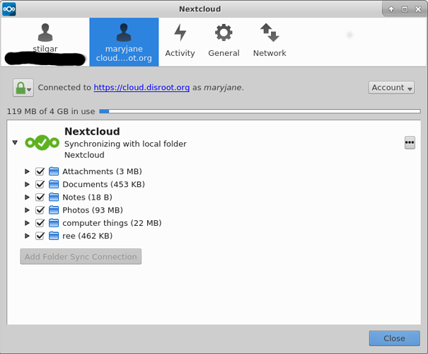

L'utilisation du client Nexcloud Desktop Client vous permet de synchroniser vos fichiers stockés dans votre cloud Disroot avec un dossier local sur votre bureau.
Ce qui signifie que vous pouvez accéder/ajouter/supprimer/éditer les fichiers de votre compte Disroot sur votre bureau sans avoir besoin de vous connecter à votre compte via un navigateur web.

# Installer l'application Nexcloud (client)

Si vous n'avez pas encore installé Nextcloud-client sur votre bureau, vous pouvez voir comment le faire [ici](https://nextcloud.com/install/#install-clients].
Pour les utilisateurs d'Ubuntu et des distributions basées sur Ubuntu, vous pouvez trouver des instructions plus détaillées [ici](https://www.c-rieger.de/how-to-install-nextcloud-desktop-client-for-ubuntu/].

# Ajouter un nouveau compte

La première fois que vous exécutez Nextcloud-client, vous serez directement accueilli avec la configuration du compte.
Ajoutez l'adresse de disroot dans le champ URL **https://cloud.disroot.org**, puis appuyez sur "next".

Ajoutez ensuite les détails de votre compte de disroot:
Nom d'utilisateur: *votre nom d'utilisateur Disroot*.
Mot de passe: *votre mot de passe pour votre compte Disroot*.
Puis appuyez sur **"Suivant"**.

Maintenant, il est temps de choisir ce que vous voulez synchroniser et où le synchroniser sur votre disque dur. Par défaut, Nextcloud veut créer un dossier appelé "Nexcloud" dans votre dossier d'origine. Ce dossier sera utilisé pour synchroniser tous les fichiers stockés sur votre cloud.

Vous pouvez choisir de tout synchroniser ou sélectionner les dossiers que vous souhaitez synchroniser. Ceci est particulièrement utile si votre stockage en nuage est énorme et que vous ne voulez pas en avoir une copie exacte sur votre ordinateur de bureau ou portable. Ce réglage peut être modifié ultérieurement à tout moment.

Une fois que vous êtes satisfait des réglages, appuyez simplement sur "Se connecter".

Et ensuite, "Fini".
Tout fichier que vous éditez dans ce dossier (.txt, tableur, word) sera synchronisé avec votre cloud Disroot. Tous les fichiers que vous supprimez ou ajoutez seront supprimés ou ajoutés dans votre cloud Disroot. Cela fonctionne bien sûr dans l'autre sens. Toute modification effectuée sur l'interface cloud de Disroot reflétera votre dossier synchronisé sur votre bureau, à moins que vous n'ayez choisi de ne pas synchroniser un fichier ou un dossier particulier.

# Options générales

Nextcloud-client s'ouvre par défaut en arrière-plan. En interagissant avec l'icône du système nextcloud, vous pouvez focaliser l'application

L'application se compose de 4 onglets principaux:
- Votre compte
- Activités
- Général
- Réseau

## Votre compte
Vous donne un aperçu général de l'état actuel de votre application. Vous pouvez:
- voir l'état de toute synchronisation
- choisir les dossiers à synchroniser en cliquant sur la case à cocher
- confirmer la signature des clés ssl en appuyant sur le bouton de cadenas

Le bouton Compte permet de supprimer votre compte du client de bureau ou d'en ajouter un nouveau. Le client Nextcloud fonctionne avec plusieurs comptes. Vous n'êtes même pas limité aux seuls comptes Disroot. Vous pouvez ajouter n'importe quel compte nextcloud/owncloud à partir de n'importe quel autre serveur (y compris bien sûr votre propre serveur).

## Ajouter un autre compte
Ajouter un compte supplémentaire est la même chose que d'ajouter le premier. Les mêmes questions vous seront posées lors de l'installation. La chose importante à garder à l'esprit. **Vous ne pouvez pas utiliser le même dossier Nextcloud** avec plusieurs comptes actifs. Vous devez donc vous assurer que vous vous synchronisez avec un autre dossier.

Après avoir ajouté un deuxième compte, il apparaîtra dans la barre supérieure de l'application. C'est aussi ainsi que vous pouvez passer d'un compte à l'autre si vous devez modifier les paramètres.

## Onglet Activité
L'onglet **Activité** vous donne un aperçu de tous les fichiers et dossiers téléversés/téléchargés/ajoutés/supprimés de vos comptes. Similaire à l'application Activité dans l'interface cloud de Disroot.

# Onglet Général
L'onglet **Général** vous permet de:

- Définir la limite de taille des fichiers que vous téléchargez dans votre dossier local.
- Configurer l'affichage des notifications sur votre bureau
- Lancer ce panneau au démarrage du système

## Onglet Réseau

- Configurer votre client de bureau nextcloud pour vos paramètres proxy (si vous utilisez un proxy)
- Définir la bande passante maximale de téléchargement et de téléversement (peut être utilisée à pleine capacité si votre bande passante est limitée)

## Partager à partir de votre bureau (MacOS et Windows seulement)

Si vous utilisez Windows ou MacOS, il est possible de créer des liens de partage directement à partir du dossier local d'un fichier ou d'un sous-dossier à envoyer par email à quelqu'un d'autre. En cliquant avec le bouton droit de la souris sur le fichier ou le dossier  

Et vous aurez les mêmes options de partage que si vous accédiez à vos fichiers dans votre compte Disroot à l'aide d'un navigateur.

Cette fonctionnalité n'existe pas sous Linux: (
Bien que si vous utilisez le navigateur de fichiers nautilus (gnome, unit, etc.) vous pouvez installer un plugin supplémentaire appelé owncloud-client-nautilus (nom dépend de la distribution, pourrait être nextcloud à la place).
