----------

O Gnome é um ambiente gráfico para Linux muito popular, moderno e fácil de usar. É o meu ambiente gŕafico predileto principalmente devido à fácil integração com os serviços de cloud do Disroot.

Integração com o ambiente gráfico significa que deixa de ser necessário fazer login com a cloud do Disroot via um browser de Internet cada vez que precisa de procurar ou adicionar uma informação. Significa que tudo está  disponível diretamente a partir do Desktop. Para além disso faz parecer e sentir que a sua cloud está integrada as outras aplicações que utiliza enquanto trabalha. É definitivamente **A** maneira de fazer as coisas.

Neste tutorial gostaria de lhe mostrar quão fácil é integrar a sua cloud com o seu computador. O processo de configuração não deve demorar mais do que uns minutos.

-------
# Configurar as contas online

De modo a ter tudo a funcionar tudo o que precisa de fazer é:

 - Ir às **Definições** do GNOME (eg. escrever "definições" no Dashboard)
 - Carregar em **"Online Accounts"**
 - Selecionar **"Nextcloud"** (ou owncloud se estiver a usar uma versão mais antiga do GNOME)
 - Siga as instruções para preencher as suas credenciais:
    - **Servidor:** https://cloud.disroot.org
    - **Utilizador:** *o_seu_nome_de_utilizador*
    - **Senha:** *a_sua_password_ultra_secreta*

Carregar em **"Ligar"**

Se seguiu estes passos corretamente, então a partir de agora pode escolher que aspetos da sua cloud é que quer integrar no seu desktop. Pode alterar estas configurações a qualquer momento. Eu escolhi integrar tudo.

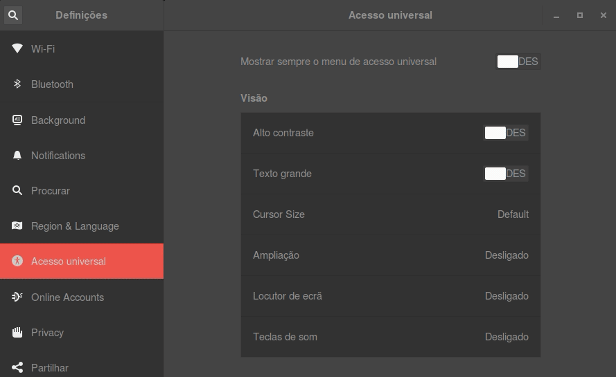

--------------
# Calendário

Uma das funcionalidades úteis é o calendário. Se carregar na **"hora"**, mostrada na barra do topo do seu desktop, irá notar que os seus calendários já se encontram integrados. Uma janela de pop-up com um calendário irá aparecer mostrando-lhe todos os eventos que estão no calendário da sua conta de cloud do Disroot. Irá também receber também notificações (as que tiver definido) de todos os seus eventos futuros.

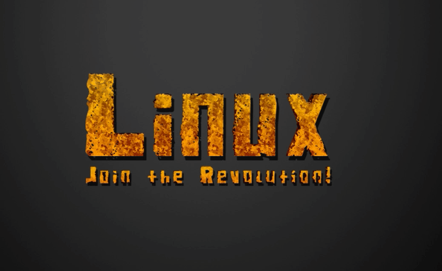

De modo a poder adicionar/editar/remover eventos ou ter uma visão geral de todos os seus calendários, eu sugeriria instalar a aplicação Gnome Calendar.
Dependendo do seu sistema operativo deve procurar esta aplicação no seu "centro de software" (loja de aplicações Linux).

Nota: se o seu sistema operativo está em Português, então depois de instalada esta aplicação surge com o nome **"Agenda"**

Assim que tiver instalado o calendário, verá que os seus calendários já estão integrados graças ao serviço de "Online Accounts" que configurou antes. A aplicação é bastante simples, mas permite-lhe fazer coisas básicas como criar/apagar/editar eventos no seu calendário. Você pode selecionar que calendários quer ver e que calendários não quer sincronizar (no caso de ter vários calendários). Você pode criar/modificar/apagar eventos, e eles serão todos sincronizados com a sua cloud do Disroot, o que significa que serão também sincronizados com os seus outros dispositivos ligados à sua conta de cloud (ex: calendário do seu smartphone).

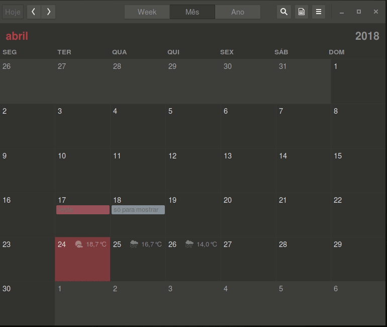

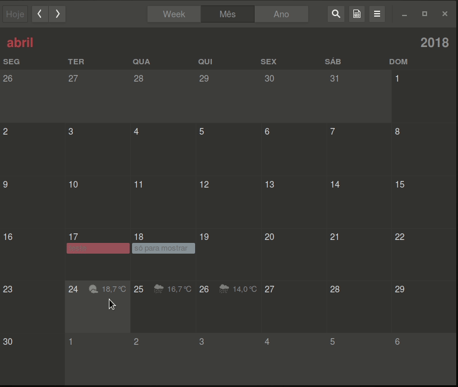

-----------
# Ficheiros

Se abrir o gestor de ficheiros irá reparar que tem uma nova pasta "remota" que aponta para a sua conta Disroot. É isso mesmo. Você pode facilmente adicionar/remover/copiar/modificar ficheiros que estão na sua cloud sem precisar de os descarregar foi fazer um login via um browser de Internet. Isto é muito diferente de usar a aplicação de "cliente de desktop" do Nextcloud, pois não sincroniza os ficheiros com uma cópia local no seu computador. **Lembre-se, está a trabalhar diretamente a partir do seu armazenamento na "nuvem"** (qualquer mudança que faça afeta imediatamente o ficheiro na sua cloud).

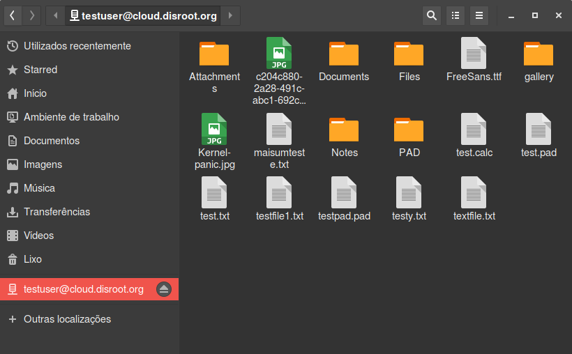

----------

# Tarefas

Tarefas é uma ferramenta muito útil para organizar o seu trabalho. Graças ao sistema de integrações não necessita de fazer login via um browser de Internet. Basta ir ao "Centro de Software" do seu sistema operativo, ou qualquer outro meio que use para instalar software e procure pela aplicação "GNOME To Do".

**Nota:** depois de instalada esta aplicação em Português chama-se: "A Fazer".

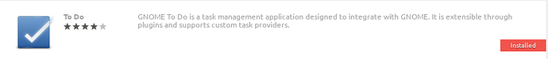

Tal como com os calendários, irá ver as suas tarefas automaticamente sincronizadas. Você pode fácilmente adicionar novas tarefas, prazos, descrições, e notas e definir prioridades e organizar tarefas e sub-tarefas. A aplicação é muito intuitiva e fácil de usar.

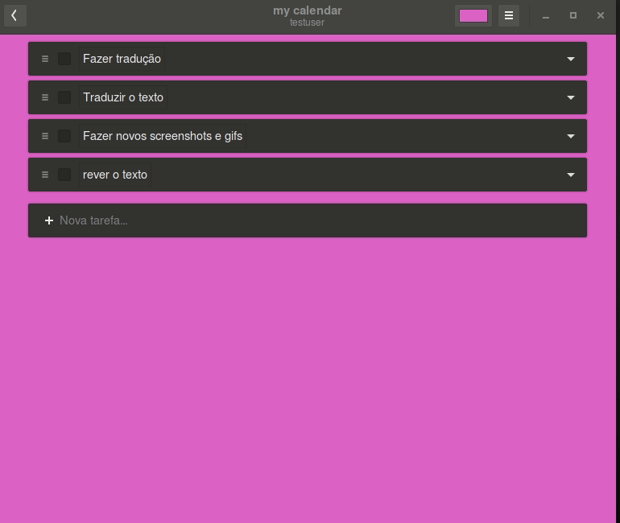

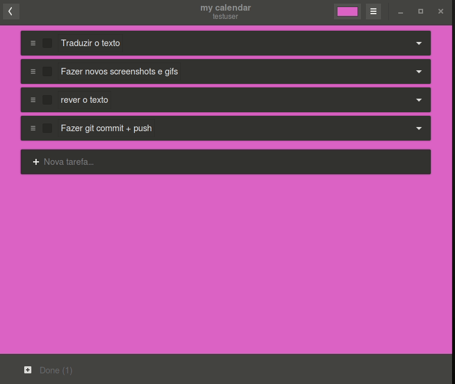

----------

# Contactos

Integrar os contactos é tão fácil como todos os exemplos anteriores. É seguir a mesma lógica. Primeiro instalar a aplicação "Contacts" caso ainda não a tenha instalada.

**Nota:** em Português, depois de instalada a aplicação chama-se "contactos".

Depois necessita de alterar o seu livro de contactos para o que é fornecido pela sua conta de cloud do Disroot.
Selecione "Change Address Book" no menu da aplicação. Assim que selecionar a sua conta Disroot como o seu Livro de Endereços, todos os seus contactos serão sincronizados com o seu computador. Todos os novos contactos serão sincronizados com a sua conta Disroot  e com todos os dispositivos conectados à  sua conta.

----------

# Email

Se nunca trabalhou com um cliente de Desktop para  email antes e se sempre usou o interface web para aceder ao seu email, então está a trabalhar da maneira **errada!** Apesar da tendência recente na qual as grades empresas tentam convence-lo do contrário, clientes de Desktop para email permitem-lhe ter a integração com o seu trabalho que sempre lhe faltou. O cliente de email open source mais popular é o Thunderbird (pode ver como configurar [aqui](https://howto.disroot.org/pt/email/email-clients/desktop/thunderbird) ). Se não gosta do thunderbird e gostaria de integrar o seu email com o GNOME, há uma maneira fácil de o fazer. Abra novamente a janela de "Definições" do Gnome e carregue em "Online Accounts". Agora vá até ao fundo da janela e carregue na última opção. A seguir selecione IMAP e SMTP. A partir desta fase ser-lhe-ão feitas várias perguntas acerca da sua conta de email e configurações do servidor. Basta seguir a lista que está em baixo.

**Email:** *<nome_de_utilizador>*@disroot.org 
**Nome:** Um nome para a sua conta (pode ser qualquer coisa) 
**Configurações de IMAP:** 
**Servidor IMAP:** disroot.org 
**Utilizador:** *O seu nome de utilizador no Disroot* 
**Senha:** *A sua password no Disroot* 
**Encriptação:** SSL On dedicated port 

**Configurações de SMTP:** 
**Servidor SMTP:** disroot.org 
**Utilizador:** *O seu nome de utilizador no Disroot* 
**Senha:** *A sua password no Disroot* 
**Encriptação:** STARTTLS após ligação

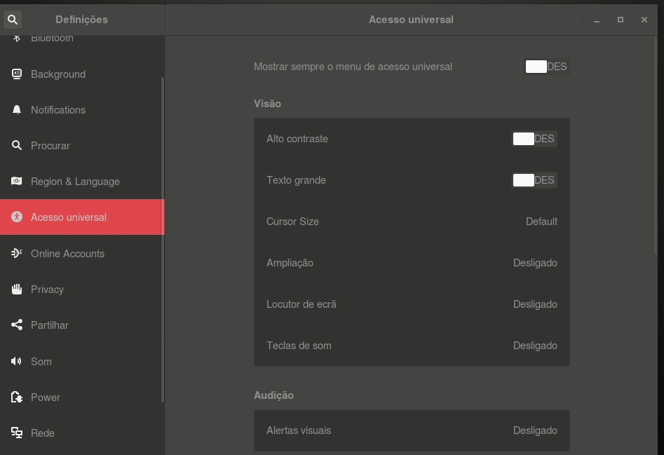

Agora que tem o seu email configurado e integrado com o seu ambiente de trabalho você pode usar ou o cliente de email "Evolution" ou o "Geary" e desfrutar de todos os seus emails, calendários, tarefas e contactos integrados em apenas uma aplicação. Magia... :)

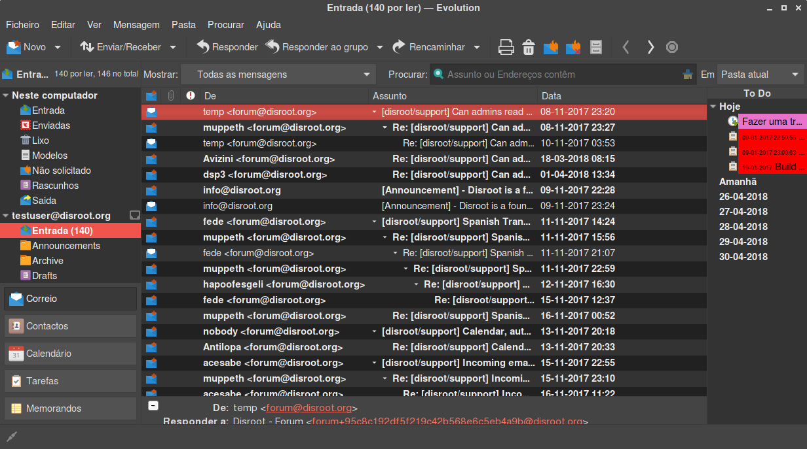

----------

# Notícias
A aplicação de Notícias na sua conta Disroot permite-lhe agregar todos os novos posts dos seus websites favoritos usando um feed de RSS, e sincronizar esse feed com todos os seus dispositivos. É bastante útil quando você se quer manter a par de noticias que lhe interessam. A grande maioria dos websites tem um feed de RSS. Normalmente consegue encontrá-lo neste ícone , ou escrevendo um endereço semelhante a: https://disroot.org/feed

Para além das já tradicionais aplicações web e de smartphone para RSS, nós podemos integrar facilmente a aplicação de Notícias com o seu Desktop. Tal como com todas as integrações de aplicações anteriores, o primeiro passo é instalar o software apropriado. A aplicação de feed de RSS que integra com a cloud do Disroot chama-se **"FeedReader"**, que deve estar disponível no seu "Centro de Software" (loja de aplicações). Caso não esteja pode encontrar instruções sobre como instalar [aqui](https://github.com/jangernert/feedreader).

Assim que estiver instalada, tudo o que tem que fazer é inserir as suas credenciais do Disroot e está tudo pronto.

Assim que a sua conta estiver configurada, irá ocurrer uma sincronização inicial. Todos os feeds de RSS que subscreve serão sincronizados com o seu Desktop. Tal como na aplicação web ou de smartphone pode agora ler as últimas notícias, adicionar / remover feeds, sincronizá-los, etc. Tudo será sincronizado com a sua conta de cloud. A aplicação corre no background e procura novas notícias e envia-lhe uma notificação de Desktop, deste modo não irá perder nenhuma notícia.

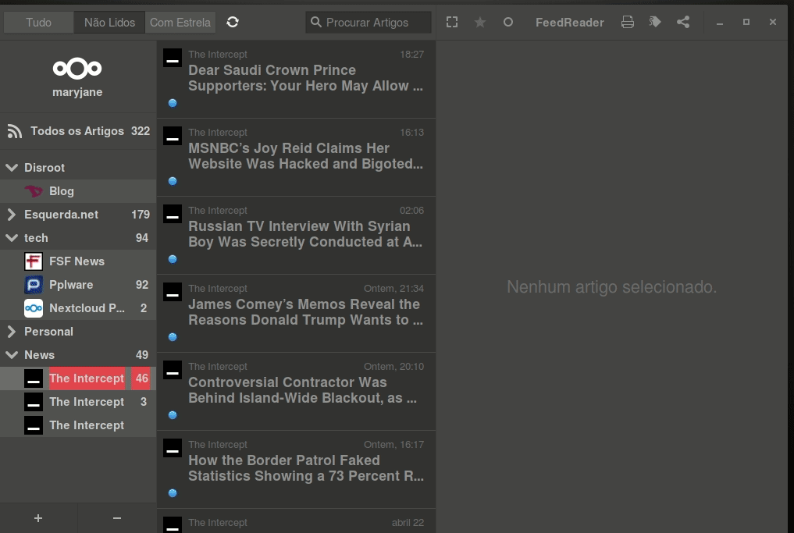
