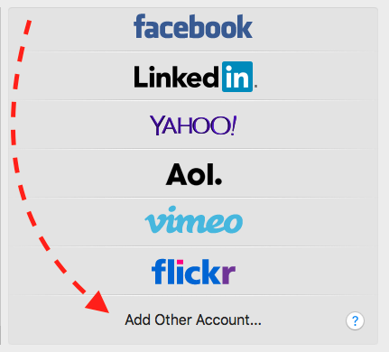
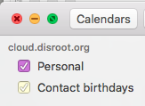

_Este tutorial foi actualizado pela ultima vez a 13 de fevereiro de 2017_

# Objetivo:
**Sincronizar a aplicação de calendário do macOSX com a cloud do Disroot.**

Isto irá permitir-lhe, consultar, editar e remover eventos do seu calendário a partir de qualquer computador com uma ligação de internet. Também lhe irá permitir sincronizar o seu calendário com o seu smarthphone ou tablet. Assim que esteja a funcionar e nada de mal aconteça, pode esquecer que existe.

# Requisitos

* O seu nome de utilizador do Disroot
* A sua password do Disroot
* Um computador Apple com OSX (10.8 - 10.11.6) instalado
* Uma conexão de Internet que funcione
* 15 minutos

# Configurar a sincronização do Calendário

1. Carregue no **ícone da Apple** no canto superior esquerdo do seu ecrã.
2. Abra o menu '**Preferências de sistema...**'.
3. Carregue no ícone com o nome '**Contas de Internet**'.

5. Vá até ao fundo da página até ver '**adicionar outras contas**'

7. Escolha o terceiro item do painel: '**Conta CalDav**'

Irá abrir uma janela chamada **'Adicionar conta CalDAV'**

A partir do menu: 
**Account type:** Advancada. 
**Username**: O seu nome de utilizador  (_without @disroot.org_) 
**Password**: A sua password 
**Server Address**: `cloud.disroot.org` 
**Server Path**: `remote.php/dav/principals/users/USERNAME/`  (substitua USERNAME com o seu nome de utilizador) 
**Port**: `443` and **Use SSL** ticked.

Carregue em `Sign In`!

Agora o seu calendário foi adicionado. Se abrir a aplicação calendário, dois novos calendários irão aparecer ana coluna esquerda. Pode alterar o nome e as cores nas preferencias da sua aplicação de calendários.

