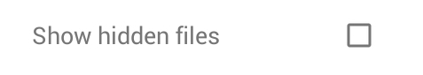
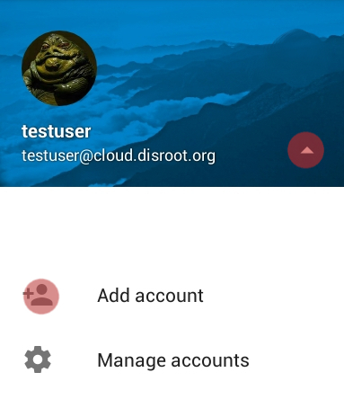

La posibilidad de sincronizar, subir y descargar fácilmente archivos desde tu nube de Disroot a tu móvil puede ser de mucha utilidad en muchos casos.

En este tutorial te mostraremos cómo instalar y trabajar con la aplicación para móviles de Nextcloud. Esta aplicación te permite acceder y sincronizar convenientemente tus archivos en la nube de Disroot y descargar/subir/compartir/borrar desde tu móvil prescindiendo de un navegador para hacerlo o de tener que conectarlo a una laptop para transferir archivos.

Esta aplicación no descarga los archivos a una carpeta local en tu móvil, simplemente muestra los archivos existentes en tu nube. Los archivos sólo son descargados si los seleccionas para hacerlo. De esta manera, se ahorra mucho espacio en el dispositivo. Para los archivos subidos, si quieres conservar una copia local o no de ellos en el móvil, es tu elección.

----------

# Instalar la aplicación Nextcloud para móviles

Para instalar la aplicación en Android, te recomendamos instalar la Tienda de aplicaciones [F-droid](https://f-droid.org/). F-droid provee aplicaciones libres y open source, y es una manera de reducir tu dependencia de Google. Una vez que hayas instalado y configurado F-droid, puedes buscar e instalar la [Aplicación Nexcloud para móviles](https://f-droid.org/repository/browse/?fdfilter=Nextcloud&fdid=com.nextcloud.client/).

Los usuarios de IOS probablemente tengan que pagar alrededor de 0,99€ por él en la Tienda de IOS.

----------

# Configuración de la cuenta
Una vez que la aplicación está instalada, iniciala:

* **Servidor:** [https://cloud.disroot.org](https://cloud.disroot.org)

Se te solicitará permiso para conceder a tu dispositivo acceso a la cuenta de Disroot.

Una vez que hayas autorizado al dispositivo, completa los datos de tus credenciales de Disroot:
* **Usuario:** _tu usuario de Disroot_
* **Contraseña:** _tu contraseña de Disroot_

----------
# Interfaz general

La interfaz general es bastante clara y sencilla de usar. En el centro, te muestra tus archivos. En la barra superior tienes:

* Una herramienta de búsqueda
* Un botón de tres líneas horizontales a la izquierda para acceder a tus configuraciones.
* A la derecha un botón con tres puntos verticales para actualizar tu cuenta y establecer el modo de visualización.
* Abajo a la derecha, tienes el botón "más" que te muestra las opciones de subida.

Puedes navegar a través de las carpetas presionando sobre ellas y luego usando el "botón de retroceso" en la esquina superior izquierda.

Si presionas el botón con los tres puntos verticales en la barra superior de la aplicación, allí tienes las opciones de **Actualizar cuenta**, **Ordenar**, **Seleccionar todo** y **Vista en cuadrícula**.

En **Actualizar cuenta** puedes forzar la sincronización de tus archivos (si cuando inicias la aplicación del móvil por primera vez tus archivos no aparecen, utiliza esta opción). 
En **Ordenar**, puedes decidir si tus archivos se mostrarán por orden alfabético, por fecha y demás. 
**Seleccionar todo** hace exactamente eso, selecciona todos los archivos. 
En **Vista en cuadrícula**, puedes cambiar la manera en que se visualizan los archivos, de "Vista de lista" a "Vista en cuadrícula" y viceversa:

----------
## Configuración general

En la configuración general puedes:

* Elegir subir automáticamente cualquier video/foto que hagas/tomes en tu teléfono a tu nube
* Establecer a qué carpeta irán estas subidas
* Establecer si quieres mantener o no una copia local de esas imágenes y videos subidas
* Establecer una contraseña para acceder a la aplicación para móviles de Nextcloud
* Establecer si quieres que la aplicación muestre archivos ocultos
* Instalar DAVDroid así puedes sincronizar calendarios, tareas y contactos

Puedes acceder a estas configuraciones presionando el botón de tres líneas horizontales arriba a la izquierda y luego seleccionando "Configuración".

**NEEDS TO BE UPDATED**
## Pictures and videos automatic uploads

Uploading your pictures and videos automatically to the could is basically a matter of checking a box in the options.  

when you press instant picture upload or instant video upload, you are presented with all the options.
There you can set whether pictures or videos, are uploaded immediately, or only when you are connected to wifi, if it goes to the "instant upload" folder that is created for this or to another.
 

 

 
At the end of these options you can set what to do with the original files of the picture/video that where uploaded:
  
 

 
The app folder is a local folder on your mobile where the Nextcloud app can store uploaded files. Original folder is, well ... the picture or videos folder.

## Set password
To protect access to your Nextcloud mobile app, you cen checkbox "Passcode Lock". This will prevent anyone with access to your phone to open the app and browse your cloud storage.

**NOTE: If you enable password protection you will be asked for this every time you start the app, and every time you upload a file using your mobile share options (share pictures from gallery, etc).**

## Display hidden files
Nextcloud on Disroot cloud permits uploading *"hiding files"*. By checking *"Show hidden files"* option you'll be allowed to see those files on your mobile app.

----------
# Upload and Download Files

## Upload files from NextcloudApp
You can upload files to your Disroot cloud with the mobile app in two ways:

### The upload option in the app

To upload from within NextcloudApp select the *"plus"* button in the main interface

### Upload using "Share" function form other apps

Most of the apps support "Sharing" functionality, which provides you an option to share content directly to another app. Using this property you can easily share the content directly to NextcloudApp which will result in uploading it. For instance, you can use *"share"* button in Gallery app to upload pictures or videos to your cloud.

# Download files
Select the files you want to download by *"long pressing"* them. The selected file will be highlighted and all files in that folder will have a checkbox to the left of them. Use the checkboxes to select more files you want to download, then press the button on the upper right corner.

----------

##Share files and folders
You can share files or folders to anyone via a public link URL link or with other people that use a cloud based in Nextcloud/Owncloud software even if they are not Disroot users (unlike dropboxes and such).

To share via URL, *"long press"* the file or folder you want to share, then press the three vertical dots button on the upper right corner and select the **"share"** option.
 

Additionally you can decide whether you allow others to edit shared files, set expiration date, or protect the share with additional password.

To share a file or folder with other Disroot or Nextcloud/Owncloud users via Federation, in the share option select "Add user or group", write the persons federated cloud ID, usually:

* **USERNAME@SERVER_ADRESS**

----------
#Manage and add multiple accounts
If you have multiple cloud accounts spread throughout several services that use Nextcloud or Owncloud you can add them all into your mobile app.
Press the *"hamburger button"* on the upper left corner of the main interface, or swipe to the right.

Select the triangle and then "Add account"

You will have to repeat the setup account process for the new account.

Now in order to see files on additional accounts, you have to switch between them by swipping to the right and selecting an account from the menu.
If you are uploading files using the share options of your mobile device, you will be asked to which account  you want the file to be uploaded to.

----------
