A capacidade de sincronizar com facilidade, carregar ou descarregar ficheiros da sua conta Disroot para o seu smarthphone pode ser bastante útil em vários casos.

Neste tutorial iremos demonstrar como pode instalar e trabalhar com a aplicação de telemóvel Nextcloud. Esta aplicação permite-lhe aceder e sincronizar os ficheiros da sua cloud do Disroot a partir do seu dispositivo e carregar/descarregar/partilhar/apagar sem ter que usar um browser no seu telefone ou de o conectar a um outro computador para transferir ficheiros.

Esta aplicação não descarrega os ficheiros para uma pasta no smartphone, apenas mostra uma lista dos ficheiros existentes na sua cloud. Os ficheiros apenas são descarregados se os selecionar para serem descarregados. Deste modo não ocupa demasiado espaço no seu telemóvel. No caso de ficheiros que carrega para a sua cloud, se quiser manter uma cópia local deles no seu smartphone ou não é uma escolha sua.

----------

# Instalar a aplicação Nextcloud no seu smartphone

Para instalar a aplicação no Android nós recomendamos que instale a loja de aplicações [F-droid](https://f-droid.org/). F-droid fornece aplicações open-source, e é uma maneira de reduzir a sua dependencia da google. Depois de ter instalado o F-droid pode procurar e instalar a [Nexcloud Mobile app](https://f-droid.org/repository/browse/?fdfilter=Nextcloud&fdid=com.nextcloud.client/).

Utilizadores de IOS provavelmente terão que pagar à volta de 0,99€ pela aplicação na loja de aplicações do IOS.

----------

# Configurar a sua conta
Uma vez que aplicação esteja instalada, abra a aplicação e faça login com as credenciais da sua conta:

**Credenciais:**

* **Endereço do Servidor:** [https://cloud.disroot.org](https://cloud.disroot.org)
* **Nome de utilizador:** _your Disroot username_
* **Senha:** _your Disroot password_

Escreva o endereço do Servidor e carregue na seta à direita:

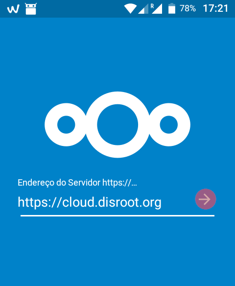

Selecione a opção **"Conceder acesso"**

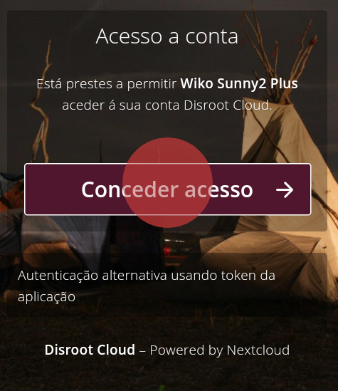

Insira o seu nome de **utilizador** e a sua **senha** e carregue em **"Iniciar Sessão"**

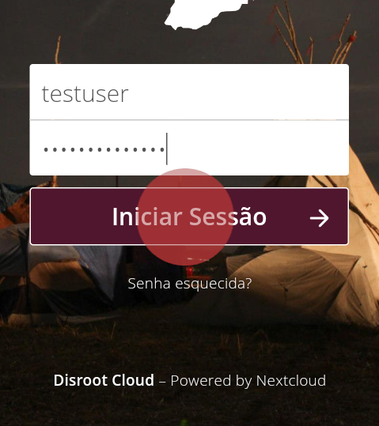

Se utiliza uma versão mais recente do Android, provavelmente irá aparecer um painel a perguntar:
**"Pretende permitir a Nextcloud aceder a fotos, multimédia e ficheiros no dispositivo?"**

Carregue em: **"Permitir"** para que o nextcloud possa aceder a ficheiros no seu dispositivo.

----------
# Interface

O interface principal da aplicação é bastante simples e fácil de usar. No centro mostra os seus ficheiros
Na barra do topo tem disponíveis:

* Uma ferramenta de procura
* Um botão "tipo hambúrguer" do lado esquerdo para aceder às suas **"Definições Gerais"**
* Do lado direito um botão para "Atualizar a conta", ordenar os ficheiros e definir como ver os ficheiros
* No canto inferior direito tem um botão "mais" que lhe apresenta opções para carregar ficheiros para a sua cloud.

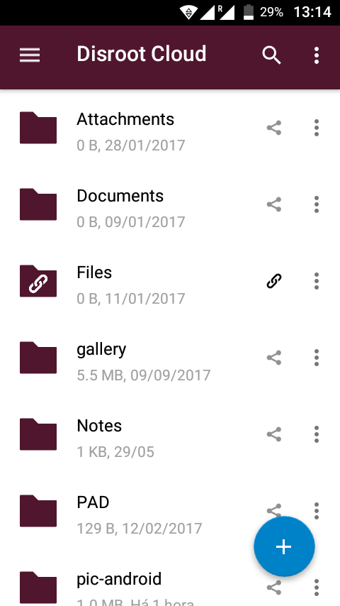

Pode navegar entre as pastas carregando nelas e carregando no botão de retroceder no canto superior esquerdo.

Se carregar no botão com três pontinhos na vertical na barra superior da aplicação pode **Atualizar a conta**, **Ordenar** e **Vista em grelha**.

Em **Atualizar a conta** você pode ordenar uma sincronização dos ficheiros (se por exemplo quando iniciar a aplicação pela primeira vez os seus ficheiros não aparecerem utilize esta opção).
Em **Ordenar**, você pode decidir se quer que os seus ficheiros e pastas lhe sejam apresentados por: ordem alfabética, por data e por aí adiante.
In **Ordenar**, pode mudar a maneira como os ficheiros são apresentados, de uma lista de ficheiros para vista em grelha e vice versa:

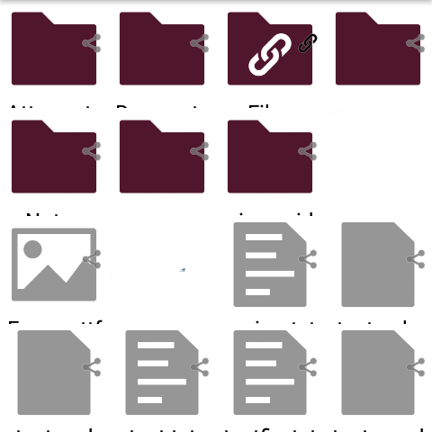    

----------
# Definições Gerais

Nas Definições gerais você pode:

* Escolher carregar para a sua cloud automaticamente os vídeos e fotos que fizer/tirar
* Escolher para que pastas na sua cloud para as quais estes vídeos/fotos são carregados
* Se quer manter uma cópia local no seu dispositivo destes ficheiros depois de carregados para a sua cloud * Definir uma password para aceder à aplicação Nexcloud Mobile
* Definir se quer que a aplicação lhe mostre os ficheiros ocultos.
* Se quer também instalar o DAVDroid para que possa sincronizar também os seus calendários, tarefas e contactos

Você pode aceder a estas definições carregando no botão "tipo hambúrger" no canto superior esquerdo da aplicação e e depois em "Auto envio" no caso de opções de carregamento automático de fotos/vídeos e em "definições" para as restantes opções".

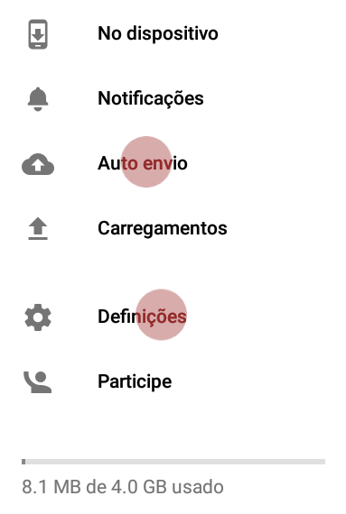

### Carregamento automático de vídeos e fotos

Carregar automaticamente para sua cloud os vídeos e fotos que faz/tira a partir do seu smartphone é básicamente uma questão de carregar num botão "checkbox"

Quando carrega em **"Auto envio"** vai aparecer uma lista das várias "categorias disponiveis" (vídeos, fotos, screenshots) para serem configuradas em separado.
Cada uma destas categorias ou outras só aprecem depois de ter feito um primeiro ficheiro de media nessa categoria.
Por exemplo se nunca fez um vídeo com o seu dispositivo a "categoria" vídeos não vai aparecer. Só depois de fazer um primeiro vídeo é que essa "categoria" aparece. O mesmo com os outros tipos de ficheiros de media.

Em cada uma destas "categorias" pode definir se os respetivos ficheiros são carregados automaticamente para a sua cloud, ou se apenas quando estiver conectado a uma rede wifi, se são carregados para a pasta "Envios Instantâneos" que é criada para o efeito ou se para outra pasta, se quer organizar os ficheiros na cloud por sub-pastas (por ano).
As opções de: alterar a pasta de destino, o que fazer ao ficheiro original e usar sub-pastas só podem ser editadas depois de o **Auto envio** dessa "categoria" ser ativado.

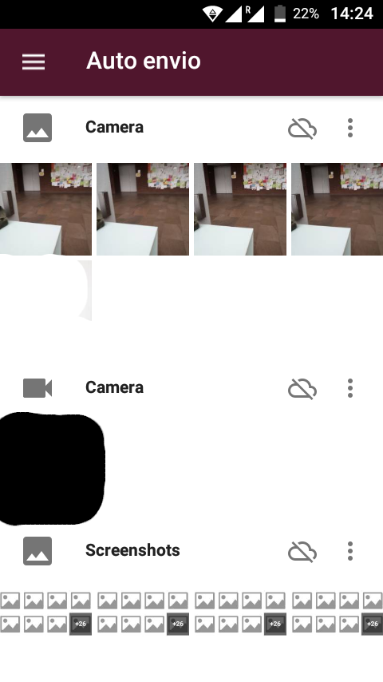

Para ativar/desativar o auto envio em cada "categoria" carregue no botão 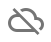. Para editar as opções de auto envio carregue no botão 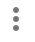. Ambos à direita da respetiva categoria.

As opções são bastante simples e óbvias e o painel de opções é o mesmo em todas as "categorias"

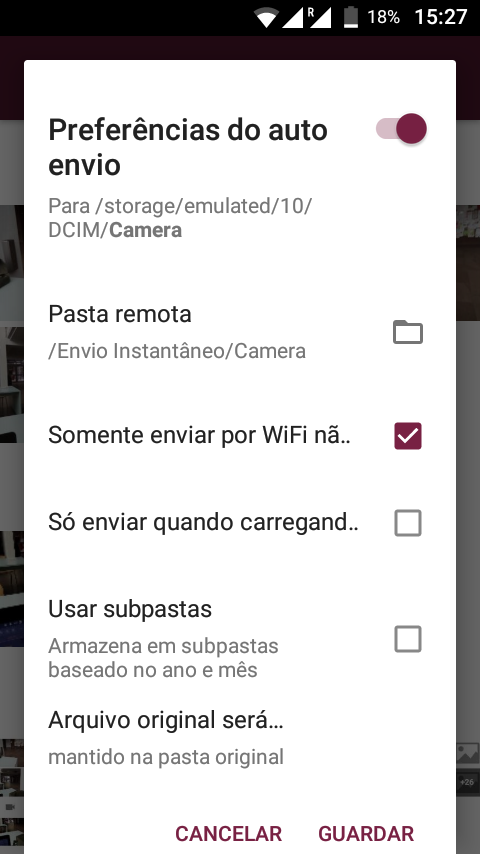

Na última opção: **"Arquivo original será..."** pode definir o que fazer com o ficheiro original depis de o de ele ter sido carregado para a cloud.

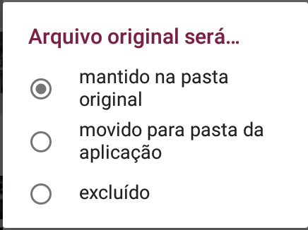

Se carregar em **"Pasta remota"** irá abrir a lista de pastas na sua cloud e poderá escolher uma ou criar nova pasta para armazenar os ficheiros carregados automaticamente.

### Implementar proteção por código da aplicação Nextcloud
Para proteger com um código o acesso à aplicação Nextcloud no seu smartphone, vá a definições e selecione **"Proteção por código"**, escreva e confirme o codigo de acesso que quer ter na aplicação.

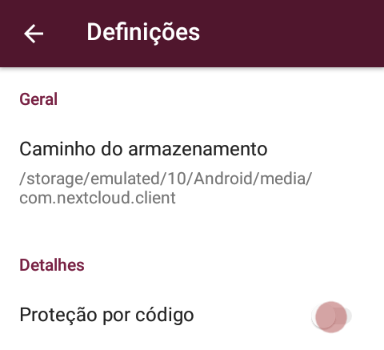

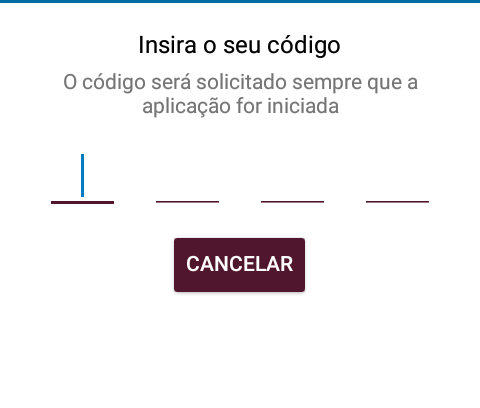

Isto irá ajudar a prevenir que alguém com acesso ao seu smartphone possa abrir a aplicação e ver os ficheiros que tem na sua conta de cloud do Disroot.

**NOTA: Se habilitar a proteção por código a aplicação irá perdir-lh este código cada vez que iniciar a aplicação e cada vez que utilizar as opções de partilha do seu smartphone, (partilhar fotografias da galeria de imagens, etc.).**

### Mostrar ficheiros escondidos
O Nextcloud no Disroot cloud permite *"esconder ficheiros"*. Carregando na opção **"Mostrar ficheiros escondidos"** poderá ver os ficheiros escondidos na aplicação de smartphone.

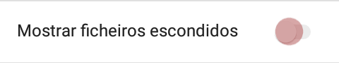

----------
# Carregar e descarregar ficheiros

## Carregar ficheiros a partir da aplicação nextcloud
Você pode carregar ficheiros com a aplicação para a sua conta de cloud do Disroot de duas maneiras:

### A opção de carregar ficheiros da aplicação

Para carregar ficheiros a partir da aplicação Nextcloud carregue no botão *"mais"* na página principal da aplicação. Selecionar o ficheiro que quer carregar e pronto.

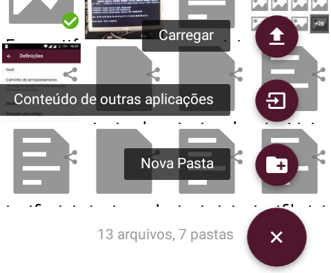

### Carregar utilizando as opções de "partilha" do das outras aplicações do seu smartphone

A maioria das aplicações de smartphone que lidam com ficheiros tem uma opção de "partilha", que lhe permite partilhar ficheiros diretamente noutra aplicação. Através desta funcionalidade consegue partilhar ficheiros fácilmente com a aplicação nextcloud o que acaba por carregar o/as ficheiro(s) em causa. Por exemplo, pode usar a opção de *"partilha"* na galeria de imagens para carregar fotografias ou vídeos para a sua cloud.

# Descarregar ficheiros
Selecione os ficheiros que quer descarregar carregando neles por alguns segundos. O ficheiro será realçado e todos os ficheiros na mesma pasta terão à sua direita uma "checkbox". Use as checkboxes para selecionar mais ficheiros que queira descarregar, depois carregue no botão no canto superior direito que irá aprecer.

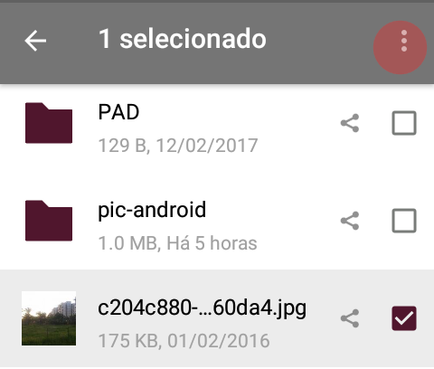

----------

# Partilhar ficheiros e pastas
Você pode partilhar ficheiros e pastas com qualquer outra pessoa através de um link de URL público ou com qualquer outra pessoa que use uma cloud baseada no software Nextcloud/Owncloud mesmo que não sejam utilizadores do Disroot (ao contrário de dropboxes e a afins).

Para partilhar um ficheiro ou pasta carregue no botão   à direita do ficheiro ou pasta em causa.

E carregue em "Compartilhar ou Link"

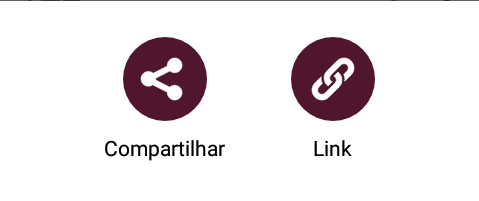

Adicionalmente você pode decidir se quer proteger o link com uma password ou definir um prazo de validade para o link.

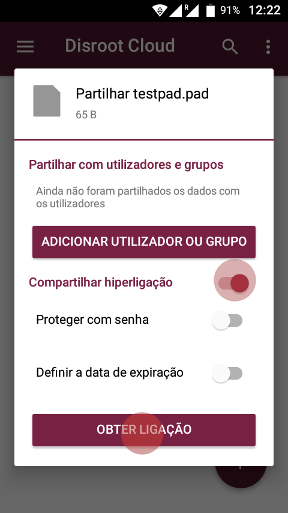

Depois de carregar em obter ligação irá aparecer um painel com uma lista de opções sobre como paertilhar o link com outras pessoas, se por uma outra aplicação (ex: email) ou só copiar o link.

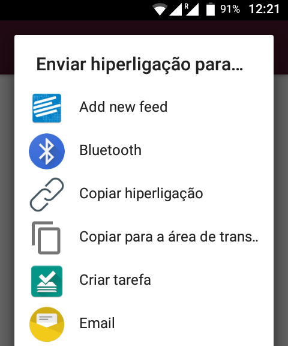

Par partilhar ficheiros ou pastas com outros utilizadores do Disroot ou do software Nextcloud/Owncloud users via federação, nas opções de partilha escolha a opção **"ADICIONAR UTILLIZADOR OU GRUPO"** e escreva a identidade "ID" de cloud dessa pessoa, geralmente:

* **NOME_DE_UTILIZADOR@ENDEREÇO_SERVIDOR**

----------
# Gerir e adicionar várias contas
Se tem várias contas de cloud "espalhadas" por vários fornecedores que usam o Nextcloud ou o Owncloud pode adicioná-los a todos à sua aplicação de Nextcloud
Carregue no *"botão tipo hambúrger"* no canto superior esquerdo da página principal da aplicação.

Carregue no triângulo e depois em "Adicionar conta"

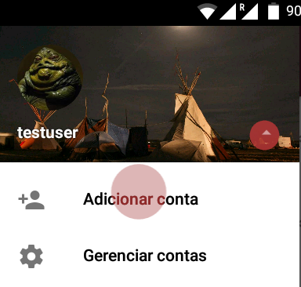

Você irá ter que repetir o processo de configuração de conta para esta nova conta.

Agora para ver os ficheiros da conta adicional você tem que alternar entre as contas, deslizando o painel principal da aplicação para a direita e selecionar uma das várias contas.

Se estiver a carregar ficheiros utilizando as opções de partilha do seu smartphone, a aplicação nextcloud irá perguntar-lhe sempre para qual das suas contas quer carregar o ficheiro.
