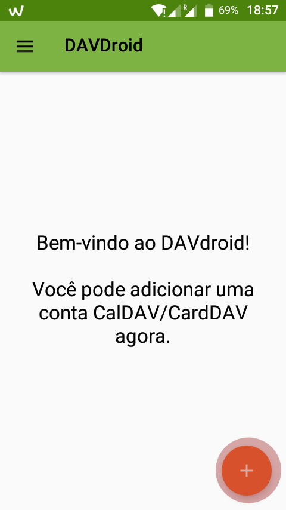
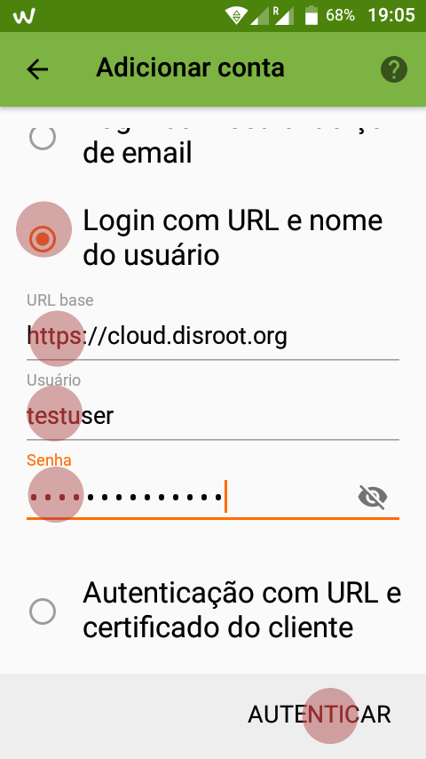
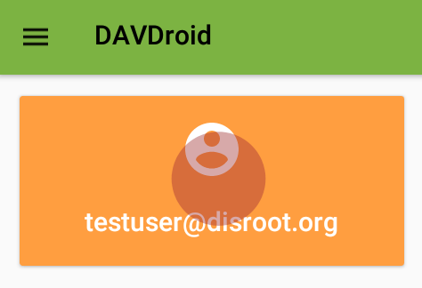
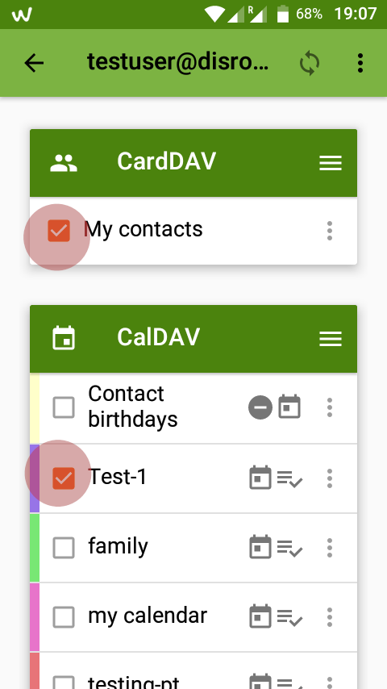
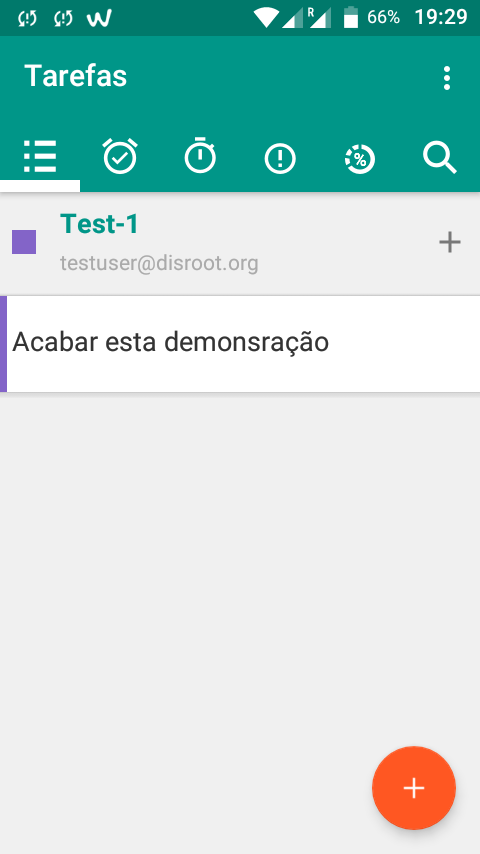
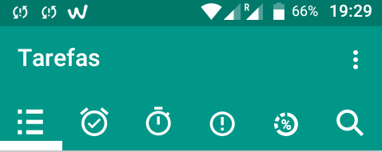

O Disroot tem habilitado aplicações de calendário, contactos e tarefas.

Neste tutorial iremos mostrar-lhe como configurar e utilizar os calendários, aplicação de tarefas e de contactos da sua conta Disroot no seu dispositivo Android.
Para fazer isto necessitará de instalar as aplicações DAVdroid e Open Tasks no seu dispositivo Android.
Para o Open Tasks funcionar precisa que o DAVdroidtambém seja instalado, mas se apenas quer sincronizar os seus calendários e contactos então não precisa de instalar o Open Tasks.

----------
# Instalar o DAVdroid
## A partir da loja de aplicações
O DAVdroid está disponível na sua loja de aplicações favorita. Nós recomendamos que utilize o  [F-Droid](https://f-droid.org/).

## A partir da aplicação Nextcloud
Se tem a aplicação Nextcloud para mobile instalada e ligada à sua conta do Disroot pode instalar o DAVdroid a partir desta aplicação:
 - Abra a aplicação Nextcloud Android
 - Vá a **"Definições"** > **"Sincronizar Calendário e Contactos"**

 A aplicação do Nextcloud irá agora descarregar instalar e configurar a sua conta no DAVdroid como que por magia :)
 ---------------

## Adicionar a sua conta Disroot ao DAVdroid

Caso não tenha instalado o DAVdroid via a aplicação de Nextcloud para Android terá que configurar a sua conta manualmente.
Abra o DAVDroid e carregue no botão *"mais"* (**+**).

Selecione "Login com URL e nome de usuário", e coloque o nome de usurário endereço do servidor e credenciais.

> URL Base: https://cloud.disroot.org  
> Usuário: O seu nome de utilizador do Disroot  
> Senha: A sua password do Disroot

Depois carregue em "Criar conta". Depois de a sua conta estar criada necessita de escolher quais os seus calendários e livros de endereços que quer sincronizar da sua conta Disroot para o seu dispositivo Android.

Carregue no botão cor de laranja gigante com o nome da sua conta.

-------------------

# Calendário
Agora os que tem na sua conta Disroot devem estar sincronizados com o seu dispositivo Android e irão aparecer na aplicação de calendário que utiliza no Android. Qualquer evento adicionado através do calendário do seu dispositivo Android será sincronizado com a sua conta no Disroot e vice versa.

---------------------
# Contactos
Os seus contactos deverão ser sincronizados imediatamente com a sua conta Disroot.
**Nota:**
Se quiser migrar os seus contactos do Android para a sua conta Disroot e para de os sincronizar com a Google então siga   [este](https://howto.disroot.org/en/nextcloud/sync-with-your-cloud/android/migrating-contacts-from-google) tutorial.

---------------------
# Tarefas

O [Open Tasks](https://f-droid.org/packages/org.dmfs.tasks/) Está disponível a partir do F-Droid e outras lojas de aplicações comerciais.

Se já seguiu os passos anteriores e já instalou e configurou o DAVdroid e já fez a sincronização com a sua conta Disroot, então todas as tarefas que tem listadas na sua cloud já estarão disponíveis a partir do momento em que abre a aplicação *"Open Tasks"* pela primeira vez (em Português depois de instalada a aplicação chama-se **"Tarefas"**).
Todas as tarefas relacionadas com cada calendário que sincronizou. Carregando no nome do Calendário irá mostrar as tarefas.

A aplicação **"Tarefas"** é fácil de usar. Você pode criar tarefas adicionais e agrupa-las, adicionar tags, estabelecer prazos para a execução das tarefas e notificações, definir qual a urgência/prioridade de uma tarefa, etc.
Todas as alterações que realizar serão automaticamente sincronizadas com a sua conta de cloud. A página principal da aplicação dá-lhe uma visão geral de todas as suas tarefas agrupadas por:
* tarefas
* tarefas a terminar
* tarefas a iniciar
* prioridade das tarefas
* progresso das tarefas

