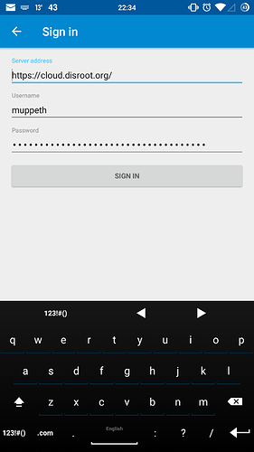
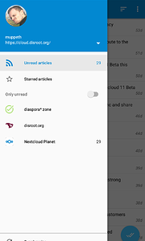
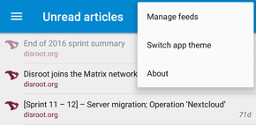

# L'application News sur Android

## Obtenez-la
Pour obtenir l'application News sur votre appareil android, nous vous recommandons de visiter f-droid et d'ajouter son app store. [F-droid](https://f-droid.org/) fournit des applications libres et fiables. L'utilisation de ce magasin plutôt que de Google Play est un grand pas en avant pour vous libérer.

Une fois que f-droid est installé et en cours d'exécution, vous pouvez rechercher [OCReader](https://f-droid.org/repository/browse/?fdfilter=news&fdid=email. schaal.ocreader) dans l'application F-droid ou télécharger et installer directement à partir du [site](https://f-droid.org/repository/browse/?fdfilter=news&fdid=email.schaal.ocreader)

## Configuration
Une fois cela fait, vous pouvez démarrer l'application et vous connecter avec votre compte Disroot.

Une fois que vous êtes connecté, tous vos flux d'informations seront synchronisés avec votre appareil et vous pourrez commencer à lire immédiatement.
Glisser vers la gauche vous montre les informations de votre compte et vous donne la liste des flux souscrits ainsi que le nombre de messages non lus.

## Ajouter/supprimer des flux
Vous pouvez également ajouter et supprimer des flux directement sur votre téléphone. Tapez sur l'icône "trois points" dans le coin supérieur droit de la fenêtre principale de l'application et sélectionnez "Gérer les flux".

## Synchroniser
Pour synchroniser vos flux, appuyez sur le bouton **"Synchroniser"** du panneau de gauche.

Bonne lecture! :grinning:

----------
