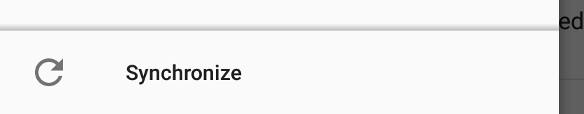

# Aplicação de notícias no Android

## Obter e instalar a aplicação
Para obter a aplicação de notícias nós recomendamos que visite o f-droid e instale esta loja de aplicações. [F-droid](https://f-droid.org/) fornece aplicações de confiança livres. Usar esta loja de aplicações em vez da loja de aplicações da Google já é um grande passo.

Uma vez que tenha o f-droid instalado e a funcionar, procure a aplicação [OCReader](https://f-droid.org/repository/browse/?fdfilter=news&fdid=email.schaal.ocreader) dentro do F-droid ou descarregue a aplicação diretamente a partir do [website](https://f-droid.org/repository/browse/?fdfilter=news&fdid=email.schaal.ocreader).

## Configuração
Assim que tenha terminado de instalar a aplicação, abra-a e faça login com as suas credenciais de utilizador da sua conta Disroot.

Assim que tiver entrado com a sua conta, todos os seus feeds de noticias serão sincronizados com o seu dispositivo e pode começar a ler notícias imediatamente
Deslizar o ecrã para a esquerda mostra as informações da sua conta e a lista de feeds que subscreveu e os posts não lidos

## Adicionar/Remover feeds
Também pode adicionar ou remover feeds diretamente a partir do seu telefone. Carregue no botão com três pontinhos no canto superior direito on the top right e selecione "Manage feeds".

## Sincronizar
Para sincronizar os seus feeds, carregue em **"Synchronize"** no lado esquerdo do painel.

Boas leituras! :grinning:

----------
