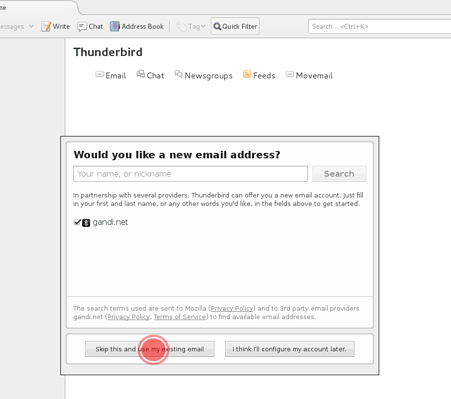
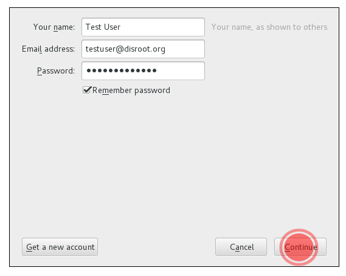
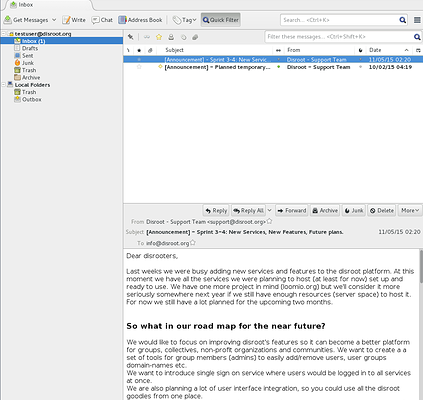

Thunderbird is a powerful open-source email client, calendar and RSS-Feed manager.

1. **Install Thunderbird.**
If you don't have thunderbird yet, got to  https://www.mozilla.org/en-US/thunderbird/all/ and choose your language and Operating System.
**!Note** For linux users we recommend using your distribution package manager to get the latest and updatable version of thunderbird.

2. **Open thunderbird**
If it's the first time you run thunderbird you will be directly greeted with account setup. Please skip the partnership suggestion and get right to the setup.

If you  are using thunderbird already and have some accounts setup just select '**New Account**" icon in the root view.

3. **Fill in your account information**

 - **Your name** Name that will be displayed in "from" field
 - **Email address** Your disroot email address eg. testuser@disroot.org
 - **Password** - Your password
 - **Remember Password?** - If you want thunderbird to remember your password for you and not prompt you for it every time you start thunderbird, select it.
 - Click "**Continue**" button once you're done and verified everything is correct..

4. Thunderbird now should auto-detect the needed settings like this:

**Done** \o/

