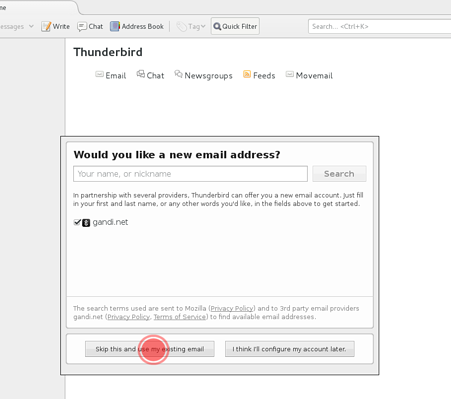
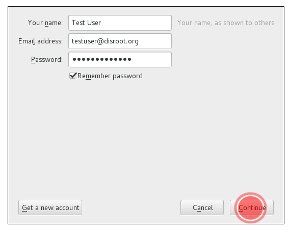

Thunderbird est un puissant client de messagerie open-source, gestionnaire de calendrier et de flux RSS.

1. **Installer Thunderbird.**
Si vous n'avez pas encore thunderbird, rendez-vous sur https://www.mozilla.org/en-US/thunderbird/all/ et choisissez votre langue et votre système d'exploitation.
**Note:** Pour les utilisateurs de Linux, nous recommandons d'utiliser votre gestionnaire de paquets de distribution pour obtenir la dernière version de thunderbird.

2. **Ouvrir thunderbird**
Si c'est la première fois que vous exécutez thunderbird, vous serez directement accueilli avec la configuration du compte. S'il vous plaît sauter la suggestion de partenariat et aller directement à l'installation.

Si vous utilisez déjà thunderbird et que vous avez configuré certains comptes, sélectionnez simplement l'icône "**Nouveau compte**" dans la vue racine.

3. **Compléter les informations de votre compte**

- **Votre nom** Nom qui sera affiché dans le champ "de".
- ** Votre adresse email** Votre adresse Disroot par ex. testuser@disroot.org
- ** Mot de passe** - Votre mot de passe
- ** Se souvenir du mot de passe?** Si vous voulez que thunderbird se souvienne de votre mot de passe pour vous et ne vous invite pas à le rentrer à chaque fois que vous démarrez thunderbird, sélectionnez cette option.
- Cliquez sur le bouton "**Continuer**" une fois que vous avez terminé et vérifié que tout est correct...

4. Thunderbird devrait maintenant détecter automatiquement les paramètres nécessaires comme ceci:

**C'est terminé** \o/

