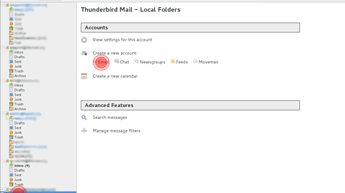
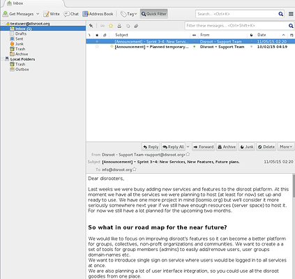

O Thunderbird é um cliente open-source de email, calendário, tarefas e gestor feed de RSS bastante poderoso.

1. **Instalar o Thunderbird.**
Se ainda não tem o thunderbird, vá a https://www.mozilla.org/en-US/thunderbird/all/ e escolha a língua e sistema operativo que quer.
**Nota:** Para utilizadores de linux nós recomendamos que utilize o gestor de pacotes ou a loja de aplicações da sua distribuição para obter a versão mais recente e actualizada do thunderbird.

2. **Abrir o thunderbird**
Se for a primeira vez que abre o thunderbird irá aprecer automáticamente o painel para configurar a sua conta de email. Por favor salte a sugestão de parceria  e vá diretamente à configuração.Please skip the partnership suggestion and get right to the setup.

Se já está a utilizar o thunderbird e já tem algumas contas de email, então selecione '**New Account**" icon in the root view.

3. **Fill in your account information**

 - **Your name** Name that will be displayed in "from" field
 - **Email address** Your disroot email address eg. testuser@disroot.org
 - **Password** - Your password
 - **Remember Password?** - If you want thunderbird to remember your password for you and not prompt you for it every time you start thunderbird, select it.
 - Click "**Continue**" button once you're done and verified everything is correct..

4. Thunderbird now should auto-detect the needed settings like this:

**Done** \o/

