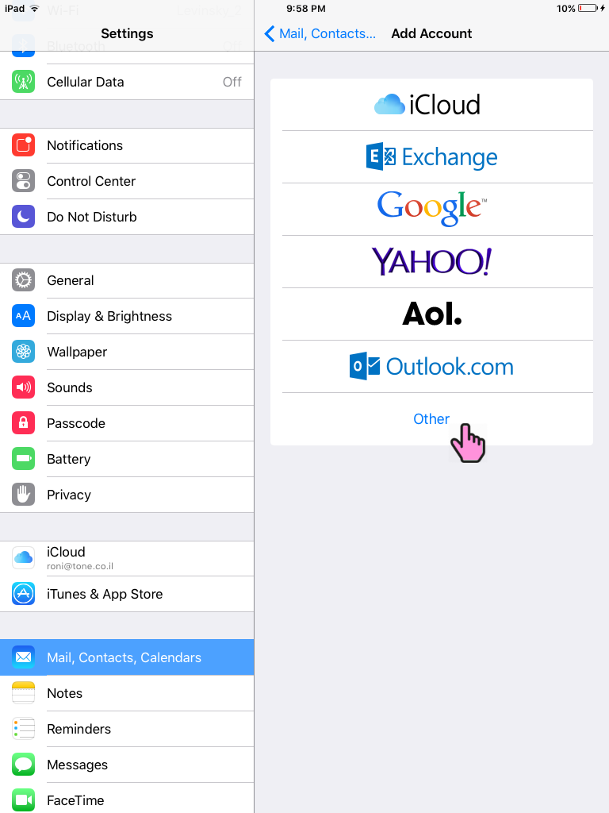
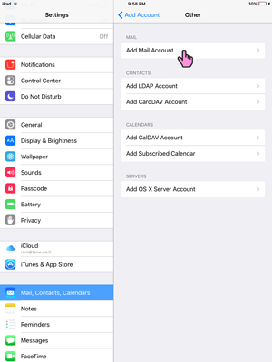
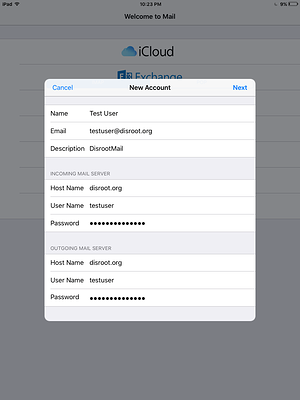

1. Open up the setting of your iOS device and go to 'Mail, Contacts, Calendars'. Then select 'Add Account'.

2. Select 'Other'.

3. Select 'Add Mail Account'.

4. Insert your credentials and click 'Next'.

5. Change the hostname to disroot.org, both for incoming and outgoing mail server.

Click 'Next' and your account should be ready to use within you iOS email client.
ios_mail1.PNG
