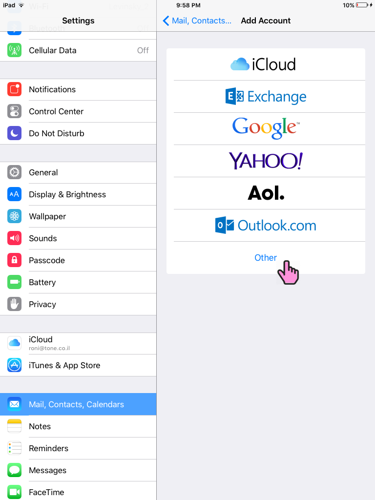
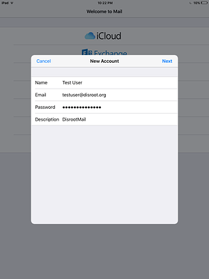

1. Abre las configuraciones de tu dispositivo iOS y ve a 'Correo, Contactos, Calendarios'. Luego selecciona 'Agregar Cuenta'.

2. Selecciona 'Otros'.

3. Selecciona 'Agregar Cuenta de Correo'.

4. Ingresa tus credenciales y haz click en 'Siguiente'.

5. Cambia el nombre del Host a disroot.org, tanto para el servidor de correo entrante como saliente.

Click en 'Siguiente' y tu cuenta debería estar lista para usar dentro de tu cliente de correo iOS.
