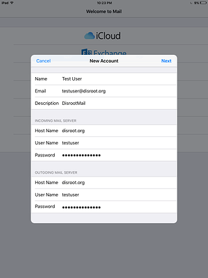

1. Abra as configurações do seu dispositivo iOS e vá a 'Mail, Contacts, Calendars'. Depois selecione 'Add Account'.

2. Escolha 'Other'.

3. E escolha 'Add Mail Account'.

4. Insera as suas credenciais e carregue em 'Next'.

5. Altere o hostname para disroot.org, tanto para o servidor de receção (incoming) como o servidor de envio de emails (outgoing).

Carregue em 'Next' e a sua conta deve estar pronta para ser usada com o seu cliente de email do IOS.
