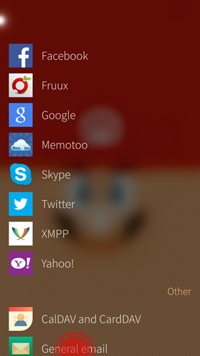
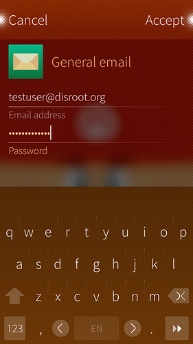
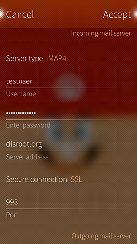

Setting up disroot mail on SailfishOS is very easy. Just follow those simple steps. (it took longer to make those fancy screenshots :P )

1. Open up **Settings** app

2. Go all the way to the bottom (Sailfish2.0) to **Accounts** tab

3. Select **General email**

4. Fill in your disroot email address and password and swipe "Accept".

5. Server settings.

 - **Incoming mail server:**
    - Edit username and **remove the domain leaving only the username**
    - Add server address: **disroot.org**
    - **Enable SSL connection**

 - **Outgoing mail server**
    - Server address: **disroot.org**
    - Secure connection: **StartTLS**
    - Port: **587**
    - **Authentication required**

6. Swipe "**Accept**"

7. Edit details such as **description** and "**Your name**", and swipe "**Accept**"

**You're done!** \o/
