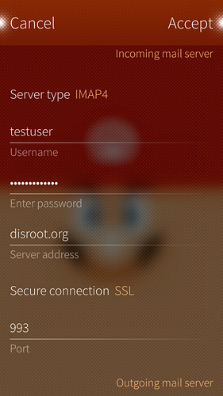

Configurar un correo de Disroot en SailfishOS es muy fácil. Sólo sigue estos sencillos pasos (más tiempo ha tomado hacer esas sofisticadas capturas :P ).

1. Abre las **Configuraciones** de la aplicación

2. Ve directamente hasta el final (Sailfish2.0) hasta la pestaña **Cuentas**

3. Selecciona **Correo general**  

4. Completa tu dirección de correo y contraseña de disroot y desliza el dedo sobre "Aceptar".  

5. **Configuraciones del servidor**: **Servidor de correo entrante:**
    - Edita usuario y **quita el dominio dejando solamente el usuario**
    - Agrega la dirección del servidor: **disroot.org**
    - **Habilita la conexión SSL**  
  

 **Configuraciones del servidor**: **Servidor de correo saliente**
  - Dirección del servidor: **disroot.org**
  - Conexión segura: **StartTLS**
  - Puerto: **587**
  - **Autenticación requerida**  
  

6. Desliza el dedo en "**Aceptar**"

7. Edita los detalles tales como **descripción** y "**Tu nombre**", y desliza el dedo sobre "**Aceptar**"  

**¡Estás listo!** \o/
