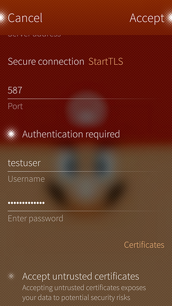

Configurar o email do Disroot no é muito fácil. Basta seguir estes passos simples. (demorou mais tempo a fazer estas capturas de ecrã XPTO :P )

1. Abra a app **Settings**

2. Vá até ao final da página para a tab **Accounts**

3. Escolha **General email**

4. Preencha com o seu endereço de email do Disroot e a palavra-passe e carregue em "Accept".

5. Configurações do servidor.

 - **Incoming mail server:**
    - edite o nome de utilizador **remova o domínio deixando apenas o nome de utilizador**
    - Adicione o endereço do servidor: **disroot.org**
    - **Enable SSL connection**

 - **Outgoing mail server**
    - Endereço do servidor: **disroot.org**
    - Ligação segura: **StartTLS**
    - Porta: **587**
    - **Authentication required**

6. Carregue em "**Accept**"

7. Edite os detalhes como **description** e "**Your name**", e carregue em "**Accept**"

**Terminado!** \o/
