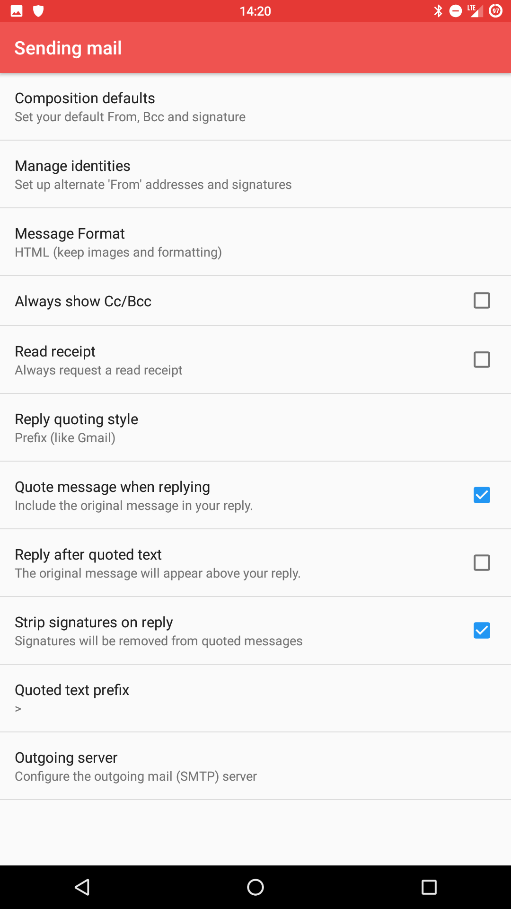

## Setup
First of, open K9 and go to your accounts settings

When in Settings, go to **"Sending Mail"** tab, tap on **"Manage Identities"**.

Select **"New identity"** by tapping the "three dot" icon on top right.
*(Every disroot user by default has an username@disr.it alias he can use)*

And fill in the form providing the new alias adress.

## Set default
To change the default identity, while still in **"Manage Identities"** settings, just tap and hold the alias you want to set and select **"Move to top / make default"** option.

## Send email
To send email with your new alias, just tap on the **"Form"** field and select alias you want to use from the dropdown menu, when composing your mail.
